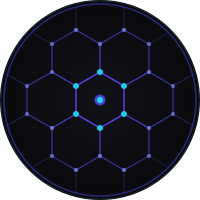

<div align="center">
  <picture>
    <source media="(prefers-color-scheme: dark)" srcset="static/brand/svg/zenzic-nav-dark.svg">
    <source media="(prefers-color-scheme: light)" srcset="static/brand/svg/zenzic-nav-light.svg">
    
  </picture>
</div>

# Guida per Sviluppatori zenzic-doc

[](https://github.com/PythonWoods/zenzic)
[](https://github.com/PythonWoods/zenzic-doc/actions/workflows/ci.yml)
[](LICENSE)
[](https://api.reuse.software/info/github.com/PythonWoods/zenzic-doc)
[](https://diataxis.fr/)
[](https://zenzic.dev/it/developers/explanation/adr-vault)
[](https://reuse.software/)

> **Questa documentazione è strettamente allineata a Zenzic v0.7.0 "Quarzo".**
> Se la versione del core cambia, esegui `just bump NEW_VERSION` per mantenere
> sincronizzati tutti i riferimenti.

Questo repository contiene il sito di documentazione Docusaurus per Zenzic.

Questa guida è scritta sia per i maintainer esperti sia per chi contribuisce per
la prima volta. Se sei nuovo, segui le sezioni in ordine.

---

## 📖 Mappa della Documentazione — La Promessa di Quarzo

La documentazione di Zenzic è distribuita come **due istanze Docusaurus separate**
sotto lo stesso dominio. Ognuna ha la propria sidebar, il proprio indice di
ricerca e il proprio pubblico — mai mischiati.

```text
zenzic.dev/
├── docs/           → Area Utente   — installazione, configurazione, CI/CD, codici
├── developers/     → Area Dev      — plugin, adapter, ADR, ledger del debito tecnico
├── blog/           → Note di rilascio e post-mortem ingegneristici
└── community/      → Brand kit, FAQ, governance
```

**La Promessa di Quarzo.** Due istanze, una Sentinella. La separazione è imposta
dall'[ADR 011: Cross-Instance Allowlist](https://zenzic.dev/it/developers/explanation/adr-cross-instance-allowlist) —
ogni link che attraversa il confine è un contratto documentato, mai una
soppressione silenziosa. Consulta il
[Ledger del Debito Tecnico](https://zenzic.dev/it/developers/governance/technical-debt) per ciò che abbiamo
rinviato e perché.

| Sei un... | Inizia da qui |
| :--- | :--- |
| 👤 Utente che legge la documentazione | [Guida Utente](https://zenzic.dev/it/docs/) |
| 🔧 Contributor / autore docs | [Portale Sviluppatori](https://zenzic.dev/it/developers/) · [ADR Vault](https://zenzic.dev/it/developers/explanation/adr-vault) |
| 🛡️ Security reviewer | [Engineering Ledger](https://zenzic.dev/it/developers/explanation/engineering-ledger) · [SECURITY.md](SECURITY.md) |

---

## 1) Prerequisiti

- Node.js 24 o superiore
- npm 10 o superiore
- Opzionale: [just](https://github.com/casey/just) per eseguire comandi brevi e memorizzabili

## 2) Primo Setup (per nuovi collaboratori)

Esegui questo comando una volta dopo aver clonato il repository:

```bash
npm ci
```

Cosa fa:

- Installa le dipendenze esattamente come definite in `package-lock.json`.
- Mantiene il tuo ambiente riproducibile con la CI.

Alternativa con just:

```bash
just setup
```

## 3) Avvia il sito docs in locale

```bash
npm run start
```

Cosa fa:

- Avvia un server di sviluppo locale.
- Ricarica automaticamente le pagine quando i file cambiano.

Alternativa con just:

```bash
just start
```

## 4) Workflow quotidiano comune

Quando modifichi documentazione o componenti, questo è il flusso più sicuro:

```bash
just start
just verify
```

Cosa fa `just verify`:

- Esegue i controlli TypeScript.
- Costruisce il sito di produzione esattamente come si aspetta la CI.

## 5) Tutti i comandi spiegati

### Comandi npm

| Comando | Quando usarlo | Cosa fa |
| --- | --- | --- |
| `npm ci` | Primo setup, reinstallazione pulita, parità CI | Installa le dipendenze dal lockfile con versioni deterministiche |
| `npm run start` | Durante lo sviluppo attivo | Avvia il server locale con live reload |
| `npm run build` | Prima di una PR, prima di una release | Produce il sito statico in `build/` |
| `npm run serve` | Dopo una build | Serve `build/` localmente per visualizzare l'output di produzione |
| `npm run lint:md` | Prima della PR, dopo modifiche docs | Lint di stile e formattazione Markdown/MDX |
| `npm run lint:ts` | Prima della PR, dopo modifiche React/TS | Lint dei sorgenti TypeScript/React |
| `npm run typecheck` | Prima della PR, quando modifichi file TS/React | Esegue i controlli `tsc` |
| `npm run clear` | Se la cache di Docusaurus causa comportamenti strani | Pulisce gli artefatti in cache |
| `npm run swizzle` | Personalizzazione avanzata del tema | Copia gli internals del tema Docusaurus per la personalizzazione |
| `npm run write-translations` | Modifiche al workflow i18n | Genera lo scaffolding delle traduzioni |
| `npm run write-heading-ids` | Aggiornamenti Markdown estesi | Scrive/aggiorna gli ID degli heading per i file docs |
| `npm run deploy` | Solo per workflow di deployment | Esegue il comando deploy di Docusaurus |
| `npm run docusaurus -- <args>` | Uso avanzato/diagnostico | Esegue la CLI Docusaurus grezza con argomenti personalizzati |

### Comandi just

`just` avvolge i comandi npm con nomi più semplici.

| Comando | Quando usarlo | Cosa fa |
| --- | --- | --- |
| `just setup` | Primo setup o reset | Esegue `npm ci` |
| `just start` | Editing quotidiano | Esegue il server di sviluppo locale |
| `just serve` | Anteprima della build di produzione | Serve `build/` con switch locale completo (il modo corretto per testare EN↔IT) |
| `just markdownlint` | Dopo aver modificato la documentazione | Esegue i controlli markdown lint |
| `just lint` | Dopo aver modificato sorgenti React/TS | Esegue i controlli lint TypeScript/React |
| `just typecheck` | Prima di aprire/aggiornare la PR | Esegue i controlli TypeScript |
| `just build` | Validazione build | Esegue la build di produzione |
| `just preview` | Valida l'output costruito | Serve il sito già buildato |
| `just verify` | Controllo locale finale raccomandato | Esegue `markdownlint` + `lint` + `typecheck` + `build` |
| `just preflight` | Prima di ogni commit | Esegue tutti gli hook pre-commit su ogni file tracciato |
| `just reuse` | Dopo aver aggiunto/rinominato file | Verifica la conformità della licenza REUSE/SPDX |
| `just sentinel` | Spot-check rapido qualità | Esegue solo la Zenzic Sentinel (più veloce di un preflight completo) |
| `just clean` | Pulizia prima di un'esecuzione fresca | Rimuove `build/` e `.docusaurus/` |
| `just bump VERSION [BADGE]` | Dopo una release del core Zenzic | Aggiorna tutti i riferimenti hardcoded alla versione |

Puoi elencare tutte le ricette con:

```bash
just --list
```

## 6) Hook pre-commit (Sentinel Guard)

Questo repository impone gate di qualità prima di ogni commit tramite [pre-commit](https://pre-commit.com/).

Installa gli hook una volta dopo il clone:

```bash
pip install pre-commit
pre-commit install
```

Ogni `git commit` eseguirà automaticamente:

| Hook | Cosa controlla |
| --- | --- |
| trailing-whitespace | Nessuno spazio finale (esclude `.mdx`) |
| end-of-file-fixer | I file terminano con una nuova riga |
| check-yaml / check-json / check-toml | Dati strutturati validi |
| check-added-large-files | Previene commit binari accidentali |
| check-merge-conflict | Nessun marcatore di merge irrisolto |
| no-commit-to-branch | Blocca i commit diretti su `main` |
| TypeScript Typecheck | `tsc --noEmit` deve passare |
| Zenzic Sentinel | `zenzic check all` deve uscire con 0 |
| REUSE/SPDX | Conformità della licenza su ogni file |

Se un hook fallisce, correggi il problema segnalato e ritenta il commit.

Per eseguire tutti gli hook manualmente senza committare:

```bash
just preflight
```

## 7) Workflow CI/CD

| Workflow | File | Trigger | Obiettivo |
| --- | --- | --- | --- |
| Docs CI | `.github/workflows/ci.yml` | PR, push su `main`, manuale | Valida install, markdown lint, TS/React lint, typecheck, e build su Node 22 e 24 |
| Dependency Audit | `.github/workflows/npm-audit.yml` | PR, push su `main`, settimanale, manuale | Rileva vulnerabilità di dipendenze ad alta gravità |
| Dependency Review | `.github/workflows/dependency-review.yml` | PR, manuale | Rileva modifiche di dipendenze rischiose introdotte dalle PR |
| CodeQL (opt-in) | `.github/workflows/codeql.yml` | PR, push su `main`, settimanale, manuale | Analisi statica quando `ENABLE_CODEQL=true` |
| Release Docs | `.github/workflows/release-docs.yml` | tag `v*`, manuale | Costruisce, archivia e pubblica l'artefatto versionato |

## 8) Note di sicurezza

- `codeql.yml` è opt-in per i repository privati.
- Per abilitare i job CodeQL: abilita Code Security (GHAS), poi imposta la variabile di repository `ENABLE_CODEQL=true`.
- `npm-audit.yml` esegue un audit strict ad alta gravità senza allowlist.

## 9) Robustezza della pipeline (stato attuale)

Policy della landing page:

- `src/pages/index.tsx` è una landing page monolitica intenzionale ed è esclusa da `lint:ts` per policy esplicita.
- È comunque coperta da `typecheck` e `build`.

Già implementato:

- Controlli di concorrenza (cancella le run obsolete).
- Timeout dei job (evita runner bloccati).
- Trigger manuali `workflow_dispatch`.
- Matrice Node (22 e 24) per la compatibilità.
- Cache npm nei workflow, con chiave `package-lock.json`.

Possibile irrobustimento futuro:

- Pin delle GitHub Actions di terze parti per commit SHA.
- Richiedere i check di branch protection dopo la validazione del rollout.

## 10) Troubleshooting

### Errore: `File '@docusaurus/tsconfig' not found`

Quando appare nel tuo editor, controlla `tsconfig.json` e assicurati che `extends` punti a:

```json
"@docusaurus/tsconfig/tsconfig.json"
```

Poi esegui:

```bash
npm run typecheck
```

### `npm ci` fallisce

Prova questa sequenza:

```bash
just clean
rm -rf node_modules
npm ci
```

Se continua a fallire, verifica le tue versioni Node/npm rispetto alla sezione prerequisiti.

### `npm run build` fallisce ma `start` funziona

Di solito significa che i controlli production-only sono più stringenti.

Esegui:

```bash
npm run typecheck
npm run build
```

Risolvi prima gli errori di tipo, poi ritenta la build.

### `/it/docs/index` è 404 in localhost

Questo è atteso quando esegui `npm run start` con il locale di default (`en`):
il dev server serve un locale alla volta.

Usa uno di questi comandi invece:

```bash
npm run start:en
npm run start:it
```

Note:

- Con `start:it`, apri `http://localhost:3000/docs/` (contenuto italiano servito alla root in dev).
- Se vuoi route con prefisso come `/it/docs/`, costruisci e servi l'output di produzione:

```bash
npm run build
npm run serve
```

### La CI fallisce ma i comandi locali passano

Usa il gate locale equivalente esatto della CI:

```bash
just verify
```

Se la CI continua a differire, controlla:

- Versione Node (la CI usa Node 22 e 24)
- Modifiche al lockfile (`package-lock.json`)
- Job specifici del workflow (dependency audit, dependency review)

### La Trappola del Fallback Silenzioso i18n

**Sintomo:** `http://localhost:3000/it/docs/` mostra contenuto inglese anche se i
file di traduzione italiana esistono in `i18n/it/`.

**Causa principale:** Docusaurus deriva la proprietà `path` da `htmlLang` quando
`path` non è impostato esplicitamente. Se dichiari `htmlLang: 'it-IT'`, Docusaurus
cerca le traduzioni in `i18n/it-IT/` — una directory che non esiste. La build si
completa silenziosamente con `translate: false` e fa fallback alla sorgente
inglese per tutte le pagine di contenuto. La chrome dell'UI (navbar, breadcrumb,
etichette di paginazione) rimane tradotta perché quelle stringhe provengono dalle
traduzioni bundled di Docusaurus, mascherando il problema.

**Diagnosi:** In `build/it/.docusaurus/i18n.json` (o `.docusaurus/i18n.json` dopo
una build), controlla se il locale `it` ha `"translate": false`. In tal caso, il
mismatch del path è la causa.

**Fix:** Imposta sempre `path` esplicitamente in `localeConfigs`:

```ts
// docusaurus.config.ts
i18n: {
  defaultLocale: 'en',
  locales: ['en', 'it'],
  localeConfigs: {
    en: { label: 'English' },
    it: { label: 'Italiano', htmlLang: 'it-IT', path: 'it' }, // ← path è obbligatorio
  },
},
```

**Scoperto in:** v0.7.0 release audit (D090 "Il Lockdown i18n").

## 11) Checklist Pull Request

Prima di aprire o aggiornare una PR, esegui questa checklist.

- [ ] Ho installato le dipendenze con `npm ci` (o `just setup`).
- [ ] Ho testato lo sviluppo locale con `npm run start` (o `just start`) se il comportamento UI/docs è cambiato.
- [ ] Ho eseguito `just verify` ed è passato.
- [ ] Ho rivisto le sezioni di `README.md` se ho cambiato comandi/workflow.
- [ ] Ho aggiornato docs o commenti quando il comportamento è cambiato.
- [ ] Il mio branch contiene solo modifiche intenzionali.
- [ ] Se ho toccato la config `i18n` o i file di locale: ho verificato che le pagine `/it/` mostrino **contenuto italiano** (non solo un URL italiano), controllando il body della pagina dopo `npm run build && npm run serve`.

Sequenza minima di comandi prima della PR:

```bash
just setup
just verify
```

---

## 📚 Le Cronache di Zenzic

Zenzic è nato da un viaggio tecnico attraverso la fragilità degli ecosistemi
moderni di documentazione. Scopri la filosofia, l'assedio alla sicurezza e
l'ingegneria dietro la Sentinella nella
[**Engineering Chronicles**](https://zenzic.dev/blog/tags/engineering-chronicles) sul blog ufficiale.

---

<div align="center">
  <a href="https://zenzic.dev">
    
  </a>
  <p>
    <strong>Progettato con precisione da PythonWoods in Italia 🇮🇹</strong><br/>
    <em>"Costruendo il Porto Sicuro per la conoscenza tecnica."</em>
  </p>
  <p>
    <a href="https://zenzic.dev"><strong>Documentazione</strong></a> &middot;
    <a href="https://github.com/PythonWoods"><strong>GitHub</strong></a> &middot;
    <a href="https://zenzic.dev/blog"><strong>Journal</strong></a>
  </p>
</div>
