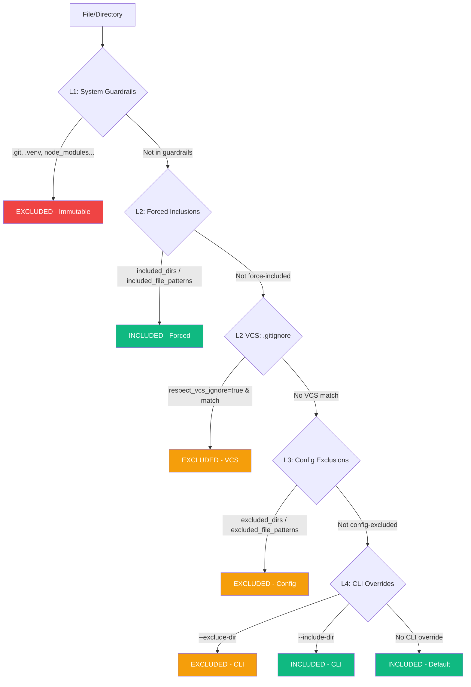

<!-- SPDX-FileCopyrightText: 2026 PythonWoods <dev@pythonwoods.dev> -->
<!-- SPDX-License-Identifier: Apache-2.0 -->


# Discovery Universale e Esclusione a Livelli

Zenzic adotta un principio architetturale preciso: **un solo punto d'ingresso** per la scoperta dei file. Ogni modulo del sistema — scanner, validator, credential scanner, orphan-checker — vede lo stesso identico insieme di file. Non esistono scorciatoie.

---

## L'Autorità della Radice {#root-authority}

Prima che Zenzic possa scoprire, escludere o scansionare un singolo file, deve rispondere a una domanda:
**dove inizia questo progetto?**

Zenzic è uno strumento con perimetro di Workspace. Non analizza directory arbitrarie; analizza
**progetti definiti**. Per stabilire il confine del progetto, Zenzic esegue una **traversata
verso l'alto** (upward traversal) a partire dal percorso target, cercando un marcatore di radice
autorizzato.

### Marcatori di Radice del Repository {#root-markers}

Due marcatori sono autorizzati (il primo trovato vince):

| Marcatore | Descrizione |
| :--- | :--- |
| `.git/` | Marcatore VCS universale — presente in qualsiasi repository tracciato da Git |
| `.zenzic.toml` | Il file di configurazione di Zenzic — il contratto esplicito di governance |

Entrambi sono intenzionalmente engine-neutral: `mkdocs.yml`, `zensical.toml` e file
analoghi dei motori di build non sono marcatori di radice. Il Core deve rimanere indipendente
da qualsiasi framework documentale specifico.

### Perché il Marcatore di Radice è Obbligatorio {#why-mandatory}

Senza un marcatore di radice (VCS o configurazione), Zenzic non può stabilire il **Perimetro di Sovranità** del progetto. Il blocco è necessario per quattro motivi indipendenti:

- **Risolvere i percorsi relativi** — ogni segnalazione è espressa come percorso relativo alla radice. Senza un'ancora fissa, la posizione dei file è ambigua e non riproducibile tra macchine diverse.
- **Mappare il workspace nel VSM** — Zenzic costruisce sempre una Virtual Site Map, indipendentemente dall'adapter. In modalità engine (Zensical, MkDocs), il VSM include ghost route, trasformazioni di slug e pagine virtuali. In modalità Standalone, il VSM è una proiezione 1:1 del filesystem. In entrambi i casi, la radice definisce il punto zero per la canonizzazione di ogni riferimento interno — così che `index.md` alla radice sia distinguibile senza ambiguità da un `index.md` in una sottocartella.
- **Applicare le `directory_policies`** — i contratti di governance fanno corrispondere percorsi tramite pattern glob relativi alla radice del workspace. Senza una radice definita, le regole di esenzione sono non deterministiche e non possono essere applicate in modo coerente.
- **Prevenire il Massive Indexing** — senza un confine esplicito, il motore potrebbe scansionare accidentalmente l'intero filesystem host, producendo dati incoerenti e rischiando la fuga di informazioni.

L'assenza di un marcatore di radice produce questo errore:

```text
ERROR: Could not locate repo root: no .git directory or .zenzic.toml found in any
ancestor of /percorso/al/target. Run Zenzic from inside the repository.
```

Non si tratta di un errore di configurazione. È una **garanzia di sicurezza**: il Quality Gate
interrompe una scansione fuori perimetro prima che inizi.

### Opzioni di Risoluzione {#root-resolution}

Zenzic risolve la root del repository risalendo dalla directory di lavoro corrente finché non trova un root marker (`.zenzic.toml` o `.git/`). Tre condizioni soddisfano questo requisito:

- **Progetto Zenzic:** un file `.zenzic.toml` nella root della directory target (creato da `zenzic init`).
- **Repository Git:** una directory `.git/` in qualsiasi punto dell'albero degli antenati.
- **Invocazione annidata:** esecuzione dall'interno di un progetto esistente che contiene già uno dei marker.

Se nessuna di queste condizioni è soddisfatta, Zenzic rifiuta l'invocazione con un errore esplicito.

> Vedi [Per iniziare](../how-to/install.md) per il workflow di setup con `zenzic init`.

---

## Il punto d'ingresso unico: `iter_markdown_sources` {#entry-point}

La funzione `iter_markdown_sources` e l'unica porta d'accesso autorizzata per iterare sui file sorgente Markdown. Nessun modulo interno chiama `rglob`, `os.walk` o `Path.iterdir` direttamente per cercare file `.md` o `.mdx`.

Questo garantisce che:

- Le esclusioni vengano applicate **universalmente** — non esistono moduli "fuori regola"
- L'ordine dei file sia **deterministico** (ordinamento imposto da `walk_files`)
- Le estensioni riconosciute come documentazione sorgente siano fissate: `.md` e `.mdx`
- I link simbolici vengano sempre saltati

Il vantaggio e architetturale: quando una directory viene esclusa, viene esclusa ovunque — scanner, validator, credential scanner e orphan-checker vedono esattamente lo stesso insieme di file. Non esiste il rischio che un modulo "dimentichi" di applicare una regola di esclusione.

La funzione accetta tre argomenti:

1. **`docs_root`** — percorso assoluto alla directory di documentazione
2. **`config`** — configurazione Zenzic caricata (fornisce `excluded_dirs`)
3. **`exclusion_manager`** — il `LayeredExclusionManager` per la valutazione completa a 4 livelli

---

## Gerarchia di esclusione a quattro livelli {#four-level-hierarchy}

Il `LayeredExclusionManager` orchestra le decisioni di esclusione attraverso quattro livelli. L'ordine di valutazione segue una logica precisa: il primo livello che corrisponde vince.

### I Quattro Livelli {#four-levels}



| Livello | Nome | Sorgente | Modificabile? |
| :---: | :--- | :--- | :---: |
| **L1** | System Guardrails | Hardcoded in `SYSTEM_EXCLUDED_DIRS` | No |
| **L2** | Forced Inclusions + VCS | `included_dirs`, `included_file_patterns`, `.gitignore` | Sì (config) |
| **L3** | Config Exclusions | `excluded_dirs`, `excluded_file_patterns` in `.zenzic.toml` o `[tool.zenzic]` in `pyproject.toml` | Sì (config) |
| **L4** | CLI Overrides | Flag `--exclude-dir`, `--include-dir` | Sì (per-run) |

### L1 — System Guardrails {#level-1-system}

**Priorità assoluta. Immutabili. Non negoziabili.**

I System Guardrails sono directory che Zenzic ignora **sempre**, indipendentemente da qualsiasi configurazione utente. Non possono essere rimossi, ne sovrascritti da inclusioni forzate, ne superati da flag CLI.

| Directory | Motivazione |
| :--- | :--- |
| `.git`, `.github` | VCS e CI/CD |
| `.venv`, `node_modules` | Ambienti virtuali e gestori pacchetti |
| `.nox`, `.tox` | Runner di test |
| `.pytest_cache`, `.mypy_cache`, `.ruff_cache` | Cache degli strumenti |
| `__pycache__` | Cache bytecode Python |
| site/, `.cache`        | Cache del motore di build |
| `.hypothesis`, `.temp` | Directory temporanee |

Queste directory vengono unite a `excluded_dirs` in modo additivo durante `model_post_init` del modello di configurazione. La logica è: le voci dell'utente si **aggiungono** ai Guardrail, non li **sostituiscono**.

### L2 — Inclusioni Forzate + VCS {#l2-forced-inclusions-vcs}

Le inclusioni forzate hanno la precedenza su tutti gli strati di esclusione eccetto L1. Servono due scopi:

**Inclusioni forzate a livello di config** (`included_dirs`, `included_file_patterns`) re-includono file o directory che altrimenti verrebbero esclusi da pattern VCS o esclusioni di config. Un caso d'uso tipico è la documentazione API generata dal build elencata in `.gitignore` ma che richiede linting.

**Esclusione VCS** (pattern `.gitignore`) viene attivata impostando `respect_vcs_ignore = true`. Quando attiva, Zenzic legge i file `.gitignore` sia dalla root del repository che dalla directory docs. I file che corrispondono ai pattern VCS vengono esclusi — ma le inclusioni forzate hanno la precedenza sulle esclusioni VCS.

### L3 — Esclusioni Config {#l3-config-exclusions}

Esclusioni a livello di config da `.zenzic.toml` o `pyproject.toml`:

- `excluded_dirs` — nomi di directory inside `docs/` da saltare
- `excluded_file_patterns` — pattern glob di nomi file da saltare

Sono additive a L1 ma subordinate alle inclusioni forzate L2.

### L4 — Override CLI {#l4-cli-overrides}

Gli override per singola esecuzione tramite i flag `--exclude-dir` e `--include-dir` estendono o restringono il perimetro di scansione per una singola invocazione senza modificare la configurazione persistente. CLI `--include-dir` non può sovrascrivere i System Guardrails — tentare di includere `.git` o `.venv` tramite CLI viene ignorato silenziosamente.

> Per la sintassi dei campi e gli esempi, vedi [Riferimento alla Configurazione](../reference/configuration-reference.md).

---

## `respect_vcs_ignore` — Semantica di Esclusione VCS {#respect-vcs-ignore}

`respect_vcs_ignore` controlla se Zenzic applica i pattern `.gitignore` come strato di esclusione aggiuntivo. Il suo default è `false`, implementando il **principio Zero-Config senza sorprese**: il perimetro di scansione è esattamente il filesystem visibile allo sviluppatore, senza esclusioni implicite nascoste.

Quando abilitato, Zenzic carica i pattern `.gitignore` da due posizioni: la root del repository e la directory docs (se esiste un `.gitignore` separato lì). Il parser VCS ignore implementa la specifica gitignore completa, incluse la negazione (`!`), l'ancoraggio dei path e i glob wildcard.

Le inclusioni forzate (`included_dirs`, `included_file_patterns`) hanno sempre la precedenza sulle esclusioni VCS. Questo rende sicuro abilitare `respect_vcs_ignore` in progetti dove la documentazione generata dal build è in `.gitignore` ma richiede comunque linting.

---

## Exclusion Zone Philosophy {#privacy-gate}

Il sistema di esclusione e progettato seguendo la Exclusion Zone Philosophy:

- **Nessuna sorpresa:** senza configurazione, Zenzic funziona con valori predefiniti ragionevoli
- **Nessun file critico esposto:** i System Guardrails proteggono directory che non contengono mai documentazione utile (`.git`, `.venv`, ecc.)
- **Inclusione esplicita:** l'utente deve dichiarare esplicitamente cosa vuole includere di non standard
- **Trasparenza:** il flusso di esclusione e deterministico e documentato — nessuna magia nascosta

Il `LayeredExclusionManager` viene costruito una sola volta dalla CLI e passato lungo tutta la pipeline. Ogni modulo riceve la stessa istanza, garantendo coerenza totale nell'insieme dei file analizzati.

---

## Note sulle Prestazioni {#performance}

- **La directory pruning** viene applicata durante `os.walk()`, non dopo. Gli alberi esclusi (ad esempio `node_modules/` con migliaia di file) non vengono mai attraversati.
- Per i file non-Markdown, `walk_files()` usa lo stesso motore `os.walk()` con pruning in-place. A differenza di `Path.rglob("*")`, non entra mai negli alberi esclusi.
- I pattern dei file sono **precompilati** in `re.Pattern` al momento della costruzione di `LayeredExclusionManager` usando `fnmatch.translate()`.
- I pattern VCS senza regole di negazione usano una **fast path con regex combinata** — tutte le regole positive vengono fuse in una singola regex compilata per matching O(1) per percorso.
- `LayeredExclusionManager` viene costruito **una sola volta** per invocazione CLI e passato per riferimento lungo l'intera pipeline.
- Un set separato di hard-prune viene usato da `find_unused_assets` per `excluded_asset_dirs`.

---

## Multi-Root Discovery {#multi-root}

`docs_dir` è la radice canonica dei sorgenti, ma gli static-site generator moderni gestiscono regolarmente **alberi di contenuto che vivono fuori da `docs/`**. Il caso di scuola è una directory `blog/`: viene materializzata in URL reali dalla build, ma una scansione Zenzic pre-current series non avrebbe mai visto i file al suo interno. Il Virtual Site Map ingeriva solo i file sotto `docs_root`, perciò i link rotti dentro (o verso) i post del blog sfuggivano a `zenzic check all` e affioravano solo a valle, quando la build falliva. Chiamiamo questa modalità di fallimento **VSM Blindness**.

Multi-Root Discovery cura la cecità permettendo all'adapter attivo di dichiarare ulteriori radici di contenuto — ciascuna con un percorso fisico, un prefisso URL e un'etichetta diagnostica. Quando vengono dichiarate radici extra, tutti gli stadi della pipeline trattano quei file come contenuto di prima classe accanto all'albero primario `docs/`.

### Auto-discovery senza `subprocess` {#auto-discovery}

Le implementazioni dell'adapter onorano l'invariante **Zero Subprocess**. I file di configurazione (come `zensical.toml` o `mkdocs.yml`) vengono parsati staticamente senza avviare alcun sottoprocesso. Nessun eseguibile del motore viene mai eseguito — la configurazione viene letta come **dato**, non eseguita come codice. Pillar 2 (Engine Sovereignty) preservato.

### Invariante di tracciabilità {#traceability}

Ogni voce nel VSM, incluse quelle prodotte da una radice extra, porta un `Route.source` che risale a un file reale su disco. Una rotta senza origine fisica sarebbe un validatore che urla `error` senza mai dire `dove`.

### Invariante di Reverse-Mapping e Virtual Routes {#reverse-mapping}

Il Multi-Root Discovery (current series) ha risolto il **VSM Blindness** per i file fisici
fuori da `docs/`. La current series estende la garanzia alle **pagine generate dal motore**:
i motori di build producono URL — pagine di tag, indici paginati, profili autore — che non hanno
un corrispondente fisico in Markdown. Queste rotte esistono solo nell'output del build,
mai su disco.

L'invariante garantisce che ogni URL generato dal motore risalga ad almeno un file sorgente. Gli adapter aderiscono implementando il metodo opzionale `get_virtual_routes()`, e le virtual routes partecipano alla collision detection alla pari delle rotte fisiche.

### Matrice di supporto motori {#engine-support}

| Motore           | Implementa `get_extra_content_roots` | Stato                                                                       |
|------------------|--------------------------------------|------------------------------------------------------------------------------|
| MkDocs (Material) | No                                  | Adesione rinviata fino all'ingresso del plugin `material/blog` nello scope v0.8.x |
| Zensical         | No                                   | Architettura identica — abilitato quando arriva un plugin out-of-tree.       |
| Standalone       | No                                   | Nessun plugin; `docs_root` è l'intera superficie di contenuto.               |

### `inspect routes` — Esportazione della Site Map {#inspect-routes}

Il comando `inspect routes` espone la VSM ai consumer esterni come struttura JSON deterministica. Ogni record contiene quattro campi: `url`, `kind` (`physical` o `virtual`), `source_files` (un array ordinato di path relativi al repo che causano l'esistenza dell'URL) e un `digest` — un'impronta SHA-256 derivata dall'URL e dai suoi file sorgente.

Il flag `--kind` restringe l'output a `physical`, `virtual` o `all` (default). Il JSON viene scritto esclusivamente su `stdout`; la diagnostica va su `stderr`.

Questo design rende la VSM componibile: strumenti esterni, dashboard CI/CD o tooling specializzato possono consumare la site map senza eseguire lo scanner completo.

> Sintassi CLI: vedi [Riferimento CLI — `inspect routes`](../reference/cli.md).
