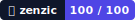

{/* SPDX-FileCopyrightText: 2026 PythonWoods <dev@pythonwoods.dev> */}
{/* SPDX-License-Identifier: Apache-2.0 */}

# Brand Ecosystem

Welcome to the Zenzic Brand Ecosystem. This is not just a style guide; it is the constitution of how Zenzic is presented across open-source communities, CI/CD integrations, and enterprise deployment landscapes.

## Our Posture

Zenzic is an authoritative, silent, and rigorous entity. Our branding reflects the philosophy of the tool itself:

* **Surgical precision:** We prefer exact, technical language over vague marketing buzzwords.
* **Zero noise:** Just like Zenzic returns exit code `0` silently when a test passes, our visual and written communication avoids unnecessary clutter.
* **Deterministic tone:** We don't guess. We prove.

## The Zenzic Lexicon

Consistency is the foundation of quality. When writing about Zenzic across any medium, adhere to the following naming conventions:

* **Zenzic**: The software suite. Always written with a capital Z.
* **`zenzic`**: The CLI command. Always written in lowercase and formatted as code.
* **The Zenzic Shield**: Our security scanning engine. Always capitalized.
* **Reference Integrity Check**: Our flagship deterministic validation algorithm.

*What we are not:* Zenzic is an engine-agnostic quality suite. Never refer to Zenzic as simply a "plugin," a "MkDocs utility," or a "Markdown viewer."

## Visual Identity: The Zenzic Artifact

The historical term *zenzic* refers to the mathematical square of a number ($x^2$). It is fundamentally tied to root systems and dimensional scaling.

Our iconography directly inherits from this heritage. The visual artifact of Zenzic represents a solid root foundation holding complex mathematical structures in balance. It stands for logic dominating chaos across interconnected systems.

When positioning our logos or visual elements in presentations or documentation:

* Give the artifact room to breathe. Do not crowd it.
* Maintain sharp, high-contrast boundaries.
* Avoid skewing, rotating, or applying blur effects that disrupt its mathematical geometry.

## Official Badges

The two static SVG badges are included in the Brand Kit for offline or enterprise deployments
that cannot reach `img.shields.io`:

| Badge | Preview | Use |
|---|---|---|
| Shield |  | Binary gate: passing / failing |
| Score |  | Quality metric: 0–100 |

For dynamic Shields.io variants and CI/CD wiring, see the [Badges guide](../usage/badges.mdx).

## Download

The complete Zenzic brand asset package (SVG + PNG) is attached to every release as `brand-kit.zip`.
Download it from the [GitHub Releases](https://github.com/PythonWoods/zenzic/releases/latest) page.

## Integration Protocols

If you are developing third-party integrations, CI/CD actions, or writing research papers incorporating Zenzic, you are part of our ecosystem.

1. **GitHub Actions & Badges:** Use our official Zenzic badges to demonstrate you are maintaining a 100% Quality Score on your repositories.
2. **Press & Media Coverage:** For inquiries regarding custom art assets, interviews on static analysis architecture, or technical deep-dives, route requests to `brand@pythonwoods.dev`.
3. **Endorsements:** Always ensure that any graphical association accurately implies integration, not exclusive ownership or dependency. Zenzic is and will permanently remain Open Source and universally adaptable.
