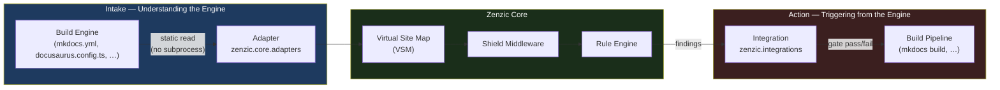

# Adapters vs. Integrations

Zenzic is designed around a clean architectural separation between two concerns: **understanding** your documentation engine and **acting** inside it. This page explains the mental model.

---

## The "Mind and Arm" Model {#mind-and-arm}

| Component | Metaphor | Direction | When it's used |
| :--- | :--- | :--- | :--- |
| **Adapter** | Mind — interprets the engine | Engine → Zenzic | Always, on every `zenzic check` run |
| **Integration** | Arm — triggers Zenzic from the engine | Zenzic → Engine | Optional, when you want automated gates during the build |

**Adapters** (in `zenzic.core.adapters`) are pure-Python components that **read** an engine's config file and translate it into Zenzic's internal model. They never modify the engine; they never run subprocesses. A `MkDocsAdapter` reads `mkdocs.yml` statically — no `mkdocs` binary is ever invoked.

**Integrations** (in `zenzic.integrations`) are optional plugins that **hook into** a build engine's lifecycle and invoke Zenzic checks automatically. The `ZenzicPlugin` for MkDocs is the first implementation. It fires `zenzic check all` as part of the MkDocs build, making it impossible to publish broken documentation.



---

## Adapters in Detail {#adapters}

An adapter implements the `BaseAdapter` protocol. It answers three questions:

1. **What files are navigable?** (`get_nav_paths()`) — Which `.md` / `.mdx` files appear in the site's navigation?
2. **What URL does this file get?** (`get_route_info()`) — Canonical URL, slug override, route base path.
3. **Which patterns does this engine ignore?** (`get_ignored_patterns()`) — Files like `README.md` that some engines skip.

Adapters are discovered via the `zenzic.adapters` entry-point group. You can ship a third-party adapter for any engine without touching the Zenzic core:

```toml
# Your adapter's pyproject.toml
[project.entry-points."zenzic.adapters"]
myengine = "my_package.adapter:MyEngineAdapter"
```

### Built-in Adapters

| Adapter class | Engine | Config file read |
| :--- | :--- | :--- |
| `MkDocsAdapter` | `mkdocs` | `mkdocs.yml` |
| `ZensicalAdapter` | `zensical` | `zensical.toml` |
| `DocusaurusAdapter` | `docusaurus` | `docusaurus.config.js` / `.ts` |
| `VanillaAdapter` | `vanilla` | _(none — every file is reachable)_ |

---

## Integrations in Detail {#integrations}

Integrations live in `zenzic.integrations`. They require the host engine to be installed alongside Zenzic, so they are **opt-in** via a package extra:

```bash
# Core Zenzic — no engine dependency
pip install zenzic

# With MkDocs integration
pip install "zenzic[mkdocs]"
```

### `zenzic.integrations.mkdocs` — The MkDocs Plugin {#mkdocs-plugin}

The MkDocs plugin is registered as a native `mkdocs.plugins` entry point. Add it to your `mkdocs.yml`:

```yaml
plugins:
  - search
  - zenzic          # ← drop-in: no extra config required
```

When `mkdocs build` runs, Zenzic fires `check all` before the first page is rendered. A finding with severity `error` causes the build to fail immediately — you cannot accidentally publish a broken documentation site.

The plugin is discovered automatically by MkDocs via the entry point:

```toml
# Registered in zenzic's pyproject.toml — no user action required
[project.entry-points."mkdocs.plugins"]
zenzic = "zenzic.integrations.mkdocs:ZenzicPlugin"
```

---

## Choosing the Right Model {#choosing}

| Scenario | Recommended approach |
| :--- | :--- |
| CI pipeline (`zenzic check all` in a GitHub Action) | **Adapter only** — no integration needed |
| MkDocs project where you want a build gate | **Adapter + MkDocs Integration** — `pip install "zenzic[mkdocs]"` |
| Custom engine not yet supported | **Write an Adapter** — ship as a separate package, register via `zenzic.adapters` entry-point |
| Trigger Zenzic from a non-MkDocs engine's build hook | **Write an Integration** — open a PR or ship as a separate package in `zenzic.integrations` |

---

## See Also {#see-also}

- [Architecture Reference](../internals/architecture-overview) — Deep dive into the Adapter Protocol and `BaseAdapter` contract.
- [Discovery & Exclusion](../guides/discovery) — How Zenzic discovers files before the Adapter is consulted.
- [Configuration Reference](../guides/configuration-reference) — `[build_context]` engine selection and `zenzic.toml` options.
