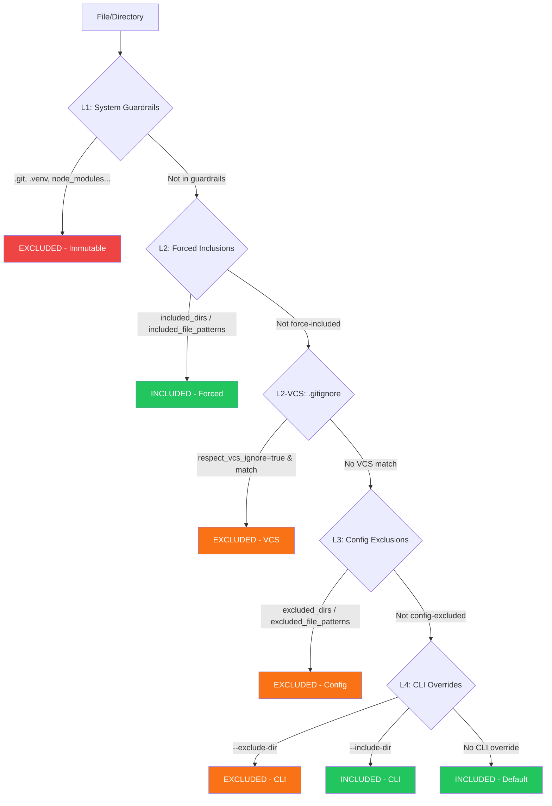

# Discovery & Exclusion

Every Zenzic check -- links, orphans, snippets, placeholders, assets, references -- operates on the same set of files. This guarantee is enforced by a **single entry point** for file discovery and a **4-level exclusion hierarchy** that determines which files and directories are included or excluded from scanning.

---

## Single Entry Point: `iter_markdown_sources` {#iter-markdown-sources}

All modules that need to iterate over documentation source files must call `iter_markdown_sources`. Direct calls to `Path.rglob()` or `os.walk()` from scanner, validator, or Shield code are prohibited by design. This function:

1. Walks the `docs_root` directory using `os.walk()` with **in-place directory pruning** (excluded subtrees are never entered).
2. Yields only `.md` and `.mdx` files, in deterministic sorted order.
3. Skips symbolic links.
4. Delegates all exclusion decisions to the `LayeredExclusionManager`.

```python
# Every module uses the same function
from zenzic.core.discovery import iter_markdown_sources

for md_file in iter_markdown_sources(docs_root, config, exclusion_manager):
    content = md_file.read_text(encoding="utf-8")
    # ... process file
```

The benefit is architectural: when a directory is excluded, it is excluded everywhere -- scanner, validator, Shield, and orphan-checker all see the exact same file set. There is no risk of one module "forgetting" to apply an exclusion rule.

---

## Layered Exclusion Hierarchy {#layered-exclusion}

Zenzic uses a 4-level exclusion model. Each level has a distinct role and a defined precedence. The hierarchy is evaluated top-to-bottom; the **first matching rule wins**.

### The Four Levels {#four-levels}



| Level | Name | Source | Mutable? |
| :---: | :--- | :--- | :---: |
| **L1** | System Guardrails | Hardcoded in `SYSTEM_EXCLUDED_DIRS` | No |
| **L2** | Forced Inclusions + VCS | `included_dirs`, `included_file_patterns`, `.gitignore` | Yes (config) |
| **L3** | Config Exclusions | `excluded_dirs`, `excluded_file_patterns` in `zenzic.toml` or `[tool.zenzic]` in `pyproject.toml` | Yes (config) |
| **L4** | CLI Overrides | `--exclude-dir`, `--include-dir` flags | Yes (per-run) |

### L1 -- System Guardrails {#l1-system-guardrails}

System Guardrails are **immutable**. They are always excluded regardless of any configuration, CLI flag, or forced inclusion. They protect Zenzic from scanning directories that should never contain documentation source files:

```
.git          .github       .venv         node_modules
.nox          .tox          .pytest_cache .mypy_cache
.ruff_cache   __pycache__   .docusaurus   .cache
.hypothesis   .temp
```

System Guardrails cannot be removed or overridden. They are merged into `excluded_dirs` unconditionally during config initialization. Even `included_dirs` cannot override them -- this is the sole exception to the forced-inclusion rule.

### L2 -- Forced Inclusions + VCS {#l2-forced-inclusions-vcs}

Forced inclusions take precedence over all exclusion layers except L1. They serve two purposes:

**Config-level forced inclusions** (`included_dirs`, `included_file_patterns`) re-include files or directories that would otherwise be excluded by VCS patterns or config exclusions:

```toml
# Force-include a build-generated API directory even though
# it is listed in .gitignore
included_dirs = ["generated-api"]

# Force-include a specific generated file pattern
included_file_patterns = ["api.generated.md"]
```

**VCS exclusion** (`.gitignore` patterns) is activated by setting `respect_vcs_ignore = true`. When active, Zenzic reads `.gitignore` files from both the repository root and the docs directory. Files matching VCS ignore patterns are excluded -- but forced inclusions override VCS exclusions.

### L3 -- Config Exclusions {#l3-config-exclusions}

Config-level exclusions from `zenzic.toml` or `pyproject.toml`:

- `excluded_dirs` -- directory names inside `docs/` to skip
- `excluded_file_patterns` -- filename glob patterns to skip

These are additive to L1 but subordinate to L2 forced inclusions.

```toml
excluded_dirs = ["includes", "stylesheets", "overrides", "hooks"]
excluded_file_patterns = ["*.it.md", "CHANGELOG*.md"]
```

### L4 -- CLI Overrides {#l4-cli-overrides}

Per-run overrides via the command line:

```bash
# Exclude an additional directory for this run
zenzic check all --exclude-dir drafts

# Force-include a directory that config would exclude
zenzic check all --include-dir generated-api
```

CLI `--include-dir` cannot override System Guardrails -- attempting to include `.git` or `.venv` via CLI is silently ignored.

---

## Resolution Order {#resolution-order}

### Directory Exclusion (`should_exclude_dir`)

For each directory encountered during the walk:

```
1. Is it in SYSTEM_EXCLUDED_DIRS?      --> EXCLUDED (L1, immutable)
2. Is it in config included_dirs?       --> INCLUDED (L2 forced)
3. Is it in CLI --exclude-dir?          --> EXCLUDED (L4)
4. Is it in CLI --include-dir?          --> INCLUDED (L4)
5. Is it matched by VCS .gitignore?     --> EXCLUDED (L2-VCS, if enabled)
6. Is it in config excluded_dirs?       --> EXCLUDED (L3)
7. Default                              --> INCLUDED
```

### File Exclusion (`should_exclude_file`)

For each file that passes directory filtering:

```
1. Is any parent dir in SYSTEM_EXCLUDED_DIRS?  --> EXCLUDED (L1)
2. Does filename match included_file_patterns? --> INCLUDED (L2 forced)
3. Is any parent dir in config included_dirs?  --> INCLUDED (L2 forced)
4. Is any parent dir in CLI --exclude-dir?     --> EXCLUDED (L4)
5. Is any parent dir in CLI --include-dir?     --> INCLUDED (L4)
6. Is it matched by VCS .gitignore?            --> EXCLUDED (L2-VCS, if enabled)
7. Does filename match excluded_file_patterns? --> EXCLUDED (L3)
8. Is any parent dir in config excluded_dirs?  --> EXCLUDED (L3)
9. Default                                     --> INCLUDED
```

---

## `respect_vcs_ignore` Workflow {#respect-vcs-ignore}

By default, `respect_vcs_ignore` is `false`. Zenzic scans every file under `docs/` that is not excluded by System Guardrails or config/CLI exclusions. This is the **Zero-Config surprise principle**: what you see in the filesystem is what Zenzic scans.

When enabled:

```toml
respect_vcs_ignore = true
```

Zenzic loads `.gitignore` patterns from two locations:

1. **Repository root** `.gitignore` -- typically excludes `site/`, `build/`, `dist/`, etc.
2. **Docs directory** `.gitignore` (if it exists and differs from the repo root) -- may exclude generated or temporary files within `docs/`.

The VCS ignore parser implements the full gitignore specification:

- Last matching rule wins (negation via `!` can re-include)
- Trailing `/` restricts a rule to directories only
- Leading `/` anchors a rule to the base directory
- `*` matches everything except `/`
- `**` matches everything including `/`

### Interaction with Forced Inclusions

Forced inclusions (`included_dirs`, `included_file_patterns`) override VCS exclusions. This supports the common workflow where build-generated documentation is listed in `.gitignore` (because it should not be committed) but should still be linted:

```toml
respect_vcs_ignore = true

# This file is in .gitignore but should be linted
included_file_patterns = ["api.generated.md"]
```

---

## Safe Harbor Philosophy {#safe-harbor}

The Layered Exclusion model implements the **Safe Harbor** principle: Zenzic creates a protected scanning environment where the file set is deterministic, reproducible, and fully controlled by the project maintainer.

The philosophy has three tenets:

1. **Determinism** -- Given the same config and filesystem state, `iter_markdown_sources` yields the exact same files in the exact same order. No randomness, no race conditions, no environment-dependent behaviour.

2. **Safety by default** -- System Guardrails prevent Zenzic from scanning VCS internals, virtual environments, or build caches. These directories could contain thousands of files irrelevant to documentation quality.

3. **Explicit override** -- Every inclusion and exclusion is traceable to a specific configuration line or CLI flag. There are no hidden heuristics or "smart" detection that could surprise a user.

The name references the concept of a safe harbor in admiralty law: a defined boundary within which rules are clear and protection is guaranteed.

---

## Performance Notes {#performance}

- **Directory pruning** is applied during `os.walk()`, not after. Excluded subtrees (e.g. `node_modules/` with thousands of files) are never entered.
- File patterns are **pre-compiled** to `re.Pattern` at `LayeredExclusionManager` construction time using `fnmatch.translate()`.
- VCS patterns with no negation rules use a **combined regex** fast path -- all positive rules are merged into a single compiled regex for O(1) matching per path.
- The `LayeredExclusionManager` is constructed **once** per CLI invocation and passed by reference through the entire pipeline.
