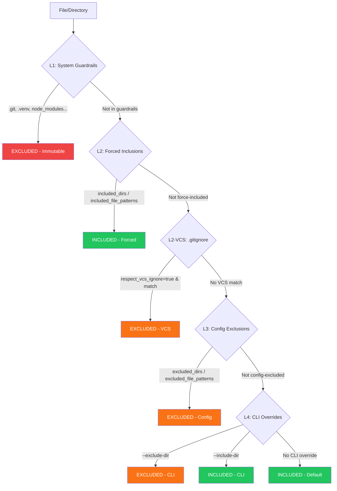

# Discovery & Exclusion

Every Zenzic check -- links, orphans, snippets, placeholders, assets, references -- operates on the same set of files. This guarantee is enforced by a **single entry point** for file discovery and a **4-level exclusion hierarchy** that determines which files and directories are included or excluded from scanning.

---

## The Authority of Root {#root-authority}

Before Zenzic can discover, exclude, or scan a single file, it must answer one question:
**where does this project begin?**

Zenzic is a workspace-scoped tool. It does not analyse arbitrary directories; it analyses
**defined projects**. To establish the project boundary, Zenzic performs an **upward traversal**
from the target path, searching for a recognised root marker.

### Root Markers {#root-markers}

Two markers are authorised (first match wins):

| Marker | Description |
| :--- | :--- |
| `.git/` | Universal VCS marker — present in any Git-tracked repository |
| `.zenzic.toml` | Zenzic's own configuration file — the explicit governance contract |

Both are intentionally engine-neutral: `mkdocs.yml`, `docusaurus.config.ts`, and similar
build-engine files are not root markers. The Core must remain independent of any specific
documentation framework.

### Why a Root Marker is Mandatory {#why-mandatory}

Without a root marker (VCS or configuration), Zenzic cannot establish the project's **Sovereignty Perimeter**. This is required for four independent reasons:

- **Resolve relative paths** — every finding is expressed as a path relative to the root. Without a fixed anchor, file locations are ambiguous and non-reproducible across machines.
- **Map the workspace into the VSM** — Zenzic always builds a Virtual Site Map, regardless of adapter. In engine mode (Docusaurus, MkDocs), the VSM includes ghost routes, slug transformations, and virtual pages. In Standalone Mode, the VSM is a 1:1 projection of the filesystem. In both cases, the root defines the zero-point for canonicalising every internal reference — so that `index.md` at the root is unambiguously distinct from `index.md` in a subdirectory.
- **Apply `directory_policies`** — governance contracts match paths via glob patterns relative to the workspace root. Without a defined root, exemption rules are non-deterministic and cannot be applied consistently.
- **Prevent Massive Indexing** — without an explicit boundary, the engine could accidentally scan the entire host filesystem, producing incoherent results and risking information leakage.

The absence of a root marker produces this error:

```text
ERROR: Could not locate repo root: no .git directory or .zenzic.toml found in any
ancestor of /path/to/target. Run Zenzic from inside the repository.
```

This is not a configuration error. It is a **safety guarantee**: the Quality Gate halts
an out-of-bounds scan before it begins.

### Resolution Options {#root-resolution}

To allow Zenzic to analyse a directory, satisfy one of the following:

**Option A — Initialise Zenzic** (creates a `.zenzic.toml` root marker):

```bash
cd /path/to/target
zenzic init
```

**Option B — Initialise a Git repository** (creates a `.git/` root marker):

```bash
cd /path/to/target
git init
```

**Option C — Run from inside an existing project** (the upward traversal will find the marker automatically):

```bash
# From anywhere inside a project that already has .git/ or .zenzic.toml
zenzic check all
```

---

## Single Entry Point: `iter_markdown_sources` {#iter-markdown-sources}

All modules that need to iterate over documentation source files must call `iter_markdown_sources`. Direct calls to `Path.rglob()`, `os.walk()`, or `Path.iterdir()` from scanner, validator, or credential scanner are prohibited by design. This function:

1. Walks the `docs_root` directory using `os.walk()` with **in-place directory pruning** (excluded subtrees are never entered).
2. Yields only `.md` and `.mdx` files, in deterministic sorted order.
3. Skips symbolic links.
4. Delegates all exclusion decisions to the `LayeredExclusionManager`.

The benefit is architectural: when a directory is excluded, it is excluded everywhere -- scanner, validator, credential scanner, and orphan-checker all see the exact same file set. There is no risk of one module "forgetting" to apply an exclusion rule.

The function takes three arguments:

1. `docs_root` -- absolute path to the documentation root.
2. `config` -- loaded Zenzic configuration (provides `excluded_dirs`).
3. `exclusion_manager` -- the `LayeredExclusionManager` used for the full 4-level evaluation.

---

## Layered Exclusion Hierarchy {#layered-exclusion}

Zenzic uses a 4-level exclusion model. Each level has a distinct role and a defined precedence. The hierarchy is evaluated top-to-bottom; the **first matching rule wins**.

### The Four Levels {#four-levels}


```mermaid
flowchart TD
    FILE[File/Directory] --> L1{L1: System Guardrails}
    L1 -->|".git, .venv, node_modules..."| EXCLUDED_L1[EXCLUDED - Immutable]
    L1 -->|Not in guardrails| L2{L2: Forced Inclusions}
    L2 -->|"included_dirs / included_file_patterns"| INCLUDED_L2[INCLUDED - Forced]
    L2 -->|Not force-included| L2VCS{L2-VCS: .gitignore}
    L2VCS -->|"respect_vcs_ignore=true & match"| EXCLUDED_VCS[EXCLUDED - VCS]
    L2VCS -->|No VCS match| L3{L3: Config Exclusions}
    L3 -->|"excluded_dirs / excluded_file_patterns"| EXCLUDED_L3[EXCLUDED - Config]
    L3 -->|Not config-excluded| L4{L4: CLI Overrides}
    L4 -->|"--exclude-dir"| EXCLUDED_L4[EXCLUDED - CLI]
    L4 -->|"--include-dir"| INCLUDED_L4[INCLUDED - CLI]
    L4 -->|No CLI override| INCLUDED[INCLUDED - Default]

    style EXCLUDED_L1 fill:#ef4444,color:#fff
    style EXCLUDED_VCS fill:#f97316,color:#fff
    style EXCLUDED_L3 fill:#f97316,color:#fff
    style EXCLUDED_L4 fill:#f97316,color:#fff
    style INCLUDED_L2 fill:#22c55e,color:#fff
    style INCLUDED_L4 fill:#22c55e,color:#fff
    style INCLUDED fill:#22c55e,color:#fff
```

| Level | Name | Source | Mutable? |
| :---: | :--- | :--- | :---: |
| **L1** | System Guardrails | Hardcoded in `SYSTEM_EXCLUDED_DIRS` | No |
| **L2** | Forced Inclusions + VCS | `included_dirs`, `included_file_patterns`, `.gitignore` | Yes (config) |
| **L3** | Config Exclusions | `excluded_dirs`, `excluded_file_patterns` in `.zenzic.toml` or `[tool.zenzic]` in `pyproject.toml` | Yes (config) |
| **L4** | CLI Overrides | `--exclude-dir`, `--include-dir` flags | Yes (per-run) |

### L1 -- System Guardrails {#l1-system-guardrails}

System Guardrails are **immutable**. They are always excluded regardless of any configuration, CLI flag, or forced inclusion. They protect Zenzic from scanning directories that should never contain documentation source files:

```text
.git          .github       .venv         node_modules
.nox          .tox          .pytest_cache .mypy_cache
.ruff_cache   __pycache__   .docusaurus   .cache
.hypothesis   .temp
```

System Guardrails cannot be removed or overridden. They are merged into `excluded_dirs` unconditionally during config initialization. Even `included_dirs` cannot override them -- this is the sole exception to the forced-inclusion rule.

### L2 -- Forced Inclusions + VCS {#l2-forced-inclusions-vcs}

Forced inclusions take precedence over all exclusion layers except L1. They serve two purposes:

**Config-level forced inclusions** (`included_dirs`, `included_file_patterns`) re-include files or directories that would otherwise be excluded by VCS patterns or config exclusions:

```toml
# Force-include a build-generated API directory even though
# it is listed in .gitignore
included_dirs = ["generated-api"]

# Force-include a specific generated file pattern
included_file_patterns = ["api.generated.md"]
```

**VCS exclusion** (`.gitignore` patterns) is activated by setting `respect_vcs_ignore = true`. When active, Zenzic reads `.gitignore` files from both the repository root and the docs directory. Files matching VCS ignore patterns are excluded -- but forced inclusions override VCS exclusions.

### L3 -- Config Exclusions {#l3-config-exclusions}

Config-level exclusions from `.zenzic.toml` or `pyproject.toml`:

- `excluded_dirs` -- directory names inside `docs/` to skip
- `excluded_file_patterns` -- filename glob patterns to skip

These are additive to L1 but subordinate to L2 forced inclusions.

```toml
excluded_dirs = ["includes", "stylesheets", "overrides", "hooks"]
excluded_file_patterns = ["*.it.md", "CHANGELOG*.md"]
```

### L4 -- CLI Overrides {#l4-cli-overrides}

Per-run overrides via the command line:

```bash
# Exclude an additional directory for this run
zenzic check all --exclude-dir drafts

# Force-include a directory that config would exclude
zenzic check all --include-dir generated-api
```

CLI `--include-dir` cannot override System Guardrails -- attempting to include `.git` or `.venv` via CLI is silently ignored.


---

## `respect_vcs_ignore` Workflow {#respect-vcs-ignore}

By default, `respect_vcs_ignore` is `false`. Zenzic scans every file under `docs/` that is not excluded by System Guardrails or config/CLI exclusions. This is the **Zero-Config surprise principle**: what you see in the filesystem is what Zenzic scans.

When enabled:

```toml
respect_vcs_ignore = true
```

Zenzic loads `.gitignore` patterns from two locations:

1. **Repository root** `.gitignore` -- typically excludes `site/`, `build/`, `dist/`, etc.
2. **Docs directory** `.gitignore` (if it exists and differs from the repo root) -- may exclude generated or temporary files within `docs/`.

The VCS ignore parser implements the full gitignore specification, including negation (`!`), path anchoring, and glob wildcards.

### Interaction with Forced Inclusions

Forced inclusions (`included_dirs`, `included_file_patterns`) override VCS exclusions. This supports the common workflow where build-generated documentation is listed in `.gitignore` (because it should not be committed) but should still be linted:

```toml
respect_vcs_ignore = true

# This file is in .gitignore but should be linted
included_file_patterns = ["api.generated.md"]
```

---

## Exclusion Zone Philosophy {#privacy-gate}

The Layered Exclusion model implements the **Exclusion Zone** principle: Zenzic creates a protected scanning environment where the file set is deterministic, reproducible, and fully controlled by the project maintainer.

The philosophy has three tenets:

1. **Determinism** -- Given the same config and filesystem state, `iter_markdown_sources` yields the exact same files in the exact same order. No randomness, no race conditions, no environment-dependent behaviour.

2. **Safety by default** -- System Guardrails prevent Zenzic from scanning VCS internals, virtual environments, or build caches. These directories could contain thousands of files irrelevant to documentation quality.

3. **Explicit override** -- Every inclusion and exclusion is traceable to a specific configuration line or CLI flag. There are no hidden heuristics or "smart" detection that could surprise a user.

The Privacy Gate (Exclusion Zone) defines a strict boundary where Zenzic's scanners are intentionally inhibited to protect sensitive metadata or intentional security-testing patterns.

---

## Performance Notes {#performance}

- **Directory pruning** is applied during `os.walk()`, not after. Excluded subtrees (e.g. `node_modules/` with thousands of files) are never entered.
- For non-Markdown files, `walk_files()` uses the same `os.walk()` engine with in-place pruning. Unlike `Path.rglob("*")`, it never enters excluded trees.
- File patterns are **pre-compiled** to `re.Pattern` at `LayeredExclusionManager` construction time using `fnmatch.translate()`.
- VCS patterns with no negation rules use a **combined regex** fast path -- all positive rules are merged into a single compiled regex for O(1) matching per path.
- The `LayeredExclusionManager` is constructed **once** per CLI invocation and passed by reference through the entire pipeline.
- A separate hard-prune set is used by `find_unused_assets` for `excluded_asset_dirs`.

---

## Multi-Root Discovery {#multi-root}

`docs_dir` is the canonical source root, but modern static-site generators routinely manage **content trees that live outside `docs/`**. The textbook case is the Docusaurus `blog/` directory: it is materialised as live URLs at build time, yet a pre-current series Zenzic scan would never see the files inside it. The Virtual Site Map ingested only files under `docs_root`, so broken links inside (or pointing to) blog posts slipped past `zenzic check all` and only surfaced when `docusaurus build` failed downstream. We call this failure mode **VSM Blindness**.

Multi-Root Discovery cures the blindness by letting the active adapter declare additional content roots — each carrying a physical path, a URL prefix, and a diagnostic label. When extra content roots are declared, all pipeline stages treat those files as first-class content alongside the primary `docs/` tree.

### Auto-discovery without `subprocess` {#auto-discovery}

Adapter implementations honour the **Zero Subprocess** invariant. The Docusaurus adapter detects the blog plugin in two passes, both pure parsing:

1. Static regex parse of `docusaurus.config.{ts,js,mjs,cjs}` for a `blog: { path, routeBasePath }` block (or a `blog: false` flag to opt out).
2. Convention fallback: when the config does not pin the blog plugin and `<repo>/blog` exists on disk, assume the default plugin layout (`path = 'blog'`, `routeBasePath = 'blog'`).

No Node.js process is ever spawned -- the config is read as **data**, not executed as code. Pillar 2 (Engine Sovereignty) is preserved.

### Traceability invariant {#traceability}

Every entry in the VSM, including those produced by an extra content root, carries a `Route.source` that resolves back to a real file on disk. A route with no physical origin would be a validator screaming `error` without ever saying `where`.

### Reverse-Mapping Invariant & Virtual Routes {#reverse-mapping}

Multi-Root Discovery (current series) solved **VSM Blindness** for physical files outside
`docs/`. current series extends the guarantee to **engine-generated pages**: Docusaurus renders
URLs — tag pages, paginated indexes, author profiles — that have no physical Markdown
counterpart. These routes exist only in the build output, never on disk.

The invariant guarantees that every engine-generated URL traces back to at least one source file. Adapters opt in by implementing the optional `get_virtual_routes()` method; virtual routes participate in collision detection on equal footing with physical routes.

### Engine support matrix {#engine-support}

| Engine          | Implements `get_extra_content_roots` | Status                                                                |
|-----------------|--------------------------------------|------------------------------------------------------------------------|
| Docusaurus      | Yes                                  | Auto-discovers `blog/` from config or convention.                      |
| MkDocs (Material) | No                                  | Opt-in deferred until `material/blog` plugin becomes available.   |
| Zensical        | No                                   | Architecture is identical -- enabled when an out-of-tree plugin ships. |
| Standalone      | No                                   | No plugins; `docs_root` is the entire content surface.                 |

### Exporting the site map: `inspect routes` {#inspect-routes}

current series ships a first-class CLI command that exposes the VSM to external consumers:

```shell
zenzic inspect routes --json
```

This feature exports the complete site map in a deterministic JSON format. It is
designed to be consumed by external tools: custom Bash scripts, CI/CD dashboards, or
specialized tools that require architectural context.

Every record in the JSON output carries four fields: `url`, `kind` (`physical` or
`virtual`), `source_files` (a sorted array of repo-relative paths that *cause* the
URL to exist), and a `digest` — a SHA-256 fingerprint derived from the URL and its
source files. The `--kind` flag narrows output to `physical`, `virtual`, or `all`
(default). JSON is written exclusively to `stdout`; diagnostics go to `stderr`.
