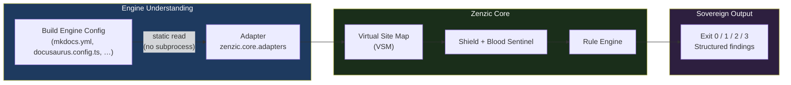

# The Adapter Model

Zenzic operates as a **sovereign external auditor**. It never embeds itself inside a build engine,
never spawns subprocesses, and never requires engine-specific installation extras.
One binary. Every engine. Full protection.

---

## Adapters — The Intelligence Layer {#adapters}

An **Adapter** (in `zenzic.core.adapters`) is a pure-Python component that **reads** a build
engine's configuration file and translates it into Zenzic's internal model. Adapters answer
three questions:

1. **What files are navigable?** (`get_nav_paths()`) — Which `.md` / `.mdx` files appear in the site's navigation?
2. **What URL does this file get?** (`get_route_info()`) — Canonical URL, slug override, route base path.
3. **Which patterns does this engine ignore?** (`get_ignored_patterns()`) — Files like `README.md` that some engines skip.



Adapters are **stateless and subprocess-free**. A `MkDocsAdapter` reads `mkdocs.yml` statically
— no `mkdocs` binary is ever invoked. The same run that analyses a MkDocs project can, with
a different adapter, analyse a Docusaurus or Zensical project using an identical code path.

---

## Built-in Adapters {#built-in-adapters}

| Adapter class | Engine | Config file read |
| :--- | :--- | :--- |
| `MkDocsAdapter` | `mkdocs` | `mkdocs.yml` |
| `ZensicalAdapter` | `zensical` | `zensical.toml` |
| `DocusaurusAdapter` | `docusaurus` | `docusaurus.config.js` / `.ts` |
| `StandaloneAdapter` | `standalone` | _(none — every file is reachable)_ |

Adapters are discovered via the `zenzic.adapters` entry-point group. Ship a third-party
adapter for any engine without touching the Zenzic core:

```toml
# Your adapter's pyproject.toml
[project.entry-points."zenzic.adapters"]
myengine = "my_package.adapter:MyEngineAdapter"
```

---

## Sovereign CLI Strategy {#sovereign-cli}

Zenzic v0.7.0 does not provide build-engine plugins or internal integrations.
This is a deliberate architectural decision, not a missing feature.

### Why no engine plugins?

| Concern | Engine plugin | Sovereign CLI |
| :--- | :--- | :--- |
| Credential scanning (Shield) | ❌ Structurally absent — hooks fire too late | ✅ Full ZRT-006/007 hardening |
| Path traversal (Blood Sentinel) | ❌ Engine controls path resolution | ✅ Every link normalised by Zenzic |
| Link validation | ❌ Engine's own resolver — not VSM | ✅ O(1) VSM with SHA256 cache |
| Engine parity | ❌ MkDocs plugin ≠ Docusaurus plugin | ✅ Single code path for all engines |
| Dependency isolation | ❌ Requires `pip install zenzic[engine]` | ✅ `pip install zenzic` — done |

A plugin that lives inside a build engine cannot enforce the same guarantees as an
external auditor. The Shield, Blood Sentinel, and VSM were designed for sovereign execution.
Embedding them inside a build hook would degrade them to best-effort checks.

### The recommended workflow

```bash
# Install — one package, no extras
pip install zenzic

# Detect engine from config files, write zenzic.toml
zenzic init

# Full audit — VSM + Shield + Blood Sentinel + link validation
zenzic check all

# In CI (GitHub Actions, GitLab CI, etc.)
# Add as a step before or after your build, not inside it
zenzic check all --strict
```

Zenzic runs **before or after** the build — never inside it. This gives you:
- Exit 2 on any leaked credential (Shell stops immediately)
- Exit 3 on any path-traversal link (cannot be suppressed)
- Engine-agnostic results: the same `zenzic check all` command works for every engine

---

## Choosing the Right Model {#choosing}

| Scenario | Recommended approach |
| :--- | :--- |
| CI pipeline for any engine | `zenzic check all` — add a step, no plugin needed |
| Pre-commit credential gate | `zenzic check references` — registers as a pre-commit hook |
| Custom engine not yet supported | **Write an Adapter** — ship as a separate package, register via `zenzic.adapters` entry-point |
| Migrate from MkDocs to Docusaurus | Use `zenzic check all` with `engine = "mkdocs"` on the source, `engine = "docusaurus"` on the target |

---

## See Also {#see-also}

- [Architecture Reference](./architecture) — Deep dive into the Adapter Protocol and `BaseAdapter` contract.
- [Discovery & Exclusion](./discovery) — How Zenzic discovers files before the Adapter is consulted.
- [Configuration Reference](../reference/configuration-reference) — `[build_context]` engine selection and `zenzic.toml` options.
