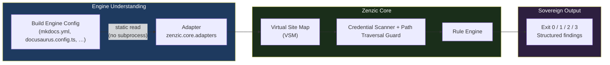

# The Zenzic Ecosystem

## The Ecosystem at a Glance {#ecosystem-at-a-glance}

| Component | Role |
| :--- | :--- |
| **Zenzic Core** | The pure, agnostic, Zero-Config linter. One binary. Every documentation engine. |
| **Zenzic-Doc** | The living test bench — a self-validating Docusaurus site that dogfoods every Zenzic release. |

Each component is independently installable and has no hard dependency on the others.

---

Zenzic operates as a **sovereign external auditor**. It never embeds itself inside a build engine,
never spawns subprocesses, and never requires engine-specific installation extras.
One binary. Every engine. Full protection.

---

## Adapters — The Intelligence Layer {#adapters}

An **Adapter** (in `zenzic.core.adapters`) is a pure-Python component that **reads** a build
engine's configuration file and translates it into Zenzic's internal model. Adapters answer
three questions:

1. **What files are navigable?** (`get_nav_paths()`) — Which `.md` / `.mdx` files appear in the site's navigation?
2. **What URL does this file get?** (`get_route_info()`) — Canonical URL, slug override, route base path.
3. **Which patterns does this engine ignore?** (`get_ignored_patterns()`) — Files like `README.md` that some engines skip.


```mermaid
flowchart LR
    subgraph INTAKE ["Engine Understanding"]
        direction TB
        ENG["Build Engine Config\n(mkdocs.yml, docusaurus.config.ts, …)"]
        ADP["Adapter\nzenzic.core.adapters"]
        ENG -->|"static read\n(no subprocess)"| ADP
    end

    subgraph CORE ["Zenzic Core"]
        direction TB
        VSM["Virtual Site Map\n(VSM)"]
        CREDENTIALS["Credential Scanner + Path Traversal Guard"]
        RULES["Rule Engine"]
        ADP --> VSM
        VSM --> CREDENTIALS
        CREDENTIALS --> RULES
    end

    subgraph OUT ["Sovereign Output"]
        EXIT["Exit 0 / 1 / 2 / 3\nStructured findings"]
        RULES --> EXIT
    end

    style INTAKE fill:#1e3a5f,color:#fff
    style CORE fill:#1a2e1a,color:#fff
    style OUT fill:#2d1f3f,color:#fff
```

Adapters are **stateless and subprocess-free**. A `MkDocsAdapter` reads `mkdocs.yml` statically
— no `mkdocs` binary is ever invoked. The same run that analyses a MkDocs project can, with
a different adapter, analyse a Docusaurus or Zensical project using an identical code path.

---

## Built-in Adapters {#built-in-adapters}

| Adapter class | Engine | Config file read |
| :--- | :--- | :--- |
| `MkDocsAdapter` | `mkdocs` | `mkdocs.yml` |
| `ZensicalAdapter` | `zensical` | `zensical.toml` |
| `DocusaurusAdapter` | `docusaurus` | `docusaurus.config.js` / `.ts` |
| `StandaloneAdapter` | `standalone` | *(none — every file is reachable)* |

Adapters are discovered via the `zenzic.adapters` entry-point group. Ship a third-party
adapter for any engine without touching the Zenzic core:

```toml
# Your adapter's pyproject.toml
[project.entry-points."zenzic.adapters"]
myengine = "my_package.adapter:MyEngineAdapter"
```

---

## Sovereign CLI Strategy {#sovereign-cli}

Zenzic does not provide build-engine plugins or internal integrations.
This is a deliberate architectural decision, not a missing feature.

### Why no engine plugins

| Concern | Engine plugin | Sovereign CLI |
| :--- | :--- | :--- |
| Credential scanning (credential scanner) | ❌ Structurally absent — hooks fire too late | ✅ Full ZRT-006/007 hardening |
| Path traversal (path traversal guard) | ❌ Engine controls path resolution | ✅ Every link normalised by Zenzic |
| Link validation | ❌ Engine's own resolver — not VSM | ✅ O(1) VSM with SHA256 cache |
| Engine parity | ❌ MkDocs plugin ≠ Docusaurus plugin | ✅ Single code path for all engines |
| Dependency isolation | ❌ Requires `pip install zenzic[engine]` | ✅ `pip install zenzic` — done |

A plugin that lives inside a build engine cannot enforce the same guarantees as an
external auditor. The credential scanner, path traversal guard, and VSM were designed for sovereign execution.
Embedding them inside a build hook would degrade them to best-effort checks.

### The recommended workflow

```bash
# Install — one package, no extras
pip install zenzic

# Detect engine from config files, write zenzic.toml
zenzic init

# Full audit -- VSM + credential scanner + path traversal guard + link validation
zenzic check all

# In CI (GitHub Actions, GitLab CI, etc.)
# Add as a step before or after your build, not inside it
zenzic check all --strict
```

Zenzic runs **before or after** the build — never inside it. This gives you:

- Exit 2 on any leaked credential (Shell stops immediately)
- Exit 3 on any path-traversal link (cannot be suppressed)
- Engine-agnostic results: the same `zenzic check all` command works for every engine

---

## zenzic-doc — Living Test Bench {#living-test-bench}

The Zenzic documentation site (`zenzic-doc`) is not a passive artifact — it is an active
participant in the quality pipeline. Every commit runs `zenzic check all --strict` against
itself before it can be pushed (Sovereign Parity, ZRT-010).

Beyond the standard Zenzic audit, `zenzic-doc` enforces a second invariant unique to its
role as documentation for a linter: every Zxxx finding code present in `docs/` must have a
registered entry in `src/zenzic/core/codes.py` in the Core package — and vice versa. This
bidirectional parity is enforced by the `verify-codes-parity` Nox session via **Graceful
Degradation**:

- **Core Maintainer**: `ZENZIC_PROJECT_PATH` set → `uv run --project <path>` against local source.
- **External Contributor**: local core absent → `uv run --with zenzic` against the published PyPI release.

Running `just verify` in `zenzic-doc` executes all four gates in sequence. External contributors
need no local checkout of Zenzic Core.

---

## The 4-Gates Standard {#4-gates-standard}

Every repository in the Zenzic ecosystem enforces quality at four progressive checkpoints:

| Gate | Trigger | Tool | What it catches |
| :--- | :--- | :--- | :--- |
| **Gate 1 — IDE** | Real-time, on save | Editor extensions (Pylance, ESLint) | Type errors, syntax issues |
| **Gate 2 — Pre-commit** | `git commit` | `pre-commit` hooks | Lint, credentials, formatting, REUSE |
| **Gate 3 — Pre-push** | `git push` | `just verify` (via `pre-commit -t pre-push`) | Full validation suite identical to CI |
| **Gate 4 — Remote CI** | Pull Request / push | GitHub Actions | Identical `just verify` on a clean Ubuntu runner |

Gates 3 and 4 execute the **same command** (`just verify`) — local and remote are never
allowed to drift. This is the Sovereign Parity principle (ZRT-010).

> For operational setup (installing hooks, workflow YAML), see the
> [CI/CD Integration guide](../how-to/configure-ci-cd#doc-code-parity).

---

## Choosing the Right Model {#choosing}

| Scenario | Recommended approach |
| :--- | :--- |
| CI pipeline for any engine | `zenzic check all` — add a step, no plugin needed |
| Pre-commit credential gate | `zenzic check references` — registers as a pre-commit hook |
| Custom engine not yet supported | **Write an Adapter** — ship as a separate package, register via `zenzic.adapters` entry-point |
| Migrate from MkDocs to Docusaurus | Use `zenzic check all` with `engine = "mkdocs"` on the source, `engine = "docusaurus"` on the target |

---

## Brand Integrity {#brand-integrity}

The Exclusion Zone model extends beyond structural correctness. A codebase or documentation suite that contains stale brand identifiers carries a different kind of debt: **narrative debt**. A page that still refers to a release codename contradicts the version history it is trying to document.

Zenzic addresses this through the [`[governance]`](../reference/configuration.mdx) configuration block and the [Z601 BRAND_OBSOLESCENCE](../reference/finding-codes.mdx#z601) finding:

```toml title="zenzic.toml"
[governance]
brand_obsolescence = ["Obsidian"]
```

Zenzic uses **format-aware, per-line suppression** for intentional historical references. In ``.md`` files, append `<!-- zenzic:ignore Z601 -->` to the line. In ``.mdx`` files, append `{/* zenzic:ignore Z601 */}` — a JSX comment invisible to the Docusaurus/React parser. Both forms are silently skipped by the scanner. The distinction between *historical citation* and *forgotten update* is enforced at the line level, not the file level.

---

## See Also {#see-also}

- [Architecture Reference](./architecture) — Deep dive into the Adapter Protocol and `BaseAdapter` contract.
- [Discovery & Exclusion](./discovery) — How Zenzic discovers files before the Adapter is consulted.
- [Configuration Reference](../reference/configuration-reference) — `[build_context]` engine selection and `zenzic.toml` options.
