{/* SPDX-FileCopyrightText: 2026 PythonWoods <dev@pythonwoods.dev> */}
{/* SPDX-License-Identifier: Apache-2.0 */}

# Philosophy

## Documentation is infrastructure

Source code has compilers, type checkers, and linters that prevent broken code from reaching
production. Documentation has historically had none of these. A broken link, a leaked credential,
or a stub page that was never completed can ship to users without any automated gate catching it.

Zenzic exists to close that gap. Documentation health should be measurable, deterministic, and
rigorously enforced — caught with the same mathematical certainty as a type error in source code.

---

## The three pillars {#three-pillars}

Every design decision in Zenzic follows three rules. When in doubt about an
implementation choice, these are the tie-breakers. If a line of code violates
any of these pillars, it is **instant technical debt**.

**1. Lint the source, not the build.**
Zenzic analyses raw Markdown files under `docs/` and configuration files
(`mkdocs.yml`, `docusaurus.config.ts`, `zensical.toml`). It never waits for
an HTML build. Analysis at the source level is faster, generator-agnostic,
and always reproducible. Where a build engine defines resolution semantics
(e.g. i18n fallback), Zenzic reads the configuration as plain text and
emulates the semantics — without importing or executing the engine.

**2. No subprocesses in the core engine.**
The core library is 100% pure Python. It never calls `subprocess.run` or
`os.system` to invoke external tools. This guarantees security (zero
execution of untrusted code), total portability, and extreme speed. Link
validation is implemented natively with a Markdown link extractor. Zenzic is
self-contained and testable without installing any documentation generator.

**3. Pure functions first.**
All validation logic lives in pure functions: no file I/O, no network access,
no terminal output. I/O happens only at the edges — in CLI wrappers that read
files from disk. Pure functions are trivially testable and can be composed
freely. This is why Zenzic supports parallelism without race conditions.

---

## The Safe Harbor principle

The documentation tooling ecosystem is not stable. MkDocs introduces breaking changes. New build
systems emerge. Teams migrate from one generator to another. In this environment, a quality tool
that is tightly coupled to a specific build engine creates a dangerous dependency: when the engine
changes, the quality gate breaks, and projects are left without verification during the exact
window when mistakes are most likely.

Zenzic is designed to be a **Safe Harbor** — a fixed, stable point that remains valid before,
during, and after a build engine migration. This is not a coincidental feature; it is the core
architectural commitment.

The implementation of this commitment is **absolute engine-agnosticism**:

- Zenzic reads raw Markdown files and configuration as plain data. It never imports or executes a
  documentation framework.
- Engine-specific knowledge (nav structure, i18n conventions, locale fallback rules) is
  encapsulated in **adapters** — thin, replaceable components that translate engine semantics into
  a neutral protocol. The Core never sees a `MkDocsAdapter` or `ZensicalAdapter` — it sees only
  a `BaseAdapter` that answers five questions.
- Third-party adapters install as Python packages and are discovered at runtime via entry-points.
  Adding support for a new engine (Hugo, Docusaurus, Sphinx) requires no Zenzic release.

The practical consequence: a project migrating from MkDocs to Zensical — or to Hugo, Docusaurus,
or any future generator — can run `zenzic check all` continuously against both configurations
simultaneously. A project that has not yet decided on a build engine can still validate its
documentation quality today, using Vanilla mode with zero configuration.

Documentation ecosystems evolve constantly — build engines introduce breaking changes,
configuration formats shift, plugin APIs are redesigned. Zenzic's position is intentionally
conservative and user-protective:

- Every supported engine receives the same level of validation fidelity.
- Existing configuration files are validated as source contracts, not as runtime promises.
- Unknown or future configuration keys are treated with tolerant parsing, not hard failures.

In practice, this means a team can defer migration decisions without losing quality gates.
Zenzic keeps the verification layer alive while the ecosystem around it evolves.

---

## The frictionless sentinel

A linter is only as good as its false-positive rate. When tools blindly raise errors, developers
learn to ignore them — and a tool that is ignored provides no safety.

Zenzic's architecture is designed around a single constraint: **every finding must be
actionable**. This shapes several decisions:

- **In-memory multi-pass algorithms.** The Two-Pass Reference Pipeline separates definition
  harvesting from usage checking, eliminating the false positives caused by forward references
  that a naive single-pass scanner would produce.
- **i18n fallback awareness.** A link from a translated page to a default-locale asset is not a
  broken link — the build engine will serve the fallback at runtime. Zenzic suppresses it.
- **Vanilla mode for nav-agnostic projects.** When Zenzic has no nav declaration to compare
  against, it skips the orphan check entirely rather than flagging every file as an orphan.

The goal is a tool that is **utterly silent when your documentation is sound**, and surgically
precise when it is not.

---

## The validation pipeline {#validation-pipeline}

Every Zenzic run follows the same four-stage pipeline, regardless of the
documentation engine:

```mermaid
flowchart LR
    classDef source  fill:#0f172a,stroke:#38bdf8,stroke-width:2px,color:#e2e8f0
    classDef shield  fill:#0f172a,stroke:#ef4444,stroke-width:2px,color:#e2e8f0
    classDef adapter fill:#0f172a,stroke:#7c3aed,stroke-width:2px,color:#e2e8f0
    classDef vsm     fill:#0f172a,stroke:#f59e0b,stroke-width:2px,color:#e2e8f0
    classDef engine  fill:#0f172a,stroke:#10b981,stroke-width:2px,color:#e2e8f0
    classDef output  fill:#0f172a,stroke:#dc2626,stroke-width:2px,color:#e2e8f0

    S["📄 Source\n.md / .mdx files\nzenzic.toml"]:::source
    SH["🛡️ Shield IO\nsafe_read_line()\nShieldViolation → Exit 2"]:::shield
    M["📦 Metadata\nbuild_metadata_cache()\nFileMetadata\n(slug · draft · tags)"]:::adapter
    A["🔌 Adapter\nget_route_info()\nRouteMetadata\n(URL · status · proxy)"]:::adapter
    V["🗺️ Virtual Site Map\nURL → Route\n(status · anchors)"]:::vsm
    R["⚙️ Rule Engine\nBuilt-in checks\nCustom Rules DSL\nPlugin rules"]:::engine
    F["📋 Findings\nIntegrityReport\nRuleFindings\nExit code"]:::output

    S -->|"read files"| SH
    SH -->|"clean lines"| M
    M -->|"FileMetadata"| A
    S -->|"get_adapter()"| A
    A -->|"RouteMetadata"| V
    V -->|"routing state\nGhost Routes\nanchor index"| R
    S -->|"raw Markdown text"| R
    R --> F
```

**Source** — Zenzic reads raw `.md`/`.mdx` files and `zenzic.toml` directly
from disk. No HTML build required.

**Shield IO** — Every frontmatter line passes through `safe_read_line()`
before any parser sees it. If a credential pattern matches (OpenAI key,
GitHub token, AWS key, etc.), Zenzic raises `ShieldViolation` and aborts
with Exit 2 — the line is never stored or parsed. This makes the Shield an
IO middleware: it sits between disk reads and metadata extraction.

**Metadata** — `build_metadata_cache()` performs single-pass eager harvesting
of YAML frontmatter across all Markdown files, producing a `FileMetadata`
per file (slug, draft, unlisted, tags). This data feeds both the Adapter
and the VSM without re-reading any file.

**Adapter** — selected by `build_context.engine` (or `--engine`). Translates
engine-specific knowledge into engine-agnostic `RouteMetadata` (canonical URL,
status, slug, route base path, proxy flag) via the `get_route_info()` API.
Four built-in adapters ship with Zenzic; third-party adapters install via
`pip` and are discovered through the `zenzic.adapters` entry-point group.
Legacy adapters that only implement `map_url()` + `classify_route()` are
supported via automatic fallback in `build_vsm()`.

**Rule Engine** — applies all active checks to the raw Markdown text:
built-in checks (orphans, snippets, placeholders, assets, references),
project-specific `[[custom_rules]]` from `zenzic.toml`, and any installed
plugin rules (Python classes registered under `zenzic.rules`).

**Findings** — results are aggregated into typed `IntegrityReport` objects
(per file) and rendered as Rich terminal output, JSON, or a 0–100 quality
score.

### Scalability profile

| Site size | Phase 1 | Phase 1.5 | Phase 2 | Total |
| :--- | :--- | :--- | :--- | :--- |
| 100 pages, 500 links | < 5 ms | < 1 ms | < 2 ms | ~ 8 ms |
| 1 000 pages, 5 000 links | ~ 30 ms | ~ 8 ms | ~ 15 ms | ~ 55 ms |
| 10 000 pages, 50 000 links | ~ 300 ms | ~ 80 ms | ~ 150 ms | ~ 530 ms |
| 50 000 pages, 250 000 links | ~ 1.5 s | ~ 400 ms | ~ 750 ms | ~ 2.6 s |

All measurements are single-threaded on a mid-range CI runner (2 vCPU,
4 GB RAM). The Shield scan (Phase 1, overlapping) adds < 10% overhead
regardless of site size because it is a single regex pass per file.

---

## Determinism as an architectural guarantee

Quality scores are worthless if they are not reproducible. Zenzic guarantees that for any given
documentation state, it always produces the same score — no nondeterminism from network state,
build artifacts, or filesystem ordering.

This determinism is what makes `zenzic diff` reliable. Tracking a score over time only makes
sense if the score is computed by a pure function of the source files. The `--save` / `diff`
workflow is built entirely on this guarantee.

---

## Security is not optional

Credential leaks in documentation are a real attack vector. A developer copies an API key into a
Markdown example and commits it. The reference pipeline's **Shield** component addresses this
directly: every reference URL is scanned for known credential patterns during Pass 1, before any
HTTP request is issued and before any downstream processing touches the URL.

Exit code `2` is reserved exclusively for Shield events (credential detection). It can never be
suppressed by `--exit-zero`, `--strict`, or any other flag. A Shield detection is a build-blocking
security incident — by design.

Exit code `3` — the **Blood Sentinel** — guards against system-path traversal. When a Markdown
link references a path that escapes the documentation root (e.g. `../../etc/passwd`), Zenzic
terminates immediately with exit code 3. Like the Shield, the Blood Sentinel cannot be suppressed
or downgraded. These two non-negotiable exit codes form Zenzic's security perimeter: no
configuration, no flag, and no adapter can silence them.

---

## The Headless Architecture {#headless-architecture}

Zenzic v0.6.0 introduced the **Headless Architecture**: the verification engine (`zenzic`) and
the documentation site (`zenzic-doc`) live in separate repositories.

This separation is deliberate and permanent:

- **The engine has no opinion on how its own documentation is rendered.** The core repository
  contains Python source, tests, and example fixtures. It does not contain a documentation
  framework, a theme, or a CSS file.
- **The documentation site is a sovereign Docusaurus project.** It has its own `package.json`,
  its own i18n system, its own React components. It is not a subdirectory of the engine — it is
  a peer.
- **Zenzic validates its own documentation.** The docs repo carries a `zenzic.toml` that
  configures the Docusaurus adapter. Every documentation pull request is linted by the tool it
  documents. This is the recursive proof that engine agnosticism works.

The Headless Architecture is the structural implementation of the Safe Harbor principle: the
verification layer and the presentation layer have no shared dependencies, no shared build steps,
and no shared failure modes.

---

## Cross-ecosystem reach {#cross-ecosystem-reach}

Zenzic is written in Python, but its reach is not limited to Python documentation.

The Docusaurus adapter demonstrates this concretely: Docusaurus is a Node.js framework built on
React. Zenzic analyses its configuration (`docusaurus.config.ts`) by reading it as text and
extracting structural data with pattern matching — no Node.js runtime, no `npm install`, no
JavaScript evaluation.

| Support level | Engine | SSG language | Adapter |
| :--- | :--- | :--- | :--- |
| **Native** | Docusaurus | Node.js | `DocusaurusAdapter` |
| **Native** | MkDocs | Python | `MkDocsAdapter` |
| **Native** | Zensical | Python | `ZensicalAdapter` |
| **Agnostic** | Vanilla | any | `VanillaAdapter` |
| **Extensible** | Hugo, Sphinx, Jekyll, Astro | any | Third-party via entry-point |

The adapter protocol is intentionally lean — five core methods — enabling developers to
integrate new engines with surgical precision and minimal architectural overhead, rather than
requiring months of reverse-engineering.

---

## Why "Obsidian Glass" {#naming}

Obsidian is volcanic glass — formed under extreme pressure, naturally transparent, and harder
than steel. It is the material that ancient civilisations used for surgical instruments because
nothing else could match its edge.

Zenzic aspires to be obsidian: transparent (deterministic, reproducible, source-only), hard
(non-suppressible security gates, strict mode by default in CI), and precise (zero false
positives as the design target, not the marketing claim).

The name is also a reminder: glass is fragile if you strike it wrong. A quality tool that cannot
be trusted is worse than no tool at all. Every design decision in Zenzic is made with this in
mind — the tool must earn the right to interrupt a developer's workflow by being unfailingly
correct when it does.

---

*Zenzic is proudly built by PythonWoods. Although its heart beats in Python,
its mission is universal: to provide a Safe Harbor for technical documentation,
regardless of the language or framework chosen for the build.*
