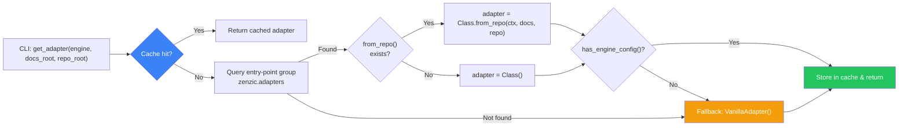
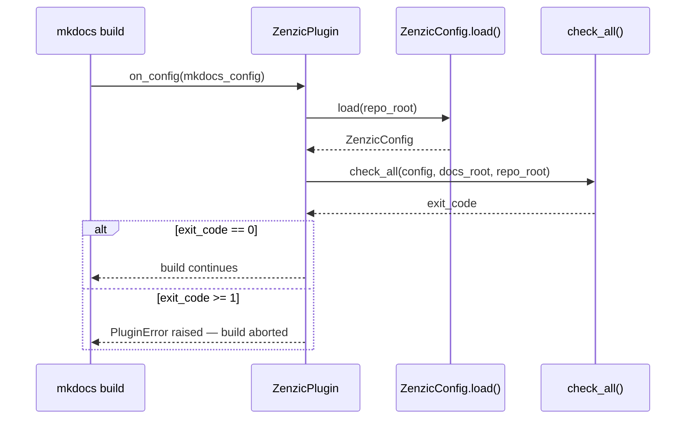

# Architecture

This page describes the internal design of Zenzic for contributors and advanced users who need to understand how the tool works under the hood. For configuration and usage, see the [Configuration Reference](../guides/configuration-reference) and [Checks Reference](../guides/checks).

---

## Two-Pass Pipeline {#two-pass-pipeline}

The core analysis engine operates as a **Two-Pass Pipeline** over the documentation file set. Each pass has a distinct responsibility; Pass 2 only begins after Pass 1 completes.

### Pass 1 -- Harvest and Shield Scan {#pass-1}

Pass 1 reads every `.md` file under `docs/` and performs two independent operations:

| Stream | What it reads | Purpose |
| :--- | :--- | :--- |
| **Shield stream** | Every line including frontmatter and fenced code blocks | Detect leaked credentials |
| **Content stream** | Lines outside fenced blocks (frontmatter skipped) | Harvest reference definitions, detect images |

The Shield stream uses raw `enumerate()` -- no line is ever invisible to the Shield. The content stream uses a fenced-block-aware state machine that skips lines inside ` ``` ` or `~~~` fences, preventing false-positive reference definitions from code examples.

During Pass 1, the `ReferenceScanner` populates a `ReferenceMap` per file:

```python
scanner = ReferenceScanner(Path("docs/guide.md"))

for event in scanner.harvest():
    lineno, event_type, data = event
    if event_type == "SECRET":
        # Shield found a credential -- abort immediately
        raise SystemExit(2)
```

Harvest events include:

| Event | Data | Meaning |
| :--- | :--- | :--- |
| `DEF` | `(norm_id, url)` | Reference definition accepted |
| `DUPLICATE_DEF` | `(norm_id, url)` | Duplicate ID (first wins per CommonMark 4.7) |
| `IMG` | `(alt_text, url)` | Image with alt text found |
| `MISSING_ALT` | `url` | Image without alt text |
| `SECRET` | `SecurityFinding` | Credential detected by Shield |

If any `SECRET` event is yielded, Pass 2 is **skipped entirely** for that file. The Shield acts as a firewall: no further analysis is performed on potentially compromised content.

### Pass 2 -- Cross-Check and Link Validation {#pass-2}

Pass 2 resolves reference-style links (`[text][id]`) against the populated `ReferenceMap`:

```python
cross_check_findings = scanner.cross_check()
```

This pass re-reads the content stream to find all reference link usages and shortcut references. Each usage is resolved against the definitions collected in Pass 1. Undefined IDs produce `DANGLING_REF` findings.

### Pass 3 -- Integrity Report {#pass-3}

Pass 3 computes the per-file integrity score and consolidates all findings:

```python
report = scanner.get_integrity_report(cross_check_findings, security_findings)
```

The report includes:

- **Dangling references** (errors) from Pass 2
- **Dead definitions** (warnings) -- defined but never referenced
- **Duplicate definitions** (warnings) -- same ID defined twice
- **Security findings** from Pass 1
- **Rule findings** from the Adaptive Rule Engine (if configured)

### Link Validation Pipeline {#link-validation}

The link validator (`validate_links_async`) operates independently with its own multi-phase structure:

**Phase 1** -- Read all `.md` files into memory, extract inline links and reference links, compute heading anchor slugs per file. Construct the `InMemoryPathResolver` once from the complete file map.

**Phase 1.5** -- Build the link adjacency graph and run iterative DFS cycle detection. The cycle registry is a `frozenset[str]` -- O(1) membership checks in Phase 2. Total complexity: Theta(V+E).

**Phase 2** -- Validate each link against the resolver, VSM, and cycle registry. Internal links are resolved entirely in memory (no disk I/O). External links are collected for Phase 3.

**Phase 3** (strict mode only) -- Concurrent HTTP HEAD validation of external URLs via `httpx`. Up to 20 simultaneous connections. Each unique URL is pinged exactly once regardless of how many files reference it.

---

## Shield Middleware {#shield-middleware}

The Zenzic Shield is a credential detection engine integrated into Pass 1. It operates as middleware: every line passes through the Shield before any other parser sees it.

### Processing Flow {#shield-flow}

```
Raw line from file
    |
    v
[Normalize] -- Strip backtick spans, table pipes, concat operators
    |
    v
[Scan raw] -- Match against 8 pre-compiled regex patterns
    |
    v
[Scan normalized] -- Match normalized form (catches split-token obfuscation)
    |
    v
[Deduplicate] -- Suppress duplicate findings (same secret type per line)
    |
    v
SecurityFinding (or pass-through)
```

### Pre-scan Normalizer {#normalizer}

The normalizer (ZRT-003 fix) reconstructs secrets that authors split across Markdown formatting:

| Transformation | Example | Result |
| :--- | :--- | :--- |
| Unwrap backtick spans | `` `AKIA` `` | `AKIA` |
| Remove concat operators | `` `AKIA` + `KEY` `` | `AKIAKEY` |
| Replace table pipes | `` \| Key \| AKIA... \| `` | `Key AKIA...` |

Both the raw and normalized forms are scanned. If the same secret type is detected in both forms, only one finding is emitted.

### Pattern Families {#shield-patterns}

| Pattern | Regex | Example prefix |
| :--- | :--- | :--- |
| `openai-api-key` | `sk-[a-zA-Z0-9]{48}` | `sk-abc...` |
| `github-token` | `gh[pousr]_[a-zA-Z0-9]{36}` | `ghp_abc...` |
| `aws-access-key` | `AKIA[0-9A-Z]{16}` | `AKIAIOSFODNN7...` |
| `stripe-live-key` | `sk_live_[0-9a-zA-Z]{24}` | `sk_live_abc...` |
| `slack-token` | `xox[baprs]-[0-9a-zA-Z]{10,48}` | `xoxb-abc...` |
| `google-api-key` | `AIza[0-9A-Za-z\-_]{35}` | `AIzaSyC...` |
| `private-key` | `-----BEGIN [A-Z ]+ PRIVATE KEY-----` | PEM header |
| `hex-encoded-payload` | `(?:\x[0-9a-fA-F]{2}){3,}` | `\x41\x42` (2× below threshold) |

### IO Middleware: `safe_read_line` {#safe-read-line}

For metadata extraction (frontmatter parsing for slugs, tags, draft status), every line passes through `safe_read_line()`. If a secret is detected, a `ShieldViolation` exception is raised immediately -- the line is never returned to the caller, preventing the secret from entering any parser.

```python
# The line never reaches the YAML parser if it contains a secret
line = safe_read_line(raw_line, file_path, line_no)
```

### Hardening {#shield-hardening}

- **Line length limit** (F2-1): Lines exceeding 1 MiB are silently truncated before regex matching to prevent ReDoS.
- **Worker timeout** (ZRT-002): In parallel mode, each worker has a 30-second timeout. Workers that exceed this limit produce a `Z009` timeout finding instead of blocking the pipeline.

---

## Enterprise-Grade Security Foundations {#enterprise-security}

This section documents the security hardening features introduced in v0.6.1 "Obsidian Bastion". These properties are verified by the test suite and enforced by the `_validate_docs_root` guard and the `safe_read_line` I/O fence.

### F2-1 — Anti-ReDoS Line Truncation {#f2-1-antiredos}

The `safe_read_line()` function imposes a hard **1 MiB limit** on every line before it reaches any regex engine.

**Threat model:** An attacker who can commit a file containing an artificially long line (or a build pipeline that generates one) could supply a pathological input to a backtracking regex engine. On catastrophic backtracking patterns, a single 1 MB line could cause the worker to spin for minutes or hours, effectively creating a Denial-of-Service condition against the analysis pipeline.

**Mitigation:**

```python
# safe_read_line() — line truncated before reaching any regex pattern
_MAX_LINE_BYTES = 1 * 1024 * 1024  # 1 MiB hard cap

if len(raw_line.encode("utf-8")) > _MAX_LINE_BYTES:
    raw_line = raw_line.encode("utf-8")[:_MAX_LINE_BYTES].decode("utf-8", errors="replace")
```

The truncated line is still scanned — a credential that begins in the first 1 MiB of a line will still be detected. Only content beyond the cap is invisible to the Shield.

**Interaction with the worker timeout:** F2-1 is the first line of defence. The 30-second `ProcessPoolExecutor` worker timeout (ZRT-002, Obligation 1) is the second. Together they ensure no single file can hold the pipeline hostage regardless of content.

### F4-1 — Anti-Jailbreak Path Validation {#f4-1-antijailbreak}

The `_validate_docs_root()` function in `cli.py` elevates the **Blood Sentinel** (Exit Code 3) from a link-time check to a **pre-scan filesystem barrier**.

**Threat model:** A malicious or misconfigured `zenzic.toml` containing `docs_dir = "../../etc"` would cause Zenzic to scan OS system directories, potentially leaking sensitive file contents through credential detection findings or exposing the directory structure in error messages.

**Mitigation:**

```python
def _validate_docs_root(repo_root: Path, docs_root: Path) -> None:
    resolved_repo = repo_root.resolve()
    resolved_docs = docs_root.resolve()
    try:
        resolved_docs.relative_to(resolved_repo)
    except ValueError:
        # BLOOD SENTINEL fires immediately — no files are read
        raise typer.Exit(3)
```

`resolve()` expands all symlinks and `..` components before the comparison, so `docs_dir = "repo/../../../etc"` is caught unconditionally. The check runs before `LayeredExclusionManager` construction, before any I/O phase, and cannot be bypassed by CLI flags.

**Exit Code 3 is never suppressed** by `--exit-zero` or `exit_zero = true`. If a jailbreak attempt is detected, the process terminates immediately after printing the Blood Sentinel diagnostic.

| Scenario | `docs_dir` value | Outcome |
| :--- | :--- | :--- |
| Normal project | `"docs"` | Resolves inside repo root → allowed |
| Repo root as docs | `"."` | Resolves to repo root → allowed |
| Parent escape | `"../../etc"` | Resolves outside repo root → **Exit 3** |
| Symlink escape | `"docs-link"` (symlink to `/tmp`) | `resolve()` expands → **Exit 3** |

---

## Adapter Protocol {#adapter-protocol}

Zenzic is engine-agnostic. It works with MkDocs, Zensical, Docusaurus, or no documentation engine at all. This is achieved through the **Adapter Protocol** -- a `@runtime_checkable` Protocol that defines the contract between the core pipeline and engine-specific path resolution.

### `BaseAdapter` Protocol {#base-adapter}

Every adapter must satisfy the `BaseAdapter` protocol:

```python
@runtime_checkable
class BaseAdapter(Protocol):
    def has_engine_config(self) -> bool: ...
    def get_nav_paths(self) -> frozenset[str]: ...
    def map_url(self, rel: Path) -> str: ...
    def classify_route(self, rel: Path, nav_paths: frozenset[str]) -> RouteStatus: ...
    def get_route_info(self, rel: Path) -> RouteMetadata: ...
    def is_locale_dir(self, part: str) -> bool: ...
    def resolve_asset(self, missing_abs: Path, docs_root: Path) -> Path | None: ...
    def resolve_anchor(self, resolved_file, anchor, anchors_cache, docs_root) -> bool: ...
    def get_ignored_patterns(self) -> set[str]: ...
    def is_shadow_of_nav_page(self, rel: Path, nav_paths: frozenset[str]) -> bool: ...
```

Key methods:

- **`has_engine_config()`** -- Returns `True` when a build-engine config was found. `VanillaAdapter` returns `False`. Callers use this to decide whether nav-based checks (orphan detection) can produce meaningful results.
- **`get_route_info()`** -- The Metadata-Driven Routing API. Returns all routing metadata in a single call: canonical URL, route status, optional slug, route base path, and proxy flag.
- **`map_url()` / `classify_route()`** -- Legacy File-to-URL API, preserved for backward compatibility. Default implementations delegate to `get_route_info()`.

### `RouteMetadata` {#route-metadata}

The unified routing metadata returned by `get_route_info()`:

```python
@dataclass(slots=True)
class RouteMetadata:
    canonical_url: str        # URL path the engine serves (e.g. "/guide/install/")
    status: RouteStatus       # REACHABLE, ORPHAN_BUT_EXISTING, IGNORED, CONFLICT
    slug: str | None = None   # Frontmatter slug override
    route_base_path: str = "/" # URL prefix from docs plugin preset
    is_proxy: bool = False    # True for build-generated routes with no source file
```

### Built-in Adapters {#built-in-adapters}

| Adapter | Engine | Config file | Features |
| :--- | :--- | :--- | :--- |
| `MkDocsAdapter` | `mkdocs` | `mkdocs.yml` | Full nav resolution, i18n folder/suffix mode, locale fallback |
| `ZensicalAdapter` | `zensical` | `zensical.toml` | Native TOML-based config, reads `mkdocs.yml` natively |
| `DocusaurusAdapter` | `docusaurus` | `docusaurus.config.js/ts` | Static JS config parsing, frontmatter slug support, route base path |
| `VanillaAdapter` | `vanilla` | (none) | No-op adapter for plain Markdown projects |

### Link Resolution and Slug Mapping {#link-resolution}

Adapters that support frontmatter `slug` overrides (currently `DocusaurusAdapter`) map slugs into the Virtual Site Map for **reachability** validation: a page with `slug: /quick-start` at URL `/docs/quick-start` is correctly marked `REACHABLE` even though its file path is `docs/guides/getting-started.mdx`.

However, Zenzic's **link integrity** validation (broken links, absolute paths) resolves relative paths from the *filesystem* location, not the slug URL. This means a heavy divergence between slug and file path can cause a page's relative links to resolve differently in Zenzic (file-based) vs the build engine (URL-based).

**Architectural invariant:** keep the filesystem hierarchy aligned with the intended URL hierarchy. If a file is moved to a new directory, let the URL follow naturally rather than using `slug` to pin the old URL. This ensures `../` links resolve identically in both the linter and the static-site generator.

### Engine Factory {#engine-factory}

The `get_adapter()` factory uses entry-point discovery to find adapters:



```
1. Query zenzic.adapters entry-point group for context.engine
2. If found: instantiate via from_repo() classmethod (if available)
3. If not found: return VanillaAdapter (neutral no-op behaviour)
```

Third-party adapters can be registered via `pyproject.toml`:

```toml
[project.entry-points."zenzic.adapters"]
myengine = "my_package.adapter:MyEngineAdapter"
```

### Adapter Cache {#adapter-cache}

Adapter instances are cached by `(engine, docs_root, repo_root)` key. This prevents redundant construction when `get_adapter()` is called from both `scanner.py` and `validator.py` in the same CLI session.

### `has_engine_config` Guard {#has-engine-config-guard}

When an adapter is instantiated but finds no engine config file (e.g. `MkDocsAdapter` with no `mkdocs.yml`), the factory falls back to `VanillaAdapter`. This ensures nav-dependent checks are skipped cleanly rather than producing false positives.

---

## Layered Exclusion Manager Internals {#exclusion-manager-internals}

The `LayeredExclusionManager` is constructed once per CLI invocation and passed through the entire pipeline. It encapsulates all four exclusion levels in pre-compiled form.

### Construction {#exclusion-construction}

```python
manager = LayeredExclusionManager(
    config,
    repo_root=repo_root,
    docs_root=docs_root,
    cli_exclude=["drafts"],
    cli_include=["generated-api"],
)
```

At construction time:

1. System Guardrails are loaded from `SYSTEM_EXCLUDED_DIRS` (frozen set).
2. Config `excluded_dirs` are stripped of system guardrails to keep layers clean.
3. File patterns are pre-compiled via `fnmatch.translate()` to `re.Pattern`.
4. If `respect_vcs_ignore` is `true`, `.gitignore` files are parsed and rules are merged into a single `VCSIgnoreParser`.

### VCS Ignore Parser {#vcs-parser}

The `VCSIgnoreParser` implements the full gitignore specification as a pure-Python parser:

- Patterns are pre-compiled to `re.Pattern` at construction time.
- Matching is O(N) per path where N = number of rules.
- When no negation rules exist, a **combined regex fast path** merges all positive rules into a single compiled regex.
- Paths containing `..` components are always treated as non-matching (safety).

### `should_exclude_dir` {#should-exclude-dir}

Called by `walk_files()` for each directory during `os.walk()`. Returns `True` to prune the directory from the walk -- the directory and all its descendants are never entered.

### `should_exclude_file` {#should-exclude-file}

Called by `iter_markdown_sources()` for each file that passes directory filtering. Performs full 5-layer evaluation including path-component checks against all exclusion layers.

---

## Exit Codes {#exit-codes}

Zenzic uses a structured exit code contract:

| Code | Name | Meaning | Suppressed by `--exit-zero`? |
| :---: | :--- | :--- | :---: |
| **0** | Clean | No issues found, or `--exit-zero` active | N/A |
| **1** | Findings | Documentation quality issues detected | Yes |
| **2** | Shield | Leaked credential detected by Zenzic Shield | **No** |
| **3** | Blood Sentinel | Path traversal to OS system directory detected | **No** |

### Exit Code 0 -- Clean

All checks passed. No errors, no warnings (or `--exit-zero` is active and only non-security findings were found).

### Exit Code 1 -- Findings

Documentation quality issues were detected: broken links, orphan pages, invalid snippets, placeholder pages, unused assets, dangling references, or dead definitions (in strict mode).

Can be suppressed by `exit_zero = true` in config or `--exit-zero` on the CLI.

### Exit Code 2 -- Shield

A leaked credential was detected by the Zenzic Shield. This exit code is **never** suppressed by `--exit-zero` or `exit_zero = true`. The credential must be rotated immediately.

### Exit Code 3 -- Blood Sentinel

A documentation link resolves to an OS system path (`/etc/`, `/root/`, `/var/`, `/proc/`, `/sys/`, `/usr/`). This is classified as `PATH_TRAVERSAL_SUSPICIOUS` -- a security incident that indicates a potential template injection, compromised toolchain, or infrastructure disclosure.

Exit code 3 has the **highest priority**. If both Shield and Blood Sentinel findings exist in the same run, exit code 3 wins.

Blood Sentinel also fires when `docs_dir` itself resolves outside the repository root (F4-1 jailbreak protection).

---

## Hybrid Adaptive Engine {#adaptive-engine}

The scan engine automatically selects sequential or parallel execution based on the number of files:

| File count | Mode | Behaviour |
| :--- | :--- | :--- |
| < 50 files | Sequential | Zero process-spawn overhead. Full O(N) I/O. |
| >= 50 files | Parallel | `ProcessPoolExecutor` with per-worker isolation |

The threshold (50 files) is a conservative heuristic: below it, `ProcessPoolExecutor` spawn overhead (~200-400ms on a cold interpreter) exceeds the parallelism benefit.

In parallel mode:

- Each file is processed by an independent worker process.
- Workers receive serialised copies of `config` and `rule_engine` via `pickle` -- no shared state.
- A 30-second timeout per worker prevents ReDoS patterns in custom rules from deadlocking the pipeline.
- External URL validation is performed in the main process after all workers complete.
- Results are always sorted by `file_path` regardless of execution mode (determinism guarantee).

---

## Integrations Layer {#integrations-layer}

The `zenzic.integrations` namespace contains **opt-in plugins** that hook into an external build engine's lifecycle and invoke Zenzic checks as a quality gate. Integrations are the **Arm** of the [Mind and Arm model](../ecosystem/overview) — they act, whereas Adapters interpret.

### Design Contract {#integrations-contract}

Integrations follow two invariants:

1. **Dependency isolation.** An integration may import its host engine (`mkdocs`, etc.). Zenzic core never imports any integration; the dependency is strictly one-directional. This is why integration extras are opt-in: `pip install "zenzic[mkdocs]"`.
2. **Subprocess-free core.** Integrations trigger Zenzic's Python API directly — no `subprocess.run("zenzic ...")`. Pillar 2 (No Subprocess) is preserved end-to-end.

### `zenzic.integrations.mkdocs` — `ZenzicPlugin` {#zenzic-plugin}

`ZenzicPlugin` is a native MkDocs plugin that injects a full `zenzic check all` gate into every `mkdocs build` invocation.

**Registration** (automatic via entry point):

```toml
[project.entry-points."mkdocs.plugins"]
zenzic = "zenzic.integrations.mkdocs:ZenzicPlugin"
```

**Activation** (user-side, in `mkdocs.yml`):

```yaml
plugins:
  - search
  - zenzic
```

**Execution flow:**



Shield findings (exit code 2) and Blood Sentinel findings (exit code 3) abort the build unconditionally, regardless of any `--exit-zero` setting. Standard quality findings (exit code 1) abort the build unless `exit_zero = true` is set in `zenzic.toml`.

**Logger:** The plugin logs under the `zenzic.integrations.mkdocs` logger (not `mkdocs.plugins.zenzic`), consistent with the standard Zenzic logging hierarchy.

### Extending the Integrations Namespace {#extending-integrations}

New integrations follow the same pattern:

1. Create `src/zenzic/integrations/<engine>.py`.
2. Add `<engine> = ["<engine-pkg>>=<version>"]` to `[project.optional-dependencies]` in `pyproject.toml`.
3. Register any required entry points (e.g. `<engine>.plugins`).
4. Use `ZenzicConfig.load()` + the core check functions — never shell out.

The `zenzic.integrations` package is intentionally thin: it contains no shared logic, only per-engine hooks. All intelligence lives in `zenzic.core`.
