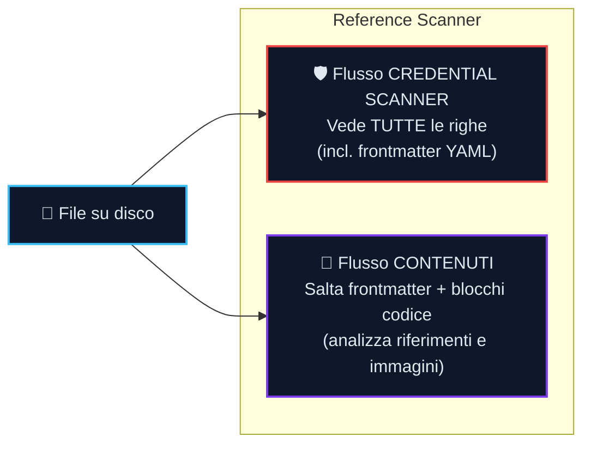

{/* SPDX-FileCopyrightText: 2026 PythonWoods <dev@pythonwoods.dev> */}
{/* SPDX-License-Identifier: Apache-2.0 */}

# Meccaniche Centrali

Il motore di validazione di Zenzic si affida a diverse architetture fondamentali per garantire risultati deterministici, a zero falsi positivi, senza dover eseguire una build completa del sito.

## La Virtual Site Map (VSM) {#vsm}

Quando Zenzic valida i link, non si limita a verificare se il file di destinazione esiste su disco. Costruisce invece una **Virtual Site Map (VSM)** — una proiezione puramente in memoria di ciò che il build engine servirà effettivamente ai lettori.

La VSM associa ogni URL canonico a una voce **Route**:

| Campo | Significato |
| :--- | :--- |
| `url` | L'URL che un browser richiederebbe, es. `/guide/install/` |
| `source` | Il file sorgente che produce questo URL, es. `guide/install.md` |
| `status` | Se la pagina è raggiungibile, orfana, ignorata o in conflitto |
| `anchors` | Ancore degli heading pre-calcolate dal file sorgente |

Ogni route porta uno stato che indica a Zenzic come trattare i link che vi puntano:

| Stato | Significato | Risultato link |
| :--- | :--- | :--- |
| `REACHABLE` | La pagina è elencata nella navigazione o è una route di localizzazione | Valido |
| `ORPHAN_BUT_EXISTING` | Il file esiste su disco ma non nella navigazione del sito | Errore Z103 |
| `IGNORED` | Escluso dalla configurazione (es. file README, directory private) | Errore Z101 |
| `CONFLICT` | Due file sorgente producono lo stesso URL canonico | Errore Z101 |

**Perché è importante:** Un file può esistere nel filesystem ed essere comunque `IGNORED` nella VSM. Un URL può essere `REACHABLE` nella VSM senza avere un file corrispondente su disco (ad esempio, le route indice delle localizzazioni). La VSM è l'autorità — Zenzic verifica la raggiungibilità, non la sola esistenza del file.

Questo design fa sì che `zenzic check links` individui problemi che un controllo diretto di esistenza del file non coglierebbe: pagine rimosse dalla navigazione, route in conflitto e contenuti orfani che i lettori non possono scoprire navigando normalmente.

## Architettura dello credential scanner

Lo credential scanner utilizza un'**architettura a doppio flusso** per garantire che nessuna parte di un file sfugga alla scansione delle credenziali.

Quando il Reference Scanner elabora un file, crea due flussi indipendenti:

I due flussi hanno regole di filtraggio opposte per design. Il flusso Contenuti deve saltare il frontmatter YAML per evitare di interpretare metadati come `author: Jane Doe` come una definizione reference rotta. Il flusso credential scanner deve vedere il frontmatter perché una chiave come `aws_key: AKIA...` nascosta nei metadati YAML è un segreto reale che deve essere intercettato. I flussi non condividono mai una sorgente dati — unirli creerebbe un punto cieco.

**Normalizzatore Pre-Scansione.** Prima di eseguire i pattern di rilevamento, il credential scanner normalizza ogni riga per contrastare l'offuscamento. I backtick di codice inline vengono rimossi, gli operatori di concatenazione eliminati e i caratteri pipe delle tabelle collassati. Questo significa che un segreto spezzato tra colonne di una tabella Markdown — come una chiave AWS divisa in `` `AKIA` + `suffisso` `` — viene riassemblato prima della scansione. Vengono verificate sia la forma grezza che quella normalizzata, e un set di deduplicazione previene le doppie segnalazioni.

**Protezione ReDoS.** I pattern regex personalizzati dichiarati in `[[custom_rules]]` vengono compilati tramite gate di compatibilità RE2 al caricamento. I costrutti non supportati (per esempio backreference o lookaround) vengono rifiutati prima che inizi qualsiasi scansione. Separatamente, il watchdog dei worker paralleli continua a emettere `Z902: RULE_TIMEOUT` se un worker si blocca a runtime per uno stall sistemico (per esempio I/O o starvation del coordinatore) e non per un canary regex con backtracking.

## I Link Circolari come Knowledge Graph

La documentazione è un **Knowledge Graph** — una rete densamente interconnessa dove i link incrociati tra pagine sono attesi e desiderabili. Se un Tutorial linka una pagina di Reference per i dettagli tecnici, è naturale e benefico che quella pagina di Reference linki a sua volta il Tutorial come esempio di implementazione. I pattern di link circolari sono quindi dati strutturali, non difetti.

Il rilevamento dei cicli viene calcolato una sola volta con DFS iterativo durante la costruzione del resolver (Fase 1.5, Θ(V+E)). Ogni lookup di appartenenza in Fase 2 contro il registro dei cicli è O(1).

**Perché il motore calcola i cicli.** Il traversal DFS è un requisito meccanico del costruttore della Virtual Site Map: senza identificare i cicli, la scansione ricorsiva del grafo andrebbe in loop infinito. Il rilevamento è necessario per far terminare il resolver — non è attivato da una preoccupazione di qualità.

## Pipeline Reference a Tre Passaggi

Per garantire una validazione accurata dei link che supporti definizioni dei riferimenti non in ordine, Zenzic esegue una rigorosa Pipeline a Tre Passaggi:

| Passaggio | Nome | Cosa succede |
| :---: | :--- | :--- |
| 1 | **Raccolta** | Processa ogni riga; registra le definizioni `[id]: url`; esegue credential scanner su ogni URL e riga |
| 2 | **Verifica Incrociata** | Risolve ogni utilizzo `[testo][id]` contro la `ReferenceMap` completa; segnala gli ID non risolvibili |
| 3 | **Report Integrità** | Calcola il punteggio di integrità per file; aggiunge avvisi su Definizioni Morte e alt-text |

Il Passaggio 2 viene sempre eseguito dopo il completamento della raccolta del Passaggio 1. I finding di sicurezza del Passaggio 1 influenzano la semantica di uscita (exit code 2), ma non saltano la verifica incrociata del Passaggio 2.
