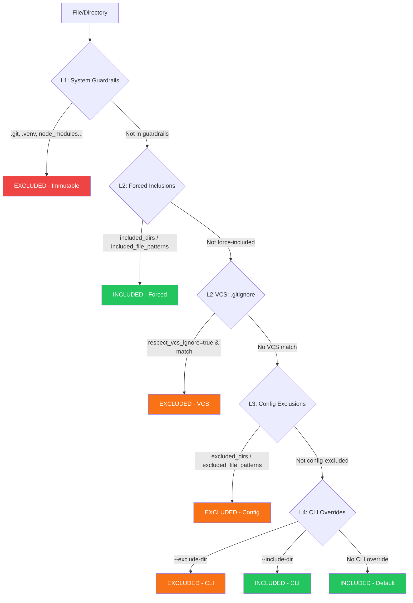

# Discovery Universale e Esclusione a Livelli

Zenzic adotta un principio architetturale preciso: **un solo punto d'ingresso** per la scoperta dei file. Ogni modulo del sistema — scanner, validator, Shield, orphan-checker — vede lo stesso identico insieme di file. Non esistono scorciatoie.

---

## Il punto d'ingresso unico: `iter_markdown_sources` {#entry-point}

La funzione `iter_markdown_sources` e l'unica porta d'accesso autorizzata per iterare sui file sorgente Markdown. Nessun modulo interno chiama `rglob`, `os.walk` o `Path.iterdir` direttamente per cercare file `.md` o `.mdx`.

Questo garantisce che:

- Le esclusioni vengano applicate **universalmente** — non esistono moduli "fuori regola"
- L'ordine dei file sia **deterministico** (ordinamento imposto da `walk_files`)
- Le estensioni riconosciute come documentazione sorgente siano fissate: `.md` e `.mdx`
- I link simbolici vengano sempre saltati

La funzione accetta tre argomenti:

1. **`docs_root`** — percorso assoluto alla directory di documentazione
2. **`config`** — configurazione Zenzic caricata (fornisce `excluded_dirs`)
3. **`exclusion_manager`** — il `LayeredExclusionManager` per la valutazione completa a 4 livelli

```python
# Uso interno — tutti i moduli seguono questo contratto
for md_file in iter_markdown_sources(docs_root, config, exclusion_manager):
    # md_file e un Path assoluto, ordinato, non-symlink, .md o .mdx
    content = md_file.read_text(encoding="utf-8")
```

---

## Gerarchia di esclusione a quattro livelli {#four-level-hierarchy}

Il `LayeredExclusionManager` orchestra le decisioni di esclusione attraverso quattro livelli. L'ordine di valutazione segue una logica precisa: il primo livello che corrisponde vince.



### L1 — Guardrail di Sistema {#level-1-system}

**Priorità assoluta. Immutabili. Non negoziabili.**

I Guardrail di Sistema sono directory che Zenzic ignora **sempre**, indipendentemente da qualsiasi configurazione utente. Non possono essere rimossi, ne sovrascritti da inclusioni forzate, ne superati da flag CLI.

| Directory | Motivazione |
| :--- | :--- |
| `.git`, `.github` | VCS e CI/CD |
| `.venv`, `node_modules` | Ambienti virtuali e gestori pacchetti |
| `.nox`, `.tox` | Runner di test |
| `.pytest_cache`, `.mypy_cache`, `.ruff_cache` | Cache degli strumenti |
| `__pycache__` | Cache bytecode Python |
| `.docusaurus`, `.cache` | Cache del motore di build |
| `.hypothesis`, `.temp` | Directory temporanee |

Queste directory vengono unite a `excluded_dirs` in modo additivo durante `model_post_init` del modello di configurazione. La logica è: le voci dell'utente si **aggiungono** ai Guardrail, non li **sostituiscono**.

### L2 — Inclusioni Forzate + VCS {#level-2-forced-and-vcs}

Il livello 2 gestisce due forze opposte:

**Inclusioni forzate** (`included_dirs`, `included_file_patterns`) — sovrascrivono le esclusioni VCS e le esclusioni di configurazione, ma **mai** i Guardrail di Sistema. Questo permette di forzare la scansione di directory o file che sarebbero altrimenti ignorati dal `.gitignore`.

**VCS ignore** (`respect_vcs_ignore = true`) — quando attivato, Zenzic legge i file `.gitignore` dalla radice del repository e dalla directory docs. I file corrispondenti vengono esclusi da tutti i controlli. Disabilitato per default (principio Zero-Config).

L'ordine di precedenza tra questi due sotto-livelli e chiaro: le inclusioni forzate vincono sempre sulle esclusioni VCS.

```toml
# zenzic.toml
respect_vcs_ignore = true
included_dirs = ["generated-docs"]
included_file_patterns = ["api.generated.md"]
```

In questo esempio, anche se `generated-docs/` e nel `.gitignore`, Zenzic lo scansionera comunque.

### L3 — Configurazione {#level-3-config}

Le esclusioni dichiarate in `zenzic.toml` o `[tool.zenzic]` in `pyproject.toml`:

- `excluded_dirs` — directory da escludere (additive ai Guardrail)
- `excluded_file_patterns` — pattern glob applicati ai nomi dei file

Queste esclusioni vengono valutate dopo le inclusioni forzate e il VCS. Se un file e stato forzatamente incluso al livello L2, le esclusioni L3 non lo toccano.

### L4 — CLI {#level-4-cli}

Flag a riga di comando per override temporanei:

- `--exclude-dir DIR` — esclude una directory aggiuntiva (ripetibile)
- `--include-dir DIR` — forza l'inclusione di una directory (ripetibile, non sovrasta i Guardrail di Sistema)

I flag CLI vengono valutati con la stessa logica degli altri livelli: `--include-dir` vince su `--exclude-dir` per la stessa directory, ma nessuno dei due puo sovrastare L1.

---

## Flusso di valutazione per le directory {#directory-evaluation-flow}

Quando `LayeredExclusionManager.should_exclude_dir` viene chiamato per una directory, il flusso e il seguente:

1. **L1 — Guardrail di Sistema:** la directory e in `SYSTEM_EXCLUDED_DIRS`? Se si, escludi (immutabile)
2. **L2 — Inclusioni forzate (config):** la directory e in `included_dirs`? Se si, includi
3. **L4 — CLI `--exclude-dir`:** la directory e stata esclusa via CLI? Se si, escludi
4. **L4 — CLI `--include-dir`:** la directory e stata inclusa via CLI? Se si, includi
5. **L2 VCS — gitignore:** con `respect_vcs_ignore = true`, la directory corrisponde a un pattern `.gitignore`? Se si, escludi
6. **L3 — Config `excluded_dirs`:** la directory e nella lista di configurazione? Se si, escludi
7. **Default:** includi

## Flusso di valutazione per i file {#file-evaluation-flow}

Il flusso per `should_exclude_file` e analogo ma piu granulare:

1. **L1 — Guardrail di Sistema:** un componente del percorso del file e in `SYSTEM_EXCLUDED_DIRS`? Se si, escludi
2. **L2 — `included_file_patterns`:** il nome del file corrisponde a un pattern di inclusione forzata? Se si, includi
3. **L2 — `included_dirs`:** un componente del percorso e in `included_dirs`? Se si, includi
4. **L4 — CLI `--exclude-dir`:** un componente del percorso e nelle esclusioni CLI? Se si, escludi
5. **L4 — CLI `--include-dir`:** un componente del percorso e nelle inclusioni CLI? Se si, includi
6. **L2 VCS — gitignore:** il percorso relativo corrisponde a un pattern `.gitignore`? Se si, escludi
7. **L3 — `excluded_file_patterns`:** il nome del file corrisponde a un pattern di esclusione? Se si, escludi
8. **L3 — `excluded_dirs`:** un componente del percorso e nelle directory escluse dalla configurazione? Se si, escludi
9. **Default:** includi

---

## Flusso di lavoro `respect_vcs_ignore` {#vcs-workflow}

Quando `respect_vcs_ignore = true`, il `LayeredExclusionManager` costruisce un `VCSIgnoreParser` unificato dai file `.gitignore`:

1. Legge `.gitignore` dalla radice del repository (se esiste)
2. Legge `.gitignore` dalla directory docs (se esiste e diversa dalla radice)
3. Unisce le regole di tutti i parser in un singolo parser
4. Pre-compila le espressioni regolari per performance ottimali

Il parser segue la specifica gitignore completa:

- L'ultima regola corrispondente vince (semantica last-match-wins)
- `!` nega una regola (re-include un file precedentemente escluso)
- `*` corrisponde a tutto tranne `/`
- `**` corrisponde a tutto incluso `/`
- La `/` finale limita la regola alle sole directory
- La `/` iniziale ancora la regola alla directory base

I percorsi contenenti `..` vengono sempre trattati come non corrispondenti (protezione di sicurezza).

---

## Filosofia Porto Sicuro {#safe-harbor}

Il sistema di esclusione e progettato seguendo la filosofia del Porto Sicuro:

- **Nessuna sorpresa:** senza configurazione, Zenzic funziona con valori predefiniti ragionevoli
- **Nessun file critico esposto:** i Guardrail di Sistema proteggono directory che non contengono mai documentazione utile (`.git`, `.venv`, ecc.)
- **Inclusione esplicita:** l'utente deve dichiarare esplicitamente cosa vuole includere di non standard
- **Trasparenza:** il flusso di esclusione e deterministico e documentato — nessuna magia nascosta

Il `LayeredExclusionManager` viene costruito una sola volta dalla CLI e passato lungo tutta la pipeline. Ogni modulo riceve la stessa istanza, garantendo coerenza totale nell'insieme dei file analizzati.

---

## Walk dei file non-Markdown {#walk-files}

Per i file non-Markdown (asset, immagini, configurazione), Zenzic fornisce `walk_files`: un iteratore basato su `os.walk` con pruning in-place delle directory.

A differenza di `Path.rglob("*")`, `walk_files` pota gli alberi esclusi (ad esempio `.nox/`, `node_modules/`) senza mai entrare in essi. Questo e cruciale per le performance in repository con migliaia di dipendenze.

Il pruning viene pilotato sia dal `LayeredExclusionManager` (via `should_exclude_dir`) sia da un set aggiuntivo di directory hard-prune (usato da `find_unused_assets` per `excluded_asset_dirs`).
