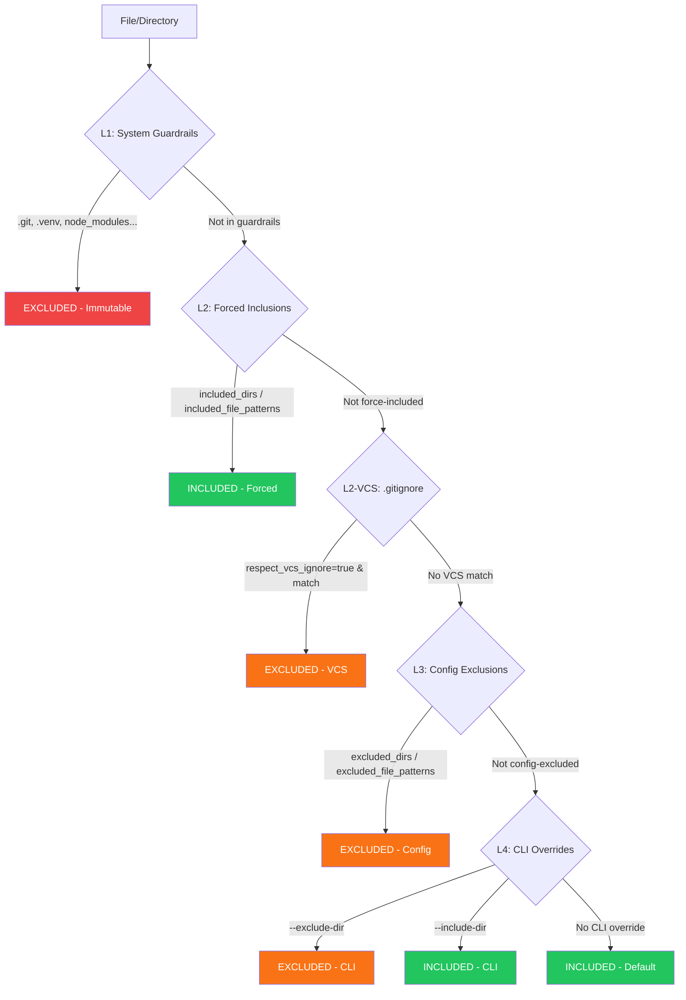

# Discovery Universale e Esclusione a Livelli

Zenzic adotta un principio architetturale preciso: **un solo punto d'ingresso** per la scoperta dei file. Ogni modulo del sistema — scanner, validator, credential scanner, orphan-checker — vede lo stesso identico insieme di file. Non esistono scorciatoie.

---

## Il punto d'ingresso unico: `iter_markdown_sources` {#entry-point}

La funzione `iter_markdown_sources` e l'unica porta d'accesso autorizzata per iterare sui file sorgente Markdown. Nessun modulo interno chiama `rglob`, `os.walk` o `Path.iterdir` direttamente per cercare file `.md` o `.mdx`.

Questo garantisce che:

- Le esclusioni vengano applicate **universalmente** — non esistono moduli "fuori regola"
- L'ordine dei file sia **deterministico** (ordinamento imposto da `walk_files`)
- Le estensioni riconosciute come documentazione sorgente siano fissate: `.md` e `.mdx`
- I link simbolici vengano sempre saltati

La funzione accetta tre argomenti:

1. **`docs_root`** — percorso assoluto alla directory di documentazione
2. **`config`** — configurazione Zenzic caricata (fornisce `excluded_dirs`)
3. **`exclusion_manager`** — il `LayeredExclusionManager` per la valutazione completa a 4 livelli

```python
# Uso interno — tutti i moduli seguono questo contratto
for md_file in iter_markdown_sources(docs_root, config, exclusion_manager):
    # md_file e un Path assoluto, ordinato, non-symlink, .md o .mdx
    content = md_file.read_text(encoding="utf-8")
```

---

## Gerarchia di esclusione a quattro livelli {#four-level-hierarchy}

Il `LayeredExclusionManager` orchestra le decisioni di esclusione attraverso quattro livelli. L'ordine di valutazione segue una logica precisa: il primo livello che corrisponde vince.


```mermaid
flowchart TD
    FILE[File/Directory] --> L1{L1: System Guardrails}
    L1 -->|".git, .venv, node_modules..."| EXCLUDED_L1[EXCLUDED - Immutable]
    L1 -->|Not in guardrails| L2{L2: Forced Inclusions}
    L2 -->|"included_dirs / included_file_patterns"| INCLUDED_L2[INCLUDED - Forced]
    L2 -->|Not force-included| L2VCS{L2-VCS: .gitignore}
    L2VCS -->|"respect_vcs_ignore=true & match"| EXCLUDED_VCS[EXCLUDED - VCS]
    L2VCS -->|No VCS match| L3{L3: Config Exclusions}
    L3 -->|"excluded_dirs / excluded_file_patterns"| EXCLUDED_L3[EXCLUDED - Config]
    L3 -->|Not config-excluded| L4{L4: CLI Overrides}
    L4 -->|"--exclude-dir"| EXCLUDED_L4[EXCLUDED - CLI]
    L4 -->|"--include-dir"| INCLUDED_L4[INCLUDED - CLI]
    L4 -->|No CLI override| INCLUDED[INCLUDED - Default]

    style EXCLUDED_L1 fill:#ef4444,color:#fff
    style EXCLUDED_VCS fill:#f97316,color:#fff
    style EXCLUDED_L3 fill:#f97316,color:#fff
    style EXCLUDED_L4 fill:#f97316,color:#fff
    style INCLUDED_L2 fill:#22c55e,color:#fff
    style INCLUDED_L4 fill:#22c55e,color:#fff
    style INCLUDED fill:#22c55e,color:#fff
```

### L1 — System Guardrails {#level-1-system}

**Priorità assoluta. Immutabili. Non negoziabili.**

I System Guardrails sono directory che Zenzic ignora **sempre**, indipendentemente da qualsiasi configurazione utente. Non possono essere rimossi, ne sovrascritti da inclusioni forzate, ne superati da flag CLI.

| Directory | Motivazione |
| :--- | :--- |
| `.git`, `.github` | VCS e CI/CD |
| `.venv`, `node_modules` | Ambienti virtuali e gestori pacchetti |
| `.nox`, `.tox` | Runner di test |
| `.pytest_cache`, `.mypy_cache`, `.ruff_cache` | Cache degli strumenti |
| `__pycache__` | Cache bytecode Python |
| `.docusaurus`, `.cache` | Cache del motore di build |
| `.hypothesis`, `.temp` | Directory temporanee |

Queste directory vengono unite a `excluded_dirs` in modo additivo durante `model_post_init` del modello di configurazione. La logica è: le voci dell'utente si **aggiungono** ai Guardrail, non li **sostituiscono**.

### L2 — Forced Inclusions + VCS {#level-2-forced-and-vcs}

Il livello 2 gestisce due forze opposte:

**Inclusioni forzate** (`included_dirs`, `included_file_patterns`) — sovrascrivono le esclusioni VCS e le esclusioni di configurazione, ma **mai** i System Guardrails. Questo permette di forzare la scansione di directory o file che sarebbero altrimenti ignorati dal `.gitignore`.

**VCS ignore** (`respect_vcs_ignore = true`) — quando attivato, Zenzic legge i file `.gitignore` dalla radice del repository e dalla directory docs. I file corrispondenti vengono esclusi da tutti i controlli. Disabilitato per default (principio Zero-Config).

L'ordine di precedenza tra questi due sotto-livelli e chiaro: le inclusioni forzate vincono sempre sulle esclusioni VCS.

```toml
# zenzic.toml
respect_vcs_ignore = true
included_dirs = ["generated-docs"]
included_file_patterns = ["api.generated.md"]
```

In questo esempio, anche se `generated-docs/` e nel `.gitignore`, Zenzic lo scansionera comunque.

### L3 — Configurazione {#level-3-config}

Le esclusioni dichiarate in `zenzic.toml` o `[tool.zenzic]` in `pyproject.toml`:

- `excluded_dirs` — directory da escludere (additive ai Guardrail)
- `excluded_file_patterns` — pattern glob applicati ai nomi dei file

Queste esclusioni vengono valutate dopo le inclusioni forzate e il VCS. Se un file e stato forzatamente incluso al livello L2, le esclusioni L3 non lo toccano.

### L4 — CLI {#level-4-cli}

Flag a riga di comando per override temporanei:

- `--exclude-dir DIR` — esclude una directory aggiuntiva (ripetibile)
- `--include-dir DIR` — forza l'inclusione di una directory (ripetibile, non sovrasta i System Guardrails)

I flag CLI vengono valutati con la stessa logica degli altri livelli: `--include-dir` vince su `--exclude-dir` per la stessa directory, ma nessuno dei due puo sovrastare L1.

---

## Flusso di valutazione per le directory {#directory-evaluation-flow}

Quando `LayeredExclusionManager.should_exclude_dir` viene chiamato per una directory, il flusso e il seguente:

1. **L1 — System Guardrails:** la directory e in `SYSTEM_EXCLUDED_DIRS`? Se si, escludi (immutabile)
2. **L2 — Inclusioni forzate (config):** la directory e in `included_dirs`? Se si, includi
3. **L4 — CLI `--exclude-dir`:** la directory e stata esclusa via CLI? Se si, escludi
4. **L4 — CLI `--include-dir`:** la directory e stata inclusa via CLI? Se si, includi
5. **L2 VCS — gitignore:** con `respect_vcs_ignore = true`, la directory corrisponde a un pattern `.gitignore`? Se si, escludi
6. **L3 — Config `excluded_dirs`:** la directory e nella lista di configurazione? Se si, escludi
7. **Default:** includi

## Flusso di valutazione per i file {#file-evaluation-flow}

Il flusso per `should_exclude_file` e analogo ma piu granulare:

1. **L1 — System Guardrails:** un componente del percorso del file e in `SYSTEM_EXCLUDED_DIRS`? Se si, escludi
2. **L2 — `included_file_patterns`:** il nome del file corrisponde a un pattern di inclusione forzata? Se si, includi
3. **L2 — `included_dirs`:** un componente del percorso e in `included_dirs`? Se si, includi
4. **L4 — CLI `--exclude-dir`:** un componente del percorso e nelle esclusioni CLI? Se si, escludi
5. **L4 — CLI `--include-dir`:** un componente del percorso e nelle inclusioni CLI? Se si, includi
6. **L2 VCS — gitignore:** il percorso relativo corrisponde a un pattern `.gitignore`? Se si, escludi
7. **L3 — `excluded_file_patterns`:** il nome del file corrisponde a un pattern di esclusione? Se si, escludi
8. **L3 — `excluded_dirs`:** un componente del percorso e nelle directory escluse dalla configurazione? Se si, escludi
9. **Default:** includi

---

## Flusso di lavoro `respect_vcs_ignore` {#vcs-workflow}

Quando `respect_vcs_ignore = true`, il `LayeredExclusionManager` costruisce un `VCSIgnoreParser` unificato dai file `.gitignore`:

1. Legge `.gitignore` dalla radice del repository (se esiste)
2. Legge `.gitignore` dalla directory docs (se esiste e diversa dalla radice)
3. Unisce le regole di tutti i parser in un singolo parser
4. Pre-compila le espressioni regolari per performance ottimali

Il parser segue la specifica gitignore completa:

- L'ultima regola corrispondente vince (semantica last-match-wins)
- `!` nega una regola (re-include un file precedentemente escluso)
- `*` corrisponde a tutto tranne `/`
- `**` corrisponde a tutto incluso `/`
- La `/` finale limita la regola alle sole directory
- La `/` iniziale ancora la regola alla directory base

I percorsi contenenti `..` vengono sempre trattati come non corrispondenti (protezione di sicurezza).

---

## Exclusion Zone Philosophy {#privacy-gate}

Il sistema di esclusione e progettato seguendo la Exclusion Zone Philosophy:

- **Nessuna sorpresa:** senza configurazione, Zenzic funziona con valori predefiniti ragionevoli
- **Nessun file critico esposto:** i System Guardrails proteggono directory che non contengono mai documentazione utile (`.git`, `.venv`, ecc.)
- **Inclusione esplicita:** l'utente deve dichiarare esplicitamente cosa vuole includere di non standard
- **Trasparenza:** il flusso di esclusione e deterministico e documentato — nessuna magia nascosta

Il `LayeredExclusionManager` viene costruito una sola volta dalla CLI e passato lungo tutta la pipeline. Ogni modulo riceve la stessa istanza, garantendo coerenza totale nell'insieme dei file analizzati.

---

## Walk dei file non-Markdown {#walk-files}

Per i file non-Markdown (asset, immagini, configurazione), Zenzic fornisce `walk_files`: un iteratore basato su `os.walk` con pruning in-place delle directory.

A differenza di `Path.rglob("*")`, `walk_files` pota gli alberi esclusi (ad esempio `.nox/`, `node_modules/`) senza mai entrare in essi. Questo e cruciale per le performance in repository con migliaia di dipendenze.

Il pruning viene pilotato sia dal `LayeredExclusionManager` (via `should_exclude_dir`) sia da un set aggiuntivo di directory hard-prune (usato da `find_unused_assets` per `excluded_asset_dirs`).

---

## Multi-Root Discovery {#multi-root}

`docs_dir` è la radice canonica dei sorgenti, ma gli static-site generator moderni gestiscono regolarmente **alberi di contenuto che vivono fuori da `docs/`**. Il caso di scuola è la directory `blog/` di Docusaurus: viene materializzata in URL reali dalla build, ma una scansione Zenzic pre-current series non avrebbe mai visto i file al suo interno. Il Virtual Site Map ingeriva solo i file sotto `docs_root`, perciò i link rotti dentro (o verso) i post del blog sfuggivano a `zenzic check all` e affioravano solo a valle, quando `docusaurus build` falliva. Chiamiamo questa modalità di fallimento **VSM Blindness**.

Multi-Root Discovery cura la cecità permettendo all'adapter attivo di dichiarare ulteriori radici di contenuto in modo deterministico — senza `rglob`, senza `subprocess`, senza euristiche ambientali:

```python
# zenzic.core.adapters._base
@dataclass(frozen=True, slots=True)
class ContentRoot:
    path: Path        # assoluto, es. <repo>/blog
    url_prefix: str   # es. 'blog' (o '' per contenuti serviti alla radice)
    label: str        # diagnostico, es. 'docusaurus-blog'
```

Gli adapter aderiscono implementando il metodo opzionale `get_extra_content_roots(repo_root) -> list[ContentRoot]`. Il Core lo individua via `hasattr()` (rispecchiando la convenzione preesistente di `get_locale_source_roots`), così gli adapter che non hanno nulla da dichiarare non hanno bisogno di stub — l'aggiunta è **non-breaking** per gli adapter di terze parti costruiti contro il Protocollo current release

Quando un adapter restituisce content root, quattro stadi della pipeline cooperano per ammettere i file come contenuto di prima classe:

1. **Discovery** — `iter_extra_content_markdown_sources(content_root, url_prefix, ...)` percorre ogni radice con `walk_files` (stesso motore `os.walk`, stesso exclusion manager) e produce coppie `(abs_path, logical_rel)` dove `logical_rel` porta il prefisso URL come primo segmento (es. `Path('blog/2026-04-12-foo.mdx')`). L'uso di `os.walk` invece di `Path.rglob()` non è una preferenza stilistica: `rglob` non offre la **potatura in-place delle sottodirectory escluse** (il walker entrerebbe in `node_modules/`, `.venv/` e `.git/` per poi scartare i risultati), e l'ordine di yield dipende dall'implementazione del filesystem. `os.walk` con potatura `dirs[:]` garantisce determinismo bit-per-bit indipendentemente dal filesystem sottostante — invariante necessario perché il VSM resti riproducibile.
2. **VSM** — `build_vsm` risolve il `rel` logico di ogni file da `docs_root` *o* da una radice extra abbinata, poi dispatcha al `get_route_info(rel)` dell'adapter. L'iniezione del prefisso permette a una sola chiamata dell'adapter di disambiguare senza un secondo dispatch.
3. **Validator** — il link checker carica i file delle radici extra in `md_contents`, estende `_allowed_roots` così i link relativi cross-tree risolvono sotto il credential scanner, e usa il `rel` con prefisso nei suggerimenti "Did you mean?".
4. **Scanner** — `find_unused_assets` e `find_placeholders` iterano le radici extra quando raccolgono i set di riferimento, così un asset citato solo da un post del blog non viene segnalato come Z405 (Asset Inutilizzato).

### Auto-discovery senza `subprocess` {#auto-discovery}

Le implementazioni dell'adapter onorano l'invariante **Zero Subprocess**. L'adapter Docusaurus rileva il plugin blog in due passaggi, entrambi puro parsing:

1. Parse statico via regex di `docusaurus.config.{ts,js,mjs,cjs}` per un blocco `blog: { path, routeBasePath }` (o un sentinella `blog: false` per disattivare).
2. Convenzione di fallback: quando il config non fissa il plugin blog e `<repo>/blog` esiste su disco, si assume il layout di default (`path = 'blog'`, `routeBasePath = 'blog'`).

Nessun processo Node.js viene mai avviato — il config viene letto come **dato**, non eseguito come codice. Pillar 2 (Engine Sovereignty) preservato.

### Invariante di tracciabilità {#traceability}

Ogni voce nel VSM, incluse quelle prodotte da una radice extra, porta un `Route.source` che risale a un file reale su disco. La suite di regression (`tests/test_docusaurus_blog_vsm.py::TestV07xReverseMapping`) asserisce `(repo_root / route.source).is_file()` per ogni rotta del blog, fissando il contratto che le rotte virtuali della current series (tag, paginazione, autori) erediteranno: una rotta senza origine fisica sarebbe un validatore che urla `error` senza mai dire `dove`.

### Invariante di Reverse-Mapping e Virtual Routes {#reverse-mapping}

Il Multi-Root Discovery (current series) ha risolto il **VSM Blindness** per i file fisici
fuori da `docs/`. La current series estende la garanzia alle **pagine generate dal motore**:
Docusaurus produce URL — pagine di tag, indici paginati, profili autore — che non hanno
un corrispondente fisico in Markdown. Queste rotte esistono solo nell'output del build,
mai su disco.

L'invariante è formalizzata nel dataclass `VirtualRoute`:

```python
from zenzic.core.adapters import VirtualRoute

route = VirtualRoute(
    url="/blog/tags/python/",
    kind="tag",
    label="tag:python",
    source_files=frozenset({"blog/2026-04-12-post.md"}),
)
# Tentare di creare una VirtualRoute con source_files=frozenset() solleva ValueError:
# "VirtualRoute '/blog/tags/ghost/': source_files is empty
#  Reverse-Mapping Invariant violated"
```

L'invariante è applicata a **tre livelli**:

| Livello | Dove | Guardia |
| :---    | :--- | :------ |
| **1 — Costruttore** | `VirtualRoute.__post_init__` | Solleva `ValueError` immediatamente |
| **2 — Builder**     | `build_vsm()` | `_log.error` difensivo + salto `continue` |
| **3 — Test**        | `TestReverseMappingInvariant` | Asserisce il contratto `ValueError` |

Gli adapter aderiscono implementando il metodo opzionale
`get_virtual_routes(md_contents) -> list[VirtualRoute]` (stesso pattern di scoperta
`hasattr` di `get_extra_content_roots`). `build_vsm()` lo chiama immediatamente dopo
il ciclo delle rotte fisiche, prima di `_detect_collisions()`, così le virtual routes
partecipano alla collision detection alla pari delle rotte fisiche.

### Matrice di supporto motori {#engine-support}

| Motore           | Implementa `get_extra_content_roots` | Stato                                                                       |
|------------------|--------------------------------------|------------------------------------------------------------------------------|
| Docusaurus       | Sì                                   | Auto-rileva `blog/` da config o convenzione.                                 |
| MkDocs (Material) | No                                  | Adesione rinviata fino all'ingresso del plugin `material/blog` nello scope current release |
| Zensical         | No                                   | Architettura identica — abilitato quando arriva un plugin out-of-tree.       |
| Standalone       | No                                   | Nessun plugin; `docs_root` è l'intera superficie di contenuto.               |

### Esportare la mappa del sito: `inspect routes` {#inspect-routes}

current series include un comando CLI di prima classe che espone il VSM a consumer esterni:

```shell
zenzic inspect routes --json
```

Questa funzionalità esporta la mappa completa del sito in formato JSON deterministico.
È progettata per essere consumata da tool esterni: script Bash custom, dashboard di
CI/CD, o tool specializzati che necessitano di contesto architetturale.

Ogni record nel JSON contiene quattro campi: `url`, `kind` (`physical` o `virtual`),
`source_files` (un array ordinato di percorsi relativi al repository che *causano*
l'esistenza dell'URL) e un `digest` — un’impronta SHA-256 derivata dall'URL e dai
suoi file sorgente. Il flag `--kind` restringe l'output a `physical`, `virtual` o
`all` (default). Il JSON viene scritto esclusivamente su `stdout`; i diagnostici
vanno su `stderr`.
