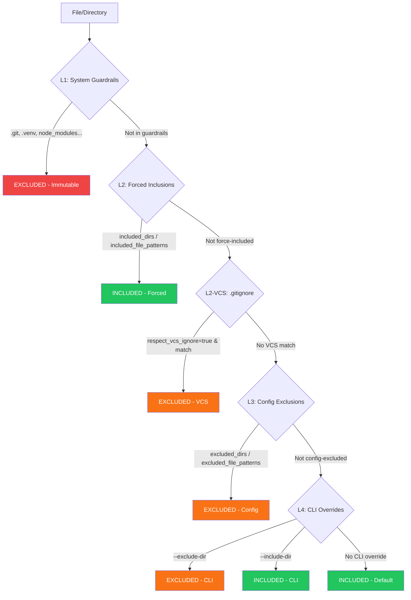

# Discovery Universale e Esclusione a Livelli

Zenzic adotta un principio architetturale preciso: **un solo punto d'ingresso** per la scoperta dei file. Ogni modulo del sistema — scanner, validator, credential scanner, orphan-checker — vede lo stesso identico insieme di file. Non esistono scorciatoie.

---

## L'Autorità della Radice {#root-authority}

Prima che Zenzic possa scoprire, escludere o scansionare un singolo file, deve rispondere a una domanda:
**dove inizia questo progetto?**

Zenzic è uno strumento con perimetro di Workspace. Non analizza directory arbitrarie; analizza
**progetti definiti**. Per stabilire il confine del progetto, Zenzic esegue una **traversata
verso l'alto** (upward traversal) a partire dal percorso target, cercando un marcatore di radice
autorizzato.

### Marcatori di Radice del Repository {#root-markers}

Due marcatori sono autorizzati (il primo trovato vince):

| Marcatore | Descrizione |
| :--- | :--- |
| `.git/` | Marcatore VCS universale — presente in qualsiasi repository tracciato da Git |
| `.zenzic.toml` | Il file di configurazione di Zenzic — il contratto esplicito di governance |

Entrambi sono intenzionalmente engine-neutral: `mkdocs.yml`, `docusaurus.config.ts` e file
analoghi dei motori di build non sono marcatori di radice. Il Core deve rimanere indipendente
da qualsiasi framework documentale specifico.

### Perché il Marcatore di Radice è Obbligatorio {#why-mandatory}

Senza un marcatore di radice (VCS o configurazione), Zenzic non può stabilire il **Perimetro di Sovranità** del progetto. Il blocco è necessario per quattro motivi indipendenti:

- **Risolvere i percorsi relativi** — ogni segnalazione è espressa come percorso relativo alla radice. Senza un'ancora fissa, la posizione dei file è ambigua e non riproducibile tra macchine diverse.
- **Mappare il workspace nel VSM** — Zenzic costruisce sempre una Virtual Site Map, indipendentemente dall'adapter. In modalità engine (Docusaurus, MkDocs), il VSM include ghost route, trasformazioni di slug e pagine virtuali. In modalità Standalone, il VSM è una proiezione 1:1 del filesystem. In entrambi i casi, la radice definisce il punto zero per la canonizzazione di ogni riferimento interno — così che `index.md` alla radice sia distinguibile senza ambiguità da un `index.md` in una sottocartella.
- **Applicare le `directory_policies`** — i contratti di governance fanno corrispondere percorsi tramite pattern glob relativi alla radice del workspace. Senza una radice definita, le regole di esenzione sono non deterministiche e non possono essere applicate in modo coerente.
- **Prevenire il Massive Indexing** — senza un confine esplicito, il motore potrebbe scansionare accidentalmente l'intero filesystem host, producendo dati incoerenti e rischiando la fuga di informazioni.

L'assenza di un marcatore di radice produce questo errore:

```text
ERROR: Could not locate repo root: no .git directory or .zenzic.toml found in any
ancestor of /percorso/al/target. Run Zenzic from inside the repository.
```

Non si tratta di un errore di configurazione. È una **garanzia di sicurezza**: il Quality Gate
interrompe una scansione fuori perimetro prima che inizi.

### Opzioni di Risoluzione {#root-resolution}

Per consentire a Zenzic di analizzare una directory, soddisfa uno dei seguenti requisiti:

**Opzione A — Inizializza Zenzic** (crea il marcatore `.zenzic.toml`):

```bash
cd /percorso/al/target
zenzic init
```

**Opzione B — Inizializza un repository Git** (crea il marcatore `.git/`):

```bash
cd /percorso/al/target
git init
```

**Opzione C — Esegui dall'interno di un progetto esistente** (la traversata verso l'alto troverà il marcatore automaticamente):

```bash
# Da qualsiasi punto all'interno di un progetto che ha già .git/ o .zenzic.toml
zenzic check all
```

---

## Il punto d'ingresso unico: `iter_markdown_sources` {#entry-point}

La funzione `iter_markdown_sources` e l'unica porta d'accesso autorizzata per iterare sui file sorgente Markdown. Nessun modulo interno chiama `rglob`, `os.walk` o `Path.iterdir` direttamente per cercare file `.md` o `.mdx`.

Questo garantisce che:

- Le esclusioni vengano applicate **universalmente** — non esistono moduli "fuori regola"
- L'ordine dei file sia **deterministico** (ordinamento imposto da `walk_files`)
- Le estensioni riconosciute come documentazione sorgente siano fissate: `.md` e `.mdx`
- I link simbolici vengano sempre saltati

La funzione accetta tre argomenti:

1. **`docs_root`** — percorso assoluto alla directory di documentazione
2. **`config`** — configurazione Zenzic caricata (fornisce `excluded_dirs`)
3. **`exclusion_manager`** — il `LayeredExclusionManager` per la valutazione completa a 4 livelli

---

## Gerarchia di esclusione a quattro livelli {#four-level-hierarchy}

Il `LayeredExclusionManager` orchestra le decisioni di esclusione attraverso quattro livelli. L'ordine di valutazione segue una logica precisa: il primo livello che corrisponde vince.

### I Quattro Livelli {#four-levels}


```mermaid
flowchart TD
    FILE[File/Directory] --> L1{L1: System Guardrails}
    L1 -->|".git, .venv, node_modules..."| EXCLUDED_L1[EXCLUDED - Immutable]
    L1 -->|Not in guardrails| L2{L2: Forced Inclusions}
    L2 -->|"included_dirs / included_file_patterns"| INCLUDED_L2[INCLUDED - Forced]
    L2 -->|Not force-included| L2VCS{L2-VCS: .gitignore}
    L2VCS -->|"respect_vcs_ignore=true & match"| EXCLUDED_VCS[EXCLUDED - VCS]
    L2VCS -->|No VCS match| L3{L3: Config Exclusions}
    L3 -->|"excluded_dirs / excluded_file_patterns"| EXCLUDED_L3[EXCLUDED - Config]
    L3 -->|Not config-excluded| L4{L4: CLI Overrides}
    L4 -->|"--exclude-dir"| EXCLUDED_L4[EXCLUDED - CLI]
    L4 -->|"--include-dir"| INCLUDED_L4[INCLUDED - CLI]
    L4 -->|No CLI override| INCLUDED[INCLUDED - Default]

    style EXCLUDED_L1 fill:#ef4444,color:#fff
    style EXCLUDED_VCS fill:#f97316,color:#fff
    style EXCLUDED_L3 fill:#f97316,color:#fff
    style EXCLUDED_L4 fill:#f97316,color:#fff
    style INCLUDED_L2 fill:#22c55e,color:#fff
    style INCLUDED_L4 fill:#22c55e,color:#fff
    style INCLUDED fill:#22c55e,color:#fff
```

| Livello | Nome | Sorgente | Modificabile? |
| :---: | :--- | :--- | :---: |
| **L1** | System Guardrails | Hardcoded in `SYSTEM_EXCLUDED_DIRS` | No |
| **L2** | Forced Inclusions + VCS | `included_dirs`, `included_file_patterns`, `.gitignore` | Sì (config) |
| **L3** | Config Exclusions | `excluded_dirs`, `excluded_file_patterns` in `.zenzic.toml` o `[tool.zenzic]` in `pyproject.toml` | Sì (config) |
| **L4** | CLI Overrides | Flag `--exclude-dir`, `--include-dir` | Sì (per-run) |

### L1 — System Guardrails {#level-1-system}

**Priorità assoluta. Immutabili. Non negoziabili.**

I System Guardrails sono directory che Zenzic ignora **sempre**, indipendentemente da qualsiasi configurazione utente. Non possono essere rimossi, ne sovrascritti da inclusioni forzate, ne superati da flag CLI.

| Directory | Motivazione |
| :--- | :--- |
| `.git`, `.github` | VCS e CI/CD |
| `.venv`, `node_modules` | Ambienti virtuali e gestori pacchetti |
| `.nox`, `.tox` | Runner di test |
| `.pytest_cache`, `.mypy_cache`, `.ruff_cache` | Cache degli strumenti |
| `__pycache__` | Cache bytecode Python |
| `.docusaurus`, `.cache` | Cache del motore di build |
| `.hypothesis`, `.temp` | Directory temporanee |

Queste directory vengono unite a `excluded_dirs` in modo additivo durante `model_post_init` del modello di configurazione. La logica è: le voci dell'utente si **aggiungono** ai Guardrail, non li **sostituiscono**.

### L2 — Forced Inclusions + VCS {#level-2-forced-and-vcs}

Il livello 2 gestisce due forze opposte:

**Inclusioni forzate** (`included_dirs`, `included_file_patterns`) — sovrascrivono le esclusioni VCS e le esclusioni di configurazione, ma **mai** i System Guardrails. Questo permette di forzare la scansione di directory o file che sarebbero altrimenti ignorati dal `.gitignore`.

**VCS ignore** (`respect_vcs_ignore = true`) — quando attivato, Zenzic legge i file `.gitignore` dalla radice del repository e dalla directory docs. I file corrispondenti vengono esclusi da tutti i controlli. Disabilitato per default (principio Zero-Config).

L'ordine di precedenza tra questi due sotto-livelli e chiaro: le inclusioni forzate vincono sempre sulle esclusioni VCS.

```toml
# .zenzic.toml
respect_vcs_ignore = true
included_dirs = ["generated-docs"]
included_file_patterns = ["api.generated.md"]
```

In questo esempio, anche se `generated-docs/` e nel `.gitignore`, Zenzic lo scansionera comunque.

### L3 — Configurazione {#level-3-config}

Le esclusioni dichiarate in `.zenzic.toml` o `[tool.zenzic]` in `pyproject.toml`:

- `excluded_dirs` — directory da escludere (additive ai Guardrail)
- `excluded_file_patterns` — pattern glob applicati ai nomi dei file

Queste esclusioni vengono valutate dopo le inclusioni forzate e il VCS. Se un file e stato forzatamente incluso al livello L2, le esclusioni L3 non lo toccano.

### L4 — CLI {#level-4-cli}

Flag a riga di comando per override temporanei:

- `--exclude-dir DIR` — esclude una directory aggiuntiva (ripetibile)
- `--include-dir DIR` — forza l'inclusione di una directory (ripetibile, non sovrasta i System Guardrails)

I flag CLI vengono valutati con la stessa logica degli altri livelli: `--include-dir` vince su `--exclude-dir` per la stessa directory, ma nessuno dei due puo sovrastare L1.


---

## Flusso di lavoro `respect_vcs_ignore` {#vcs-workflow}

Per default, `respect_vcs_ignore` è `false`. Zenzic scansiona ogni file sotto `docs/` che non sia escluso dai System Guardrails o dalle esclusioni config/CLI. Questo è il **principio Zero-Config**: ciò che vedi nel filesystem è ciò che Zenzic scansiona.

Quando `respect_vcs_ignore = true`, il `LayeredExclusionManager` costruisce un `VCSIgnoreParser` unificato dai file `.gitignore`:

1. Legge `.gitignore` dalla radice del repository (se esiste)
2. Legge `.gitignore` dalla directory docs (se esiste e diversa dalla radice)
3. Unisce le regole di tutti i parser in un singolo parser
4. Pre-compila le espressioni regolari per performance ottimali

Il parser segue la specifica gitignore completa, incluse negazione (`!`), ancoraggio al percorso e wildcards glob.

### Interazione con le Forced Inclusions

Le inclusioni forzate (`included_dirs`, `included_file_patterns`) sovrascrivono le esclusioni VCS. Questo supporta il workflow comune in cui la documentazione generata è elencata nel `.gitignore` (perché non deve essere committata) ma deve comunque essere lintata:

```toml
respect_vcs_ignore = true

# Questo file è nel .gitignore ma deve essere lintato
included_file_patterns = ["api.generated.md"]
```

---

## Exclusion Zone Philosophy {#privacy-gate}

Il sistema di esclusione e progettato seguendo la Exclusion Zone Philosophy:

- **Nessuna sorpresa:** senza configurazione, Zenzic funziona con valori predefiniti ragionevoli
- **Nessun file critico esposto:** i System Guardrails proteggono directory che non contengono mai documentazione utile (`.git`, `.venv`, ecc.)
- **Inclusione esplicita:** l'utente deve dichiarare esplicitamente cosa vuole includere di non standard
- **Trasparenza:** il flusso di esclusione e deterministico e documentato — nessuna magia nascosta

Il `LayeredExclusionManager` viene costruito una sola volta dalla CLI e passato lungo tutta la pipeline. Ogni modulo riceve la stessa istanza, garantendo coerenza totale nell'insieme dei file analizzati.

---

## Note sulle Prestazioni {#performance}

Per i file non-Markdown (asset, immagini, configurazione), Zenzic fornisce `walk_files`: un iteratore basato su `os.walk` con pruning in-place delle directory.

A differenza di `Path.rglob("*")`, `walk_files` pota gli alberi esclusi (ad esempio `.nox/`, `node_modules/`) senza mai entrare in essi. Questo e cruciale per le performance in repository con migliaia di dipendenze.

Il pruning viene pilotato sia dal `LayeredExclusionManager` (via `should_exclude_dir`) sia da un set aggiuntivo di directory hard-prune (usato da `find_unused_assets` per `excluded_asset_dirs`).

---

## Multi-Root Discovery {#multi-root}

`docs_dir` è la radice canonica dei sorgenti, ma gli static-site generator moderni gestiscono regolarmente **alberi di contenuto che vivono fuori da `docs/`**. Il caso di scuola è la directory `blog/` di Docusaurus: viene materializzata in URL reali dalla build, ma una scansione Zenzic pre-current series non avrebbe mai visto i file al suo interno. Il Virtual Site Map ingeriva solo i file sotto `docs_root`, perciò i link rotti dentro (o verso) i post del blog sfuggivano a `zenzic check all` e affioravano solo a valle, quando `docusaurus build` falliva. Chiamiamo questa modalità di fallimento **VSM Blindness**.

Multi-Root Discovery cura la cecità permettendo all'adapter attivo di dichiarare ulteriori radici di contenuto — ciascuna con un percorso fisico, un prefisso URL e un'etichetta diagnostica. Quando vengono dichiarate radici extra, tutti gli stadi della pipeline trattano quei file come contenuto di prima classe accanto all'albero primario `docs/`.

### Auto-discovery senza `subprocess` {#auto-discovery}

Le implementazioni dell'adapter onorano l'invariante **Zero Subprocess**. L'adapter Docusaurus rileva il plugin blog in due passaggi, entrambi puro parsing:

1. Parse statico via regex di `docusaurus.config.{ts,js,mjs,cjs}` per un blocco `blog: { path, routeBasePath }` (o un sentinella `blog: false` per disattivare).
2. Convenzione di fallback: quando il config non fissa il plugin blog e `<repo>/blog` esiste su disco, si assume il layout di default (`path = 'blog'`, `routeBasePath = 'blog'`).

Nessun processo Node.js viene mai avviato — il config viene letto come **dato**, non eseguito come codice. Pillar 2 (Engine Sovereignty) preservato.

### Invariante di tracciabilità {#traceability}

Ogni voce nel VSM, incluse quelle prodotte da una radice extra, porta un `Route.source` che risale a un file reale su disco. Una rotta senza origine fisica sarebbe un validatore che urla `error` senza mai dire `dove`.

### Invariante di Reverse-Mapping e Virtual Routes {#reverse-mapping}

Il Multi-Root Discovery (current series) ha risolto il **VSM Blindness** per i file fisici
fuori da `docs/`. La current series estende la garanzia alle **pagine generate dal motore**:
Docusaurus produce URL — pagine di tag, indici paginati, profili autore — che non hanno
un corrispondente fisico in Markdown. Queste rotte esistono solo nell'output del build,
mai su disco.

L'invariante garantisce che ogni URL generato dal motore risalga ad almeno un file sorgente. Gli adapter aderiscono implementando il metodo opzionale `get_virtual_routes()`, e le virtual routes partecipano alla collision detection alla pari delle rotte fisiche.

### Matrice di supporto motori {#engine-support}

| Motore           | Implementa `get_extra_content_roots` | Stato                                                                       |
|------------------|--------------------------------------|------------------------------------------------------------------------------|
| Docusaurus       | Sì                                   | Auto-rileva `blog/` da config o convenzione.                                 |
| MkDocs (Material) | No                                  | Adesione rinviata fino all'ingresso del plugin `material/blog` nello scope current release |
| Zensical         | No                                   | Architettura identica — abilitato quando arriva un plugin out-of-tree.       |
| Standalone       | No                                   | Nessun plugin; `docs_root` è l'intera superficie di contenuto.               |

### Esportare la mappa del sito: `inspect routes` {#inspect-routes}

current series include un comando CLI di prima classe che espone il VSM a consumer esterni:

```shell
zenzic inspect routes --json
```

Questa funzionalità esporta la mappa completa del sito in formato JSON deterministico.
È progettata per essere consumata da tool esterni: script Bash custom, dashboard di
CI/CD, o tool specializzati che necessitano di contesto architetturale.

Ogni record nel JSON contiene quattro campi: `url`, `kind` (`physical` o `virtual`),
`source_files` (un array ordinato di percorsi relativi al repository che *causano*
l'esistenza dell'URL) e un `digest` — un’impronta SHA-256 derivata dall'URL e dai
suoi file sorgente. Il flag `--kind` restringe l'output a `physical`, `virtual` o
`all` (default). Il JSON viene scritto esclusivamente su `stdout`; i diagnostici
vanno su `stderr`.
