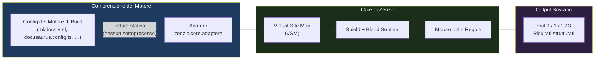

# Il Modello Adapter

Zenzic opera come **revisore esterno sovrano**. Non si incorpora mai all'interno di un motore di build,
non avvia mai sottoprocessi e non richiede mai extra di installazione specifici per il motore.
Un unico binario. Ogni motore. Protezione completa.

---

## Adapter — Il Layer dell'Intelligenza {#adapters}

Un **Adapter** (in `zenzic.core.adapters`) è un componente Pure-Python che **legge** il file di
configurazione di un motore di build e lo traduce nel modello interno di Zenzic. Gli adapter rispondono
a tre domande:

1. **Quali file sono navigabili?** (`get_nav_paths()`) — Quali file `.md` / `.mdx` compaiono nella navigazione del sito?
2. **Quale URL ottiene questo file?** (`get_route_info()`) — URL canonico, slug override, route base path.
3. **Quali pattern ignora questo motore?** (`get_ignored_patterns()`) — File come `README.md` che alcuni motori saltano.



Gli adapter sono **stateless e senza sottoprocessi**. Un `MkDocsAdapter` legge `mkdocs.yml` in modo
statico — il binario `mkdocs` non viene mai invocato. La stessa esecuzione che analizza un progetto
MkDocs può, con un adapter diverso, analizzare un progetto Docusaurus o Zensical usando un percorso
di codice identico.

---

## Adapter Integrati {#built-in-adapters}

| Classe adapter | Motore | File di configurazione letto |
| :--- | :--- | :--- |
| `MkDocsAdapter` | `mkdocs` | `mkdocs.yml` |
| `ZensicalAdapter` | `zensical` | `zensical.toml` |
| `DocusaurusAdapter` | `docusaurus` | `docusaurus.config.js` / `.ts` |
| `StandaloneAdapter` | `standalone` | _(nessuno — ogni file è REACHABLE)_ |

Gli adapter vengono scoperti tramite il gruppo entry-point `zenzic.adapters`. Puoi pubblicare un
adapter di terze parti per qualsiasi motore senza toccare il core di Zenzic:

```toml
# pyproject.toml del tuo adapter
[project.entry-points."zenzic.adapters"]
mio_motore = "mio_pacchetto.adapter:MioAdapter"
```

---

## Strategia CLI Sovrana {#sovereign-cli}

Zenzic v0.7.0 non fornisce plugin per motori di build né integrazioni interne.
Questa è una decisione architetturale deliberata, non una funzionalità mancante.

### Perché nessun plugin per motori?

| Aspetto | Plugin nel motore | CLI Sovrana |
| :--- | :--- | :--- |
| Scansione credenziali (Shield) | ❌ Strutturalmente assente — gli hook si attivano troppo tardi | ✅ Hardening completo ZRT-006/007 |
| Path traversal (Blood Sentinel) | ❌ Il motore controlla la risoluzione dei path | ✅ Ogni link normalizzato da Zenzic |
| Validazione dei link | ❌ Resolver del motore — non la VSM | ✅ VSM O(1) con cache SHA256 |
| Parità tra motori | ❌ Plugin MkDocs ≠ Plugin Docusaurus | ✅ Percorso di codice unico per tutti i motori |
| Isolamento dipendenze | ❌ Richiede `pip install zenzic[motore]` | ✅ `pip install zenzic` — fatto |

Un plugin che vive all'interno di un motore di build non può garantire le stesse proprietà di un
revisore esterno. Lo Shield, il Blood Sentinel e la VSM sono stati progettati per l'esecuzione
sovrana. Incorporarli in un hook di build li degraderebbe a controlli best-effort.

### Il workflow consigliato

```bash
# Installazione — un solo pacchetto, nessun extra
pip install zenzic

# Rilevamento motore dai file di configurazione, scrittura zenzic.toml
zenzic init

# Audit completo — VSM + Shield + Blood Sentinel + validazione link
zenzic check all

# In CI (GitHub Actions, GitLab CI, ecc.)
# Aggiungi come step prima o dopo la build, non al suo interno
zenzic check all --strict
```

Zenzic viene eseguito **prima o dopo** la build — mai al suo interno. Questo garantisce:
- Exit 2 per qualsiasi credenziale esposta (la shell si ferma immediatamente)
- Exit 3 per qualsiasi link path-traversal (non sopprimibile)
- Risultati engine-agnostici: lo stesso comando `zenzic check all` funziona per ogni motore

---

## Scegliere il Modello Giusto {#choosing}

| Scenario | Approccio consigliato |
| :--- | :--- |
| Pipeline CI per qualsiasi motore | `zenzic check all` — aggiungi uno step, nessun plugin necessario |
| Gate pre-commit per le credenziali | `zenzic check references` — si registra come hook pre-commit |
| Motore custom non ancora supportato | **Scrivi un Adapter** — pubblica come pacchetto separato, registra via entry-point `zenzic.adapters` |
| Migrazione da MkDocs a Docusaurus | Usa `zenzic check all` con `engine = "mkdocs"` sulla sorgente, `engine = "docusaurus"` sulla destinazione |

---

## Vedi Anche {#see-also}

- [Riferimento Architettura](./architecture) — Approfondimento sul Protocollo Adapter e il contratto `BaseAdapter`.
- [Discovery e Esclusione](./discovery) — Come Zenzic scopre i file prima che l'Adapter venga consultato.
- [Riferimento Configurazione](../reference/configuration-reference) — Selezione engine in `[build_context]` e opzioni `zenzic.toml`.
