# Adapter vs. Integrazioni

Zenzic è costruito attorno a una separazione architetturale netta tra due responsabilità: **comprendere** il tuo motore di documentazione e **agire** al suo interno. Questa pagina spiega il modello mentale.

---

## Il Modello "Mente e Braccio" {#mind-and-arm}

| Componente | Metafora | Direzione | Quando viene usato |
| :--- | :--- | :--- | :--- |
| **Adapter** | Mente — interpreta il motore | Engine → Zenzic | Sempre, ad ogni esecuzione di `zenzic check` |
| **Integration** | Braccio — attiva Zenzic dal motore | Zenzic → Engine | Opzionale, quando vuoi gate automatici durante la build |

Gli **Adapter** (in `zenzic.core.adapters`) sono componenti Pure-Python che **leggono** il file di configurazione di un motore e lo traducono nel modello interno di Zenzic. Non modificano mai il motore, non avviano mai sottoprocessi. Un `MkDocsAdapter` legge `mkdocs.yml` in modo statico — il binario `mkdocs` non viene mai invocato.

Le **Integrazioni** (in `zenzic.integrations`) sono plugin opzionali che si **agganciano** al ciclo di vita di un motore di build e invocano automaticamente i controlli di Zenzic. Lo `ZenzicPlugin` per MkDocs è la prima implementazione. Si attiva durante `mkdocs build`, rendendo impossibile pubblicare documentazione con link rotti.

```mermaid
flowchart LR
    subgraph INTAKE ["Intake — Comprensione del Motore"]
        direction TB
        ENG["Motore di Build\n(mkdocs.yml, docusaurus.config.ts, …)"]
        ADP["Adapter\nzenzic.core.adapters"]
        ENG -->|"lettura statica\n(nessun sottoprocesso)"| ADP
    end

    subgraph CORE ["Core di Zenzic"]
        direction TB
        VSM["Virtual Site Map\n(VSM)"]
        SHIELD["Shield Middleware"]
        RULES["Motore delle Regole"]
        ADP --> VSM
        VSM --> SHIELD
        SHIELD --> RULES
    end

    subgraph ACTION ["Action — Attivazione dal Motore"]
        direction TB
        INTG["Integration\nzenzic.integrations"]
        BUILD["Pipeline di Build\n(mkdocs build, …)"]
        RULES -->|risultati| INTG
        INTG -->|pass/fail gate| BUILD
    end

    style INTAKE fill:#1e3a5f,color:#fff
    style CORE fill:#1a2e1a,color:#fff
    style ACTION fill:#3b1f1f,color:#fff
```



---

## Adapter nel Dettaglio {#adapters}

Un adapter implementa il protocollo `BaseAdapter`. Risponde a tre domande:

1. **Quali file sono navigabili?** (`get_nav_paths()`) — Quali file `.md` / `.mdx` compaiono nella navigazione del sito?
2. **Quale URL ottiene questo file?** (`get_route_info()`) — URL canonico, slug override, route base path.
3. **Quali pattern ignora questo motore?** (`get_ignored_patterns()`) — File come `README.md` che alcuni motori saltano.

Gli adapter vengono scoperti tramite il gruppo entry-point `zenzic.adapters`. Puoi pubblicare un adapter di terze parti per qualsiasi motore senza toccare il core di Zenzic:

```toml
# pyproject.toml del tuo adapter
[project.entry-points."zenzic.adapters"]
mio_motore = "mio_pacchetto.adapter:MioAdapter"
```

### Adapter Integrati

| Classe adapter | Motore | File di configurazione letto |
| :--- | :--- | :--- |
| `MkDocsAdapter` | `mkdocs` | `mkdocs.yml` |
| `ZensicalAdapter` | `zensical` | `zensical.toml` |
| `DocusaurusAdapter` | `docusaurus` | `docusaurus.config.js` / `.ts` |
| `StandaloneAdapter` | `standalone` | _(nessuno — ogni file è REACHABLE)_ |

---

## Integrazioni nel Dettaglio {#integrations}

Le integrazioni vivono in `zenzic.integrations`. Richiedono che il motore host sia installato insieme a Zenzic, quindi sono **opt-in** tramite un extra del pacchetto:

```bash
# Solo Zenzic — nessuna dipendenza dal motore
pip install zenzic

# Con l'integrazione MkDocs
pip install "zenzic[mkdocs]"
```

### `zenzic.integrations.mkdocs` — Il Plugin MkDocs {#mkdocs-plugin}

Il plugin MkDocs è registrato come entry point nativo `mkdocs.plugins`. Aggiungilo al tuo `mkdocs.yml`:

```yaml
plugins:
  - search
  - zenzic          # ← drop-in: nessuna configurazione aggiuntiva richiesta
```

Quando viene eseguito `mkdocs build`, Zenzic attiva `check all` prima che venga renderizzata la prima pagina. Un risultato con severità `error` causa il fallimento immediato della build — non puoi pubblicare accidentalmente un sito di documentazione con link rotti.

Il plugin viene scoperto automaticamente da MkDocs tramite l'entry point:

```toml
# Registrato nel pyproject.toml di zenzic — nessuna azione richiesta dall'utente
[project.entry-points."mkdocs.plugins"]
zenzic = "zenzic.integrations.mkdocs:ZenzicPlugin"
```

---

## Scegliere il Modello Giusto {#choosing}

| Scenario | Approccio consigliato |
| :--- | :--- |
| Pipeline CI (`zenzic check all` in una GitHub Action) | **Solo Adapter** — nessuna integrazione necessaria |
| Progetto MkDocs con gate di build | **Adapter + Integrazione MkDocs** — `pip install "zenzic[mkdocs]"` |
| Motore custom non ancora supportato | **Scrivi un Adapter** — pubblica come pacchetto separato, registra via entry-point `zenzic.adapters` |
| Attivare Zenzic da un hook di build non-MkDocs | **Scrivi un'Integrazione** — apri una PR o pubblica come pacchetto separato in `zenzic.integrations` |

---

## Vedi Anche {#see-also}

- [Riferimento Architettura](./architecture) — Approfondimento sul Protocollo Adapter e il contratto `BaseAdapter`.
- [Discovery e Esclusione](./discovery) — Come Zenzic scopre i file prima che l'Adapter venga consultato.
- [Riferimento Configurazione](../reference/configuration-reference) — Selezione engine in `[build_context]` e opzioni `zenzic.toml`.
