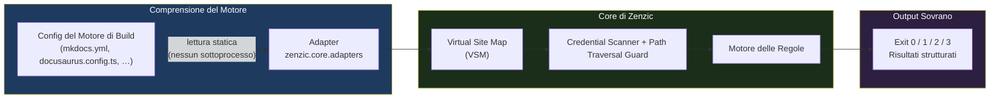

# L'Ecosistema Zenzic

## L'Ecosistema in Sintesi {#ecosystem-at-a-glance}

| Componente | Ruolo |
| :--- | :--- |
| **Zenzic Core** | Il linter puro, agnostico, Zero-Config. Un solo binario. Ogni motore di documentazione. |
| **Structum** | Interfaccia MCP opzionale che fornisce contesto architetturale agli assistenti AI per la programmazione. |
| **Zenzic-Doc** | Il banco di prova vivente — un sito Docusaurus auto-validante che testa ogni release di Zenzic su sé stesso. |

Ogni componente è installabile indipendentemente e non ha dipendenze rigide dagli altri.

---

Zenzic opera come **revisore esterno sovrano**. Non si incorpora mai all'interno di un motore di build,
non avvia mai sottoprocessi e non richiede mai extra di installazione specifici per il motore.
Un unico binario. Ogni motore. Protezione completa.

---

## Adapter — Il Layer dell'Intelligenza {#adapters}

Un **Adapter** (in `zenzic.core.adapters`) è un componente Pure-Python che **legge** il file di
configurazione di un motore di build e lo traduce nel modello interno di Zenzic. Gli adapter rispondono
a tre domande:

1. **Quali file sono navigabili?** (`get_nav_paths()`) — Quali file `.md` / `.mdx` compaiono nella navigazione del sito?
2. **Quale URL ottiene questo file?** (`get_route_info()`) — URL canonico, slug override, route base path.
3. **Quali pattern ignora questo motore?** (`get_ignored_patterns()`) — File come `README.md` che alcuni motori saltano.


```mermaid
flowchart LR
    subgraph INTAKE ["Comprensione del Motore"]
        direction TB
        ENG["Config del Motore di Build\n(mkdocs.yml, docusaurus.config.ts, …)"]
        ADP["Adapter\nzenzic.core.adapters"]
        ENG -->|"lettura statica\n(nessun sottoprocesso)"| ADP
    end

    subgraph CORE ["Core di Zenzic"]
        direction TB
        VSM["Virtual Site Map\n(VSM)"]
        CREDENTIALS["Credential Scanner + Path Traversal Guard"]
        RULES["Motore delle Regole"]
        ADP --> VSM
        VSM --> CREDENTIALS
        CREDENTIALS --> RULES
    end

    subgraph OUT ["Output Sovrano"]
        EXIT["Exit 0 / 1 / 2 / 3\nRisultati strutturati"]
        RULES --> EXIT
    end

    style INTAKE fill:#1e3a5f,color:#fff
    style CORE fill:#1a2e1a,color:#fff
    style OUT fill:#2d1f3f,color:#fff
```

Gli adapter sono **stateless e senza sottoprocessi**. Un `MkDocsAdapter` legge `mkdocs.yml` in modo
statico — il binario `mkdocs` non viene mai invocato. La stessa esecuzione che analizza un progetto
MkDocs può, con un adapter diverso, analizzare un progetto Docusaurus o Zensical usando un percorso
di codice identico.

---

## Adapter Integrati {#built-in-adapters}

| Classe adapter | Motore | File di configurazione letto |
| :--- | :--- | :--- |
| `MkDocsAdapter` | `mkdocs` | `mkdocs.yml` |
| `ZensicalAdapter` | `zensical` | `zensical.toml` |
| `DocusaurusAdapter` | `docusaurus` | `docusaurus.config.js` / `.ts` |
| `StandaloneAdapter` | `standalone` | *(nessuno — ogni file è REACHABLE)* |

Gli adapter vengono scoperti tramite il gruppo entry-point `zenzic.adapters`. Puoi pubblicare un
adapter di terze parti per qualsiasi motore senza toccare il core di Zenzic:

```toml
# pyproject.toml del tuo adapter
[project.entry-points."zenzic.adapters"]
mio_motore = "mio_pacchetto.adapter:MioAdapter"
```

---

## Strategia CLI Sovrana {#sovereign-cli}

Zenzic v0.7.0 non fornisce plugin per motori di build né integrazioni interne.
Questa è una decisione architetturale deliberata, non una funzionalità mancante.

### Perché nessun plugin per motori

| Aspetto | Plugin nel motore | CLI Sovrana |
| :--- | :--- | :--- |
| Scansione credenziali | ❌ Strutturalmente assente — gli hook si attivano troppo tardi | ✅ Hardening completo ZRT-006/007 |
| Path traversal (path traversal guard) | ❌ Il motore controlla la risoluzione dei path | ✅ Ogni link normalizzato da Zenzic |
| Validazione dei link | ❌ Resolver del motore — non la VSM | ✅ VSM O(1) con cache SHA256 |
| Parità tra motori | ❌ Plugin MkDocs ≠ Plugin Docusaurus | ✅ Percorso di codice unico per tutti i motori |
| Isolamento dipendenze | ❌ Richiede `pip install zenzic[motore]` | ✅ `pip install zenzic` — fatto |

Un plugin che vive all'interno di un motore di build non può garantire le stesse proprietà di un
revisore esterno. Il credential scanner, il path traversal guard e la VSM sono stati progettati per l'esecuzione
sovrana. Incorporarli in un hook di build li degraderebbe a controlli best-effort.

### Il workflow consigliato

```bash
# Installazione — un solo pacchetto, nessun extra
pip install zenzic

# Rilevamento motore dai file di configurazione, scrittura zenzic.toml
zenzic init

# Audit completo — VSM + credential scanner + path traversal guard + validazione link
zenzic check all

# In CI (GitHub Actions, GitLab CI, ecc.)
# Aggiungi come step prima o dopo la build, non al suo interno
zenzic check all --strict
```

Zenzic viene eseguito **prima o dopo** la build — mai al suo interno. Questo garantisce:

- Exit 2 per qualsiasi credenziale esposta (la shell si ferma immediatamente)
- Exit 3 per qualsiasi link path-traversal (non sopprimibile)
- Risultati engine-agnostici: lo stesso comando `zenzic check all` funziona per ogni motore

---

## zenzic-doc — Banco di Prova Vivente {#living-test-bench}

Il sito di documentazione Zenzic (`zenzic-doc`) non è un artefatto passivo — è un
partecipante attivo nella pipeline di qualità. Ogni commit esegue `zenzic check all --strict`
contro sé stesso prima di poter essere inviato (Sovereign Parity, ZRT-010).

Oltre all'audit standard di Zenzic, `zenzic-doc` impone un secondo invariante unico al suo
ruolo di documentazione di un linter: ogni codice di finding Zxxx presente in `docs/` deve
avere un'entità registrata in `src/zenzic/core/codes.py` nel pacchetto Core — e viceversa.
Questa parità bidirezionale è applicata dalla sessione Nox `verify-codes-parity` tramite
**Graceful Degradation**:

- **Core Maintainer**: `ZENZIC_PROJECT_PATH` impostato → `uv run --project <percorso>` sul sorgente locale.
- **External Contributor**: core locale assente → `uv run --with zenzic` sulla release PyPI pubblicata.

Eseguire `just verify` in `zenzic-doc` avvia tutti e quattro i gate in sequenza. I contributori
esteri non hanno bisogno di un checkout locale di Zenzic Core.

---

## Lo Standard a 4 Cancelli {#4-gates-standard}

Ogni repository dell'ecosistema Zenzic impone la qualità in quattro checkpoint progressivi:

| Cancello | Trigger | Strumento | Cosa rileva |
| :--- | :--- | :--- | :--- |
| **Cancello 1 — IDE** | In tempo reale, al salvataggio | Estensioni editor (Pylance, ESLint) | Errori di tipo, problemi sintattici |
| **Cancello 2 — Pre-commit** | `git commit` | Hook `pre-commit` | Lint, credenziali, formattazione, REUSE |
| **Cancello 3 — Pre-push** | `git push` | `just verify` (via `pre-commit -t pre-push`) | Suite di validazione completa identica alla CI |
| **Cancello 4 — CI Remota** | Pull Request / push | GitHub Actions | `just verify` identico su un runner Ubuntu pulito |

I Cancelli 3 e 4 eseguono lo **stesso comando** (`just verify`) — locale e remoto non possono
mai divergere. Questo è il principio di Sovereign Parity (ZRT-010).

> Per la configurazione operativa (installazione hook, YAML del workflow), vedi la
> [guida CI/CD Integration](../how-to/configure-ci-cd#doc-code-parity).

---

## Scegliere il Modello Giusto {#choosing}

| Scenario | Approccio consigliato |
| :--- | :--- |
| Pipeline CI per qualsiasi motore | `zenzic check all` — aggiungi uno step, nessun plugin necessario |
| Gate pre-commit per le credenziali | `zenzic check references` — si registra come hook pre-commit |
| Motore custom non ancora supportato | **Scrivi un Adapter** — pubblica come pacchetto separato, registra via entry-point `zenzic.adapters` |
| Migrazione da MkDocs a Docusaurus | Usa `zenzic check all` con `engine = "mkdocs"` sulla sorgente, `engine = "docusaurus"` sulla destinazione |

---

## Integrità del Brand — Quartz Clarity {#brand-integrity}

Il modello Exclusion Zone va oltre la correttezza strutturale. Una base di codice o una suite di documentazione che contiene identificatori di brand obsoleti (codename di release non più in uso) porta un tipo di debito diverso: **debito narrativo**. Una pagina v0.7.0 che fa ancora riferimento a un codename v0.6.x contraddice la cronologia delle versioni che cerca di documentare.

Zenzic affronta questo problema attraverso il blocco di configurazione [`[governance]`](../reference/configuration.mdx) e il finding [Z601 BRAND_OBSOLESCENCE](../reference/finding-codes.mdx#z601):

```toml title="zenzic.toml"
[governance]
brand_obsolescence = ["Obsidian"]
```

Zenzic usa una **soppressione per riga, format-aware** per i riferimenti storici intenzionali. Nei file ``.md``, aggiungi `<!-- zenzic:ignore Z601 -->` in fondo alla riga. Nei file ``.mdx``, aggiungi `{/* zenzic:ignore Z601 */}` — un commento JSX invisibile al parser Docusaurus/React. Entrambe le forme vengono silenziosamente saltate dallo scanner. La distinzione tra *citazione storica* e *aggiornamento dimenticato* viene applicata a livello di riga, non di file.

---

## Vedi Anche {#see-also}

- [Riferimento Architettura](./architecture) — Approfondimento sul Protocollo Adapter e il contratto `BaseAdapter`.
- [Discovery e Esclusione](./discovery) — Come Zenzic scopre i file prima che l'Adapter venga consultato.
- [Riferimento Configurazione](../reference/configuration-reference) — Selezione engine in `[build_context]` e opzioni `zenzic.toml`.
