{/* SPDX-FileCopyrightText: 2026 PythonWoods <dev@pythonwoods.dev> */}
{/* SPDX-License-Identifier: Apache-2.0 */}

# Filosofia

## La documentazione è infrastruttura

Il codice sorgente ha compilatori, type checker e linter che impediscono al codice rotto di
raggiungere la produzione. La documentazione storicamente non ha avuto nulla di tutto ciò. Un link
interrotto, una credenziale esposta o una pagina stub mai completata possono arrivare agli utenti
senza che alcun gate automatizzato li intercetti.

Zenzic esiste per colmare questo divario. Lo stato di salute della documentazione deve essere
misurabile, deterministico e rigorosamente garantito — intercettato con la stessa certezza
matematica di un errore di tipo nel codice sorgente.

---

## I tre pilastri {#three-pillars}

Ogni decisione di design in Zenzic segue tre regole. Quando c'è dubbio su una
scelta implementativa, queste sono i criteri di risoluzione. Se una riga di codice
viola uno qualsiasi di questi pilastri, è **debito tecnico istantaneo**.

**1. Valida il sorgente, non il build.**
Zenzic analizza i file Markdown grezzi sotto `docs/` e i file di configurazione
(`mkdocs.yml`, `docusaurus.config.ts`, `zensical.toml`). Non aspetta mai un
build HTML. L'analisi a livello sorgente è più veloce, agnostica rispetto al
generatore, e sempre riproducibile. Dove un motore di build definisce la
semantica di risoluzione (es. fallback i18n), Zenzic legge la configurazione
come testo e ne emula la semantica — senza importare o eseguire il motore.

**2. Nessun sottoprocesso nel core engine.**
La libreria core è 100% Python puro. Non chiama mai `subprocess.run` o
`os.system` per invocare strumenti esterni. Questo garantisce sicurezza (zero
esecuzione di codice non fidato), portabilità totale e velocità estrema. La
validazione dei link è implementata nativamente con un estrattore di link
Markdown. Zenzic è autocontenuto e testabile senza installare alcun
generatore di documentazione.

**3. Funzioni pure prima di tutto.**
Tutta la logica di validazione vive in funzioni pure: nessun I/O su file,
nessun accesso di rete, nessun output su terminale. L'I/O avviene solo ai
bordi — nei wrapper CLI che leggono file da disco. Le funzioni pure sono
trivialmente testabili e componibili liberamente. Per questo Zenzic supporta
il parallelismo senza race condition.

---

## Il principio Safe Harbor

L'ecosistema degli strumenti di documentazione non è stabile. MkDocs introduce breaking change.
Nuovi sistemi di build emergono. I team migrano da un generatore a un altro. In questo contesto,
uno strumento di qualità strettamente accoppiato a un motore di build specifico crea una
dipendenza pericolosa: quando il motore cambia, il quality gate si rompe, e i progetti restano
senza verifica proprio nella finestra temporale in cui gli errori sono più probabili.

Zenzic è progettato per essere un **Safe Harbor** — un punto fisso e stabile che rimane valido
prima, durante e dopo una migrazione di motore di build. Questo non è un feature casuale; è
l'impegno architetturale fondamentale.

L'implementazione di questo impegno è l'**agnosticismo assoluto rispetto al motore**:

- Zenzic legge file Markdown grezzi e configurazione come dati puri. Non importa né esegue mai
  un framework di documentazione.
- La conoscenza engine-specifica (struttura nav, convenzioni i18n, regole di fallback locale) è
  incapsulata negli **adapter** — componenti sottili e sostituibili che traducono la semantica del
  motore in un protocollo neutro. Il Core non vede mai un `MkDocsAdapter` o `ZensicalAdapter` —
  vede solo un `BaseAdapter` che risponde a cinque domande.
- Gli adapter di terze parti si installano come pacchetti Python e vengono scoperti a runtime
  tramite entry-point. Aggiungere supporto per un nuovo motore (Hugo, Docusaurus, Sphinx) non
  richiede alcun rilascio di Zenzic.

La conseguenza pratica: un progetto che migra da MkDocs a Zensical — o a Hugo, Docusaurus o
qualsiasi generatore futuro — può eseguire `zenzic check all` continuamente contro entrambe le
configurazioni simultaneamente. Un progetto che non ha ancora deciso il motore di build può
comunque validare la qualità della propria documentazione oggi, usando la modalità Vanilla
senza alcuna configurazione.

Gli ecosistemi di documentazione evolvono costantemente — i motori di build introducono breaking
change, i formati di configurazione cambiano, le API dei plugin vengono ridisegnate. La posizione
di Zenzic è intenzionalmente conservativa e protettiva verso l'utente:

- Ogni motore supportato riceve lo stesso livello di fedeltà nella validazione.
- I file di configurazione esistenti vengono validati come contratti sorgente, non come promesse
  di runtime.
- Chiavi di configurazione sconosciute o future vengono trattate con parsing tollerante, non con
  errori fatali.

In pratica, questo significa che un team può rimandare le decisioni di migrazione senza perdere i
quality gate. Zenzic mantiene vivo il layer di verifica mentre l'ecosistema intorno evolve.

---

## La sentinella senza attriti

Un linter vale quanto il suo tasso di falsi positivi. Quando gli strumenti sollevano errori alla
cieca, gli sviluppatori imparano a ignorarli — e uno strumento ignorato non fornisce alcuna
sicurezza.

L'architettura di Zenzic è progettata attorno a un singolo vincolo: **ogni finding deve essere
azionabile**. Questo plasma diverse decisioni:

- **Algoritmi multi-pass in memoria.** La Pipeline di Riferimento a Due Passi separa la raccolta
  delle definizioni dal controllo degli usi, eliminando i falsi positivi causati dai forward
  reference che uno scanner naive single-pass produrrebbe.
- **Consapevolezza del fallback i18n.** Un link da una pagina tradotta a un asset della locale
  default non è un link rotto — il motore di build servirà il fallback a runtime. Zenzic lo
  sopprime.
- **Modalità Vanilla per progetti senza nav.** Quando Zenzic non ha dichiarazioni nav contro cui
  confrontare, salta interamente il controllo orfani piuttosto che segnalare ogni file come orfano.

L'obiettivo è uno strumento **completamente silenzioso quando la tua documentazione è sana**, e
chirurgicamente preciso quando non lo è.

---

## La pipeline di validazione {#validation-pipeline}

Ogni esecuzione di Zenzic segue la stessa pipeline a quattro stadi,
indipendentemente dal motore di documentazione:

```mermaid
flowchart LR
    classDef source  fill:#0f172a,stroke:#38bdf8,stroke-width:2px,color:#e2e8f0
    classDef shield  fill:#0f172a,stroke:#ef4444,stroke-width:2px,color:#e2e8f0
    classDef adapter fill:#0f172a,stroke:#7c3aed,stroke-width:2px,color:#e2e8f0
    classDef vsm     fill:#0f172a,stroke:#f59e0b,stroke-width:2px,color:#e2e8f0
    classDef engine  fill:#0f172a,stroke:#10b981,stroke-width:2px,color:#e2e8f0
    classDef output  fill:#0f172a,stroke:#dc2626,stroke-width:2px,color:#e2e8f0

    S["📄 Sorgente\nfile .md / .mdx\nzenzic.toml"]:::source
    SH["🛡️ Shield IO\nsafe_read_line()\nShieldViolation → Exit 2"]:::shield
    M["📦 Metadati\nbuild_metadata_cache()\nFileMetadata\n(slug · draft · tags)"]:::adapter
    A["🔌 Adapter\nget_route_info()\nRouteMetadata\n(URL · status · proxy)"]:::adapter
    V["🗺️ Virtual Site Map\nURL → Route\n(status · anchors)"]:::vsm
    R["⚙️ Rule Engine\nControlli built-in\nRegole Custom DSL\nRegole Plugin"]:::engine
    F["📋 Findings\nIntegrityReport\nRuleFindings\nExit code"]:::output

    S -->|"lettura file"| SH
    SH -->|"righe pulite"| M
    M -->|"FileMetadata"| A
    S -->|"get_adapter()"| A
    A -->|"RouteMetadata"| V
    V -->|"stato routing\nGhost Routes\nindice ancore"| R
    S -->|"testo Markdown grezzo"| R
    R --> F
```

**Sorgente** — Zenzic legge i file `.md`/`.mdx` grezzi e `zenzic.toml`
direttamente da disco. Nessun build HTML richiesto.

**Shield IO** — Ogni riga del frontmatter passa attraverso `safe_read_line()`
prima che qualsiasi parser la veda. Se un pattern di credenziale viene rilevato
(chiave OpenAI, token GitHub, chiave AWS, ecc.), Zenzic solleva
`ShieldViolation` e interrompe con Exit 2 — la riga non viene mai salvata né
parsata. Questo rende lo Shield un middleware IO: si posiziona tra le letture
da disco e l'estrazione dei metadati.

**Metadati** — `build_metadata_cache()` esegue un'estrazione eager single-pass
del frontmatter YAML su tutti i file Markdown, producendo un `FileMetadata`
per file (slug, draft, unlisted, tags). Questi dati alimentano sia l'Adapter
che la VSM senza rileggere alcun file.

**Adapter** — selezionato da `build_context.engine` (o `--engine`). Traduce la
conoscenza engine-specifica in `RouteMetadata` engine-agnostico (URL canonico,
stato, slug, route base path, flag proxy) tramite l'API `get_route_info()`.
Quattro adapter built-in sono distribuiti con Zenzic; adapter di terze parti si
installano via `pip` e vengono scoperti tramite l'entry-point group
`zenzic.adapters`. Gli adapter legacy che implementano solo `map_url()` +
`classify_route()` sono supportati tramite fallback automatico in `build_vsm()`.

**Rule Engine** — applica tutti i controlli attivi al testo Markdown grezzo:
controlli built-in (orfani, snippet, placeholder, asset, riferimenti),
`[[custom_rules]]` specifiche del progetto da `zenzic.toml`, e qualsiasi
regola plugin installata (classi Python registrate sotto `zenzic.rules`).

**Findings** — i risultati vengono aggregati in oggetti tipizzati
`IntegrityReport` (per file) e renderizzati come output Rich nel terminale,
JSON, o un punteggio di qualità 0–100.

### Profilo di scalabilità

| Dimensione sito | Fase 1 | Fase 1.5 | Fase 2 | Totale |
| :--- | :--- | :--- | :--- | :--- |
| 100 pagine, 500 link | < 5 ms | < 1 ms | < 2 ms | ~ 8 ms |
| 1 000 pagine, 5 000 link | ~ 30 ms | ~ 8 ms | ~ 15 ms | ~ 55 ms |
| 10 000 pagine, 50 000 link | ~ 300 ms | ~ 80 ms | ~ 150 ms | ~ 530 ms |
| 50 000 pagine, 250 000 link | ~ 1.5 s | ~ 400 ms | ~ 750 ms | ~ 2.6 s |

Tutte le misurazioni sono single-threaded su un runner CI di fascia media
(2 vCPU, 4 GB RAM). La scansione Shield (Fase 1, sovrapposta) aggiunge < 10%
di overhead indipendentemente dalla dimensione del sito, poiché è un singolo
passaggio regex per file.

---

## Il determinismo come garanzia architetturale

I punteggi di qualità sono inutili se non sono riproducibili. Zenzic garantisce che per qualsiasi
stato della documentazione, produce sempre lo stesso punteggio — nessun non-determinismo da stato
della rete, artefatti di build o ordinamento del filesystem.

Questo determinismo è ciò che rende `zenzic diff` affidabile. Tracciare un punteggio nel tempo ha
senso solo se il punteggio è calcolato da una funzione pura dei file sorgente. Il workflow
`--save` / `diff` è costruito interamente su questa garanzia.

---

## La sicurezza non è opzionale

I leak di credenziali nella documentazione sono un vettore di attacco reale. Uno sviluppatore copia
una chiave API in un esempio Markdown e la committa. Il componente **Shield** della pipeline di
riferimento affronta questo problema direttamente: ogni URL di riferimento viene scansionato per
pattern di credenziali noti durante il Passo 1, prima che qualsiasi richiesta HTTP venga emessa e
prima che qualsiasi elaborazione a valle tocchi l'URL.

Il codice di uscita `2` è riservato esclusivamente agli eventi Shield (rilevamento credenziali).
Non può mai essere soppresso da `--exit-zero`, `--strict` o qualsiasi altro flag. Un rilevamento
Shield è un incidente di sicurezza bloccante per il build — by design.

Il codice di uscita `3` — il **Blood Sentinel** — protegge contro l'attraversamento di percorsi
di sistema. Quando un link Markdown referenzia un percorso che esce dalla root della documentazione
(es. `../../etc/passwd`), Zenzic termina immediatamente con codice di uscita 3. Come lo Shield, il
Blood Sentinel non può essere soppresso o declassato. Questi due codici di uscita non negoziabili
formano il perimetro di sicurezza di Zenzic: nessuna configurazione, nessun flag e nessun adapter
può silenziarli.

---

## L'Architettura Headless {#headless-architecture}

Zenzic v0.6.0 ha introdotto l'**Architettura Headless**: il motore di verifica (`zenzic`) e il
sito di documentazione (`zenzic-doc`) risiedono in repository separati.

Questa separazione è intenzionale e permanente:

- **Il motore non ha opinioni su come la propria documentazione viene renderizzata.** Il
  repository core contiene sorgenti Python, test e fixture di esempio. Non contiene un framework
  di documentazione, un tema o un file CSS.
- **Il sito documentale è un progetto Docusaurus sovrano.** Ha il suo `package.json`, il
  suo sistema i18n, i suoi componenti React. Non è una sottodirectory del motore — è un peer.
- **Zenzic valida la propria documentazione.** Il repo docs include un `zenzic.toml` che configura
  l'adapter Docusaurus. Ogni pull request documentale è verificata dallo strumento che documenta.
  Questa è la prova ricorsiva che l'agnosticismo di motore funziona.

L'Architettura Headless è l'implementazione strutturale del principio Safe Harbor: il livello di
verifica e il livello di presentazione non condividono dipendenze, step di build né modalità di
fallimento.

---

## Portata cross-ecosistema {#cross-ecosystem-reach}

Zenzic è scritto in Python, ma la sua portata non si limita alla documentazione Python.

L'adapter Docusaurus lo dimostra concretamente: Docusaurus è un framework Node.js costruito su
React. Zenzic analizza la sua configurazione (`docusaurus.config.ts`) leggendola come testo ed
estraendo dati strutturali con pattern matching — nessun runtime Node.js, nessun `npm install`,
nessuna valutazione JavaScript.

| Livello di supporto | Motore | Linguaggio SSG | Adapter |
| :--- | :--- | :--- | :--- |
| **Nativo** | Docusaurus | Node.js | `DocusaurusAdapter` |
| **Nativo** | MkDocs | Python | `MkDocsAdapter` |
| **Nativo** | Zensical | Python | `ZensicalAdapter` |
| **Agnostico** | Vanilla | qualsiasi | `VanillaAdapter` |
| **Estensibile** | Hugo, Sphinx, Jekyll, Astro | qualsiasi | Terze parti via entry-point |

Il protocollo adapter è intenzionalmente snello — cinque metodi fondamentali — permettendo agli
sviluppatori di integrare nuovi motori con precisione chirurgica e un overhead architetturale
minimo, senza richiedere mesi di reverse-engineering.

---

## Perché "Obsidian Glass" {#naming}

L'ossidiana è vetro vulcanico — formata sotto pressione estrema, naturalmente trasparente e più
dura dell'acciaio. È il materiale che le civiltà antiche usavano per gli strumenti chirurgici
perché nient'altro poteva eguagliarne il taglio.

Zenzic aspira a essere ossidiana: trasparente (deterministico, riproducibile, solo-sorgente), duro
(gate di sicurezza non sopprimibili, modalità strict di default in CI) e preciso (zero falsi
positivi come obiettivo di design, non come claim di marketing).

Il nome è anche un promemoria: il vetro è fragile se lo colpisci nel modo sbagliato. Uno strumento
di qualità che non ispira fiducia è peggio di nessuno strumento. Ogni decisione di design in
Zenzic è presa con questo in mente — lo strumento deve guadagnarsi il diritto di interrompere il
flusso di lavoro di uno sviluppatore essendo infallibilmente corretto quando lo fa.

---

*Zenzic è un progetto orgogliosamente sviluppato da PythonWoods. Sebbene il suo
cuore batta in Python, la sua missione è universale: fornire un Porto Sicuro per la
documentazione tecnica, indipendentemente dal linguaggio o dal framework scelto per
la build.*
