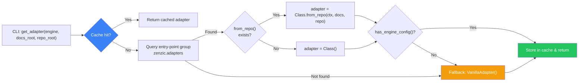
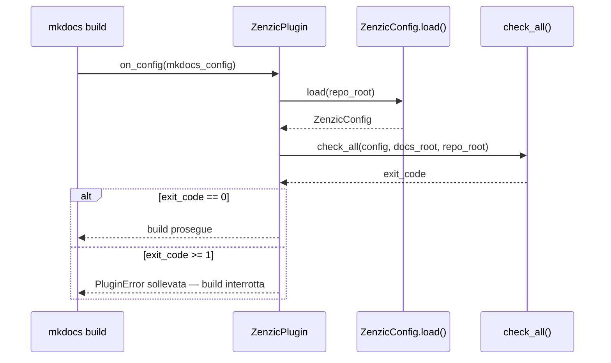

# Architettura

Zenzic e un analizzatore statico a due passate. Questa pagina documenta le strutture interne che ne governano il funzionamento: dalla pipeline di scansione al protocollo degli adapter, dal flusso dello Shield al sistema di esclusione a livelli.

---

## Pipeline a Due Passate {#two-pass-pipeline}

La pipeline principale di Zenzic opera in due passate sequenziali sul medesimo insieme di file. Ogni file viene letto una sola volta per passata; il costo I/O totale resta $O(N)$ rispetto al numero di file.

### Passata 1 — Raccolta e Scansione {#pass-1}

La prima passata attraversa tutti i file `.md` e `.mdx` scoperti da `iter_markdown_sources` ed esegue tre operazioni per ciascun file:

| Fase | Descrizione | Output |
| :--- | :--- | :--- |
| **1.a Shield pass** | Scansiona **ogni riga** del file (incluso il frontmatter YAML e le righe dentro blocchi di codice) alla ricerca di pattern di credenziali | Lista di `SecurityFinding` |
| **1.b Content pass** | Estrae le definizioni reference-link (`[id]: url`), rileva le immagini inline, verifica la presenza dell'alt text | `ReferenceMap` popolata, eventi `DEF`, `IMG`, `MISSING_ALT` |
| **1.c Shield URL** | Per ogni URL trovato in una definizione reference, esegue `scan_url_for_secrets` | `SecurityFinding` aggiuntivi (se la riga non era gia segnalata da 1.a) |

Lo Shield ha la priorità assoluta. Se la fase 1.a rileva un segreto, l'evento viene emesso immediatamente. I risultati Shield e Content vengono poi uniti e ordinati per numero di riga.

Lo Shield scansiona le righe **senza saltare i blocchi di codice** — questo e intenzionale. Un segreto incorporato in un esempio `bash` o in un blocco senza etichetta linguistica e comunque un segreto esposto.

### Passata 1.5 — Costruzione del grafo dei link {#pass-1-5}

Dopo la Passata 1, e prima della validazione, Zenzic costruisce il **grafo di adiacenza** dei link interni Markdown-to-Markdown. Questo grafo viene usato per il rilevamento dei cicli.

La costruzione avviene in tempo $\Theta(V+E)$ tramite un DFS iterativo con colorazione WHITE/GREY/BLACK:

- **WHITE** — nodo non ancora visitato
- **GREY** — nodo nella pila di esplorazione corrente (un arco verso un nodo GREY indica un ciclo)
- **BLACK** — nodo completamente esplorato

Il risultato è un `frozenset` canonico dei percorsi di tutti i nodi che partecipano ad almeno un ciclo. Ogni lookup di appartenenza in Passata 2 è $O(1)$.

### Passata 2 — Validazione e Risoluzione {#pass-2}

La seconda passata valida i link estratti contro gli indici globali costruiti nella Passata 1:

| Operazione | Dettaglio |
| :--- | :--- |
| **Risoluzione link interni** | Delegata a `InMemoryPathResolver`. Nessun I/O su disco — la mappa dei file e le ancore sono gia in memoria |
| **Validazione ancore** | Il frammento `#anchor` viene confrontato con gli slug degli heading estratti dal file target |
| **Rilevamento traversamento path** | I link che risolvono fuori dalla directory `docs/` vengono classificati come `PATH_TRAVERSAL` o `PATH_TRAVERSAL_SUSPICIOUS` |
| **Classificazione route (VSM)** | Quando l'adapter ha una configurazione engine, la Virtual Site Map determina se il target e `REACHABLE`, `ORPHAN_BUT_EXISTING` o `IGNORED` |
| **Rilevamento cicli** | Il target risolto viene cercato nel registro dei cicli ($O(1)$). I risultati `CIRCULAR_LINK` sono a livello `info` |
| **Link esterni (solo `--strict`)** | Validazione HTTP asincrona con richieste HEAD concorrenti (max 20 connessioni). Fallback a GET su 405. HTTP 401/403/429 trattati come "vivo" |

---

## Flusso Middleware Shield {#shield-flow}

Lo Zenzic Shield e un middleware di sicurezza che opera trasversalmente a tutta la pipeline. Il suo flusso per ogni riga di ogni file e il seguente:

```
Riga sorgente
    |
    v
Normalizzazione (trim, decodifica)
    |
    v
Scansione pattern (regex pre-compilati)
    |
    +---> Nessuna corrispondenza --> Continua pipeline
    |
    +---> Corrispondenza trovata --> SecurityFinding emesso
                                        |
                                        v
                                    Exit Code 2
```

### Famiglie di pattern

Lo Shield rileva otto famiglie di pattern di credenziali:

| Pattern | Esempio di corrispondenza |
| :--- | :--- |
| `openai-api-key` | `sk-...` (chiavi API OpenAI) |
| `github-token` | `ghp_...`, `gho_...`, `ghu_...`, `ghs_...`, `ghr_...` |
| `aws-access-key` | `AKIA...` (ID chiave di accesso AWS IAM) |
| `stripe-live-key` | `sk_live_...` (chiavi segrete live Stripe) |
| `slack-token` | `xoxb-...`, `xoxp-...`, `xoxa-...`, `xoxr-...`, `xoxs-...` |
| `google-api-key` | `AIza...` (chiavi API Google Cloud / Maps) |
| `private-key` | `-----BEGIN ... PRIVATE KEY-----` (chiavi PEM) |
| `hex-encoded-payload` | 3+ sequenze consecutive `\xNN` (Hex Shield) |

### Proprieta del middleware

- **Nessuna riga invisibile:** lo Shield scansiona anche le righe dentro blocchi di codice e il frontmatter YAML
- **Priorità assoluta:** un risultato Shield blocca la Passata 2 per quel file (la `ReferenceMap` non viene cross-checked)
- **Exit Code 2 dedicato:** non viene mai soppresso da `--exit-zero` o `exit_zero = true`
- **Deduplicazione:** se `scan_line_for_secrets` e `scan_url_for_secrets` rilevano lo stesso segreto sulla stessa riga, viene emesso un solo evento

---

## Protocollo Adapter {#adapter-protocol}

Gli adapter sono il meccanismo che permette a Zenzic di supportare diversi motori di build senza accoppiarsi a nessuno di essi.

### BaseAdapter

`BaseAdapter` e un `@runtime_checkable` Protocol che ogni adapter deve soddisfare. I metodi chiave sono:

| Metodo | Responsabilita |
| :--- | :--- |
| `has_engine_config()` | Guard: restituisce `True` se l'adapter ha trovato un file di configurazione del motore. Quando `False`, i controlli nav-dipendenti vengono saltati |
| `get_nav_paths()` | Restituisce l'insieme dei percorsi `.md` dichiarati nella navigazione del sito |
| `get_ignored_patterns()` | Pattern fnmatch che l'adapter tratta come ignorati (ad esempio `README.md` per alcuni motori) |
| `classify_route(rel, nav_paths)` | Classifica una route come `REACHABLE`, `ORPHAN_BUT_EXISTING` o `IGNORED` |
| `is_locale_dir(name)` | Determina se una directory e un albero di localizzazione |
| `map_url(rel_path)` | Mappa un percorso file relativo al suo URL canonico |
| `resolve_asset(path, docs_root)` | Risolve un asset con fallback i18n |
| `resolve_anchor(file, anchor, cache, docs_root)` | Risolve un'ancora con fallback i18n |

### RouteMetadata

`RouteMetadata` e il contenitore dei metadati di routing per ogni pagina nella Virtual Site Map (VSM):

- `url` — URL canonico della pagina
- `status` — stato della route: `REACHABLE`, `ORPHAN_BUT_EXISTING`, `IGNORED`
- `source_path` — percorso del file sorgente relativo a `docs_root`
- `version` — etichetta opzionale della versione (supporto Docusaurus)

---

## Virtual Site Map (VSM) {#vsm}

La Virtual Site Map è l'**unica fonte di verità per il routing** di Zenzic. È una struttura dati pura (una mappa tra stringhe `canonical_url` e oggetti `Route`) costruita dal `VSMBuilder` combinando la conoscenza degli adapter con la scoperta del filesystem.

### Versioning e Supporto Multi-Doc {#vsm-versioning}

A partire dalla v0.6.1 "Obsidian Glass", la VSM è **consapevole delle versioni**. Per gli adapter che supportano la documentazione multi-versione (attualmente `DocusaurusAdapter`), il VSM builder:

1. **Identifica i confini di versione** tramite la scoperta estesa della root dell'adapter.
2. **Etichetta le route** con la rispettiva versione in `RouteMetadata`.
3. **Risolve i cross-link** dando priorità al contesto della stessa versione, prevenendo la "version-skew" nella validazione dei link.

Le route versionate sono spesso trattate come **Ghost Routes** — sono marcate come `REACHABLE` anche se non appaiono nel file di navigazione principale, poiché si assume che il motore di build gestisca automaticamente le sidebar specifiche per versione.

### Modalità Offline e Risoluzione URL Flat {#vsm-offline}

Il flag `--offline` innesca un cambiamento architetturale globale nel modo in cui la VSM risolve gli URL. Quando attivo:

1. **`offline_mode`** viene impostato a `True` nel `BuildContext`.
2. **Gli adapter forzano `use_directory_urls = False`**, sovrascrivendo qualsiasi configurazione specifica del motore.
3. **`map_url()`** produce percorsi `.html` piatti (es. `guida/install.md` → `/guida/install.html`) invece di slug in stile directory.

Questo garantisce che Zenzic rimanga un **Custode Strutturale** anche per la documentazione distribuita su filesystem dove la risoluzione dell'indice di directory (es. `/pagina/` → `/pagina/index.html`) non è disponibile.

### Adapter disponibili

| Engine | Adapter | Configurazione rilevata |
| :--- | :--- | :--- |
| `mkdocs` | `MkDocsAdapter` | `mkdocs.yml` |
| `zensical` | `ZensicalAdapter` | `zensical.toml` |
| `docusaurus` | `DocusaurusAdapter` | `docusaurus.config.js` / `.ts` |
| `vanilla` | `VanillaAdapter` | Nessuna — no-op, ogni file e REACHABLE |

### Risoluzione Link e Mapping degli Slug {#link-resolution}

Gli adapter che supportano override `slug` nel frontmatter (attualmente `DocusaurusAdapter`) mappano gli slug nella Virtual Site Map per la validazione della **raggiungibilità**: una pagina con `slug: /quick-start` all'URL `/docs/quick-start` viene correttamente marcata `REACHABLE` anche se il suo percorso file è `docs/guides/getting-started.mdx`.

Tuttavia, la validazione dell'**integrità dei link** di Zenzic (link rotti, percorsi assoluti) risolve i percorsi relativi dalla posizione nel *filesystem*, non dall'URL dello slug. Questo significa che una divergenza marcata tra slug e percorso file può causare una risoluzione diversa dei link relativi in Zenzic (basata sui file) rispetto al build engine (basata sugli URL).

**Invariante architetturale:** mantieni la gerarchia del filesystem allineata alla gerarchia degli URL desiderata. Se un file viene spostato in una nuova directory, lascia che l'URL segua naturalmente piuttosto che usare `slug` per bloccare il vecchio URL. Questo garantisce che i link `../` si risolvano in modo identico sia nel linter che nel generatore di siti statici.

### Factory degli engine



La factory `get_adapter` segue un protocollo di costruzione a due fasi:

1. **Scoperta:** il gruppo entry-point `zenzic.adapters` viene consultato per primo, poi il registro built-in
2. **Costruzione:** se l'adapter espone un classmethod `from_repo(context, docs_root, repo_root)`, viene usato quello; altrimenti si chiama il costruttore standard
3. **Guard `has_engine_config`:** se l'adapter costruito restituisce `False` da `has_engine_config()`, la factory ricade su `VanillaAdapter`
4. **Cache:** le istanze vengono memorizzate con chiave `(engine, docs_root, repo_root)` per evitare doppie istanziazioni nella stessa sessione CLI

Questo design significa che aggiungere un nuovo adapter per un motore di build **non richiede mai di modificare il core di Zenzic** — basta installare un pacchetto adapter.

---

## Fondamenti di Sicurezza Enterprise-Grade {#enterprise-security}

Questa sezione documenta le funzionalità di hardening della sicurezza introdotte in v0.6.1 "Obsidian Bastion". Queste proprietà sono verificate dalla suite di test e applicate dalla guardia `_validate_docs_root` e dal recinto I/O `safe_read_line`.

### F2-1 — Troncamento Anti-ReDoS delle righe {#f2-1-antiredos}

La funzione `safe_read_line()` impone un limite rigido di **1 MiB** su ogni riga prima che raggiunga qualsiasi motore regex.

**Modello di minaccia:** Un attaccante che può fare commit di un file contenente una riga artificialmente lunga (o una pipeline di build che ne genera una) potrebbe fornire un input patologico a un motore regex con backtracking. Su pattern di backtracking catastrofico, una singola riga da 1 MB potrebbe far girare il worker per minuti o ore, creando effettivamente una condizione di Denial-of-Service sulla pipeline di analisi.

**Mitigazione:**

```python
# safe_read_line() — riga troncata prima di raggiungere qualsiasi pattern regex
_MAX_LINE_BYTES = 1 * 1024 * 1024  # limite rigido a 1 MiB

if len(raw_line.encode("utf-8")) > _MAX_LINE_BYTES:
    raw_line = raw_line.encode("utf-8")[:_MAX_LINE_BYTES].decode("utf-8", errors="replace")
```

La riga troncata viene comunque scansionata — una credenziale che inizia nel primo 1 MiB di una riga verrà comunque rilevata. Solo il contenuto oltre il limite è invisibile allo Shield.

**Interazione con il timeout del worker:** F2-1 è la prima linea di difesa. Il timeout del worker `ProcessPoolExecutor` di 30 secondi (ZRT-002, Obbligazione 1) è la seconda. Insieme garantiscono che nessun singolo file possa tenere in ostaggio la pipeline indipendentemente dal contenuto.

### F4-1 — Validazione Anti-Jailbreak del Percorso {#f4-1-antijailbreak}

La funzione `_validate_docs_root()` in `cli.py` eleva il **Blood Sentinel** (Codice di Uscita 3) da un controllo a tempo di link a una **barriera pre-scansione del filesystem**.

**Modello di minaccia:** Un `zenzic.toml` malevolo o mal configurato contenente `docs_dir = "../../etc"` causerebbe la scansione da parte di Zenzic di directory di sistema OS, potenzialmente divulgando contenuti di file sensibili attraverso i risultati del rilevamento credenziali o esponendo la struttura delle directory nei messaggi di errore.

**Mitigazione:**

```python
def _validate_docs_root(repo_root: Path, docs_root: Path) -> None:
    resolved_repo = repo_root.resolve()
    resolved_docs = docs_root.resolve()
    try:
        resolved_docs.relative_to(resolved_repo)
    except ValueError:
        # BLOOD SENTINEL scatta immediatamente — nessun file viene letto
        raise typer.Exit(3)
```

`resolve()` espande tutti i symlink e i componenti `..` prima del confronto, quindi `docs_dir = "repo/../../../etc"` viene catturato incondizionatamente. Il controllo viene eseguito prima della costruzione di `LayeredExclusionManager`, prima di qualsiasi fase I/O, e non può essere aggirato da flag CLI.

**Il Codice di Uscita 3 non viene mai soppresso** da `--exit-zero` o `exit_zero = true`. Se viene rilevato un tentativo di jailbreak, il processo termina immediatamente dopo la stampa del messaggio diagnostico del Blood Sentinel.

| Scenario | Valore `docs_dir` | Risultato |
| :--- | :--- | :--- |
| Progetto normale | `"docs"` | Risolve dentro la radice del repo → consentito |
| Radice del repo come docs | `"."` | Risolve alla radice del repo → consentito |
| Escape dal parent | `"../../etc"` | Risolve fuori dalla radice del repo → **Exit 3** |
| Escape tramite symlink | `"docs-link"` (symlink a `/tmp`) | `resolve()` espande → **Exit 3** |

---

## LayeredExclusionManager — Interni {#exclusion-internals}

Il `LayeredExclusionManager` e il cuore del sistema di esclusione a 4 livelli. I suoi interni sono documentati in dettaglio nella pagina [Discovery e Esclusione](../guides/discovery).

I punti salienti dal punto di vista architetturale:

- **Pre-compilazione:** i pattern `excluded_file_patterns` e `included_file_patterns` vengono compilati in `re.Pattern` al momento della costruzione del manager, non ad ogni valutazione
- **Pulizia dei livelli:** le `SYSTEM_EXCLUDED_DIRS` vengono rimosse da `_config_excluded_dirs` per evitare confusione tra L1 e L3
- **VCSIgnoreParser unificato:** quando `respect_vcs_ignore = true`, le regole da tutti i file `.gitignore` vengono unite in un singolo parser con cache `_positive_combined` per il fast-path senza negazioni
- **Costruzione unica:** il manager viene costruito una sola volta dalla CLI e passato lungo tutta la pipeline

---

## Codici di uscita {#exit-codes}

Zenzic usa quattro codici di uscita, ognuno con una semantica precisa:

| Codice | Nome | Significato | Sopprimibile con `--exit-zero`? |
| :---: | :--- | :--- | :---: |
| **0** | Pulito | Nessun problema trovato (o `--exit-zero` attivo per problemi non-sicurezza) | — |
| **1** | Risultati | Errori di qualita trovati (link rotti, orfani, snippet, segnaposto, asset, riferimenti) | Si |
| **2** | Shield | Credenziale rilevata dallo Zenzic Shield | **No** |
| **3** | Blood Sentinel | Traversamento path verso directory di sistema OS (`/etc/`, `/root/`, `/var/`, `/proc/`, `/sys/`, `/usr/`) | **No** |

### Gerarchia di priorità dei codici di uscita

Quando piu condizioni si verificano nella stessa esecuzione, la priorità è:

```
Exit 3 (Blood Sentinel)  >  Exit 2 (Shield)  >  Exit 1 (Risultati)  >  Exit 0 (Pulito)
```

Il Blood Sentinel (exit 3) viene valutato per primo. Poi lo Shield (exit 2). Solo dopo viene valutata la presenza di risultati standard (exit 1).

:::danger[Exit 2 e 3 non sono mai sopprimibili]
I codici di uscita 2 (Shield) e 3 (Blood Sentinel) rappresentano eventi di sicurezza. Non vengono mai soppressi da `--exit-zero` o `exit_zero = true` nella configurazione. Questo e un contratto architetturale invariante.
:::

---

## Motore Adattivo Ibrido {#hybrid-adaptive-engine}

La pipeline di scansione seleziona automaticamente tra esecuzione sequenziale e parallela in base al numero di file:

| Condizione | Modalita | Dettaglio |
| :--- | :--- | :--- |
| `workers=1` (default) oppure file < 50 | **Sequenziale** | Zero overhead di spawn processi. Supporto completo per validazione URL esterni |
| `workers != 1` e file >= 50 | **Parallelo** | `ProcessPoolExecutor` con distribuzione per-file. Ogni worker e un processo indipendente |

La soglia di 50 file (`ADAPTIVE_PARALLEL_THRESHOLD`) e un'euristica conservativa: sotto questa soglia, l'overhead di spawn del `ProcessPoolExecutor` (~200-400 ms su un interprete freddo) supera il beneficio del parallelismo.

### Garanzie del motore parallelo

- **Determinismo:** i risultati sono sempre ordinati per `file_path` indipendentemente dalla modalita di esecuzione
- **Shield per-worker:** ogni worker applica lo Shield indipendentemente. I file con risultati di sicurezza vengono esclusi dalla validazione link
- **Timeout per worker:** un worker che eccede 30 secondi (`_WORKER_TIMEOUT_S`) viene abbandonato e produce un risultato `Z009` anziché bloccare l'intera scansione (protezione anti-ReDoS)
- **Contratto di immutabilita:** `config` e `rule_engine` vengono serializzati via `pickle`. Ogni worker riceve una copia indipendente — nessuno stato condiviso tra processi

---

## Layer delle Integrazioni {#integrations-layer}

Il namespace `zenzic.integrations` contiene **plugin opt-in** che si agganciano al ciclo di vita di un motore di build esterno e invocano i controlli di Zenzic come quality gate. Le integrazioni sono il **Braccio** del [modello Mente e Braccio](../ecosystem/overview) — agiscono, mentre gli Adapter interpretano.

### Contratto di Progettazione {#integrations-contract}

Le integrazioni seguono due invarianti:

1. **Isolamento delle dipendenze.** Un'integrazione può importare il suo motore host (`mkdocs`, ecc.). Il core di Zenzic non importa mai alcuna integrazione; la dipendenza è strettamente unidirezionale. Per questo motivo gli extra delle integrazioni sono opt-in: `pip install "zenzic[mkdocs]"`.
2. **Core subprocess-free.** Le integrazioni attivano l'API Python di Zenzic direttamente — nessun `subprocess.run("zenzic ...")`. Il Pilastro 2 (Zero Sottoprocessi) è preservato end-to-end.

### `zenzic.integrations.mkdocs` — `ZenzicPlugin` {#zenzic-plugin}

`ZenzicPlugin` è un plugin nativo MkDocs che inietta un gate completo `zenzic check all` in ogni esecuzione di `mkdocs build`.

**Registrazione** (automatica tramite entry point):

```toml
[project.entry-points."mkdocs.plugins"]
zenzic = "zenzic.integrations.mkdocs:ZenzicPlugin"
```

**Attivazione** (lato utente, in `mkdocs.yml`):

```yaml
plugins:
  - search
  - zenzic
```

**Flusso di esecuzione:**



I risultati Shield (exit code 2) e Blood Sentinel (exit code 3) interrompono la build incondizionatamente, indipendentemente da qualsiasi impostazione `--exit-zero`. I risultati di qualità standard (exit code 1) interrompono la build a meno che `exit_zero = true` non sia impostato in `zenzic.toml`.

**Logger:** Il plugin registra sotto il logger `zenzic.integrations.mkdocs` (non `mkdocs.plugins.zenzic`), coerentemente con la gerarchia di logging standard di Zenzic.

### Estendere il Namespace delle Integrazioni {#extending-integrations}

Le nuove integrazioni seguono lo stesso schema:

1. Crea `src/zenzic/integrations/<motore>.py`.
2. Aggiungi `<motore> = ["<pacchetto-motore>>=<versione>"]` a `[project.optional-dependencies]` in `pyproject.toml`.
3. Registra gli entry point richiesti (es. `<motore>.plugins`).
4. Usa `ZenzicConfig.load()` + le funzioni di controllo del core — non avviare mai sottoprocessi shell.

Il package `zenzic.integrations` è intenzionalmente snello: non contiene logica condivisa, solo hook per-motore. Tutta l'intelligenza vive in `zenzic.core`.
