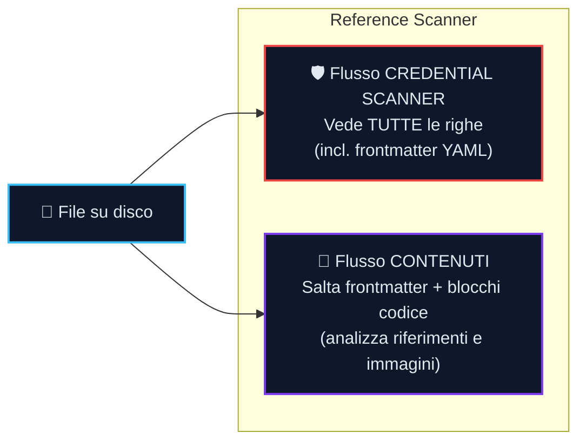

import {
  GutterTerminal,
  CredentialTerminal,
  SummaryTerminal,
  SnippetTerminal,
  OrphanTerminal,
} from '@site/src/components/ZenzicTerminal';

## Riferimento Controlli {#checks-reference}

Zenzic esegue **sei controlli indipendenti**. Ciascuno affronta una categoria distinta di degrado documentale — il deterioramento silenzioso che avviene quando un progetto cresce e la manutenzione della documentazione resta indietro rispetto allo sviluppo.

| Controllo | CLI | Cosa individua |
| :--- | :--- | :--- |
| [Controllo Link](#check-links) | `zenzic check links` | Link interni rotti, ancore morte, URL irraggiungibili |
| [Orfani](#check-orphans) | `zenzic check orphans` | File `.md` presenti su disco ma assenti dalla navigazione |
| [Snippet](#check-snippets) | `zenzic check snippets` | Errori di sintassi Python/YAML/JSON/TOML nei blocchi di codice |
| [Segnaposto](#check-placeholders) | `zenzic check placeholders` | Pagine stub con basso conteggio parole o pattern `TODO` |
| [Asset](#check-assets) | `zenzic check assets` | Media mai referenziati da alcuna pagina |
| [Riferimenti](#check-references) | `zenzic check references` | Ref-link pendenti, definizioni morte, credenziali esposte |

---

## Link {#check-links}

**CLI:** `zenzic check links [--strict]`

Il link rot è uno dei difetti più comuni e visibili nella documentazione. Uno sviluppatore rinomina una pagina, sposta una sezione o elimina un'ancora, e i link che puntavano ad essa diventano silenziosamente vicoli ciechi.

`zenzic check links` utilizza un parser Python nativo — nessun sottoprocesso, nessuna dipendenza dal build driver. Scansiona ogni file `.md` sotto `docs/`, estrae tutti i link Markdown con una macchina a stati consapevole dei blocchi di codice, e li valida in due livelli.

### Come funziona la Virtual Site Map {#vsm-how-it-works}

Quando Zenzic valida i link, non si limita a verificare se il file di destinazione esiste su disco. Costruisce invece una **Virtual Site Map (VSM)** — una proiezione puramente in memoria di ciò che il build engine servirà effettivamente ai lettori.

La VSM associa ogni URL canonico a una voce **Route**:

| Campo | Significato |
| :--- | :--- |
| `url` | L'URL che un browser richiederebbe, es. `/guide/install/` |
| `source` | Il file sorgente che produce questo URL, es. `guide/install.md` |
| `status` | Se la pagina è raggiungibile, orfana, ignorata o in conflitto |
| `anchors` | Ancore degli heading pre-calcolate dal file sorgente |

Ogni route porta uno stato che indica a Zenzic come trattare i link che vi puntano:

| Stato | Significato | Risultato link |
| :--- | :--- | :--- |
| `REACHABLE` | La pagina è elencata nella navigazione o è una route di localizzazione | Valido |
| `ORPHAN_BUT_EXISTING` | Il file esiste su disco ma non nella navigazione del sito | Avviso Z103 |
| `IGNORED` | Escluso dalla configurazione (es. file README, directory private) | Errore Z101 |
| `CONFLICT` | Due file sorgente producono lo stesso URL canonico | Errore Z101 |

**Perché è importante:** Un file può esistere nel filesystem ed essere comunque `IGNORED` nella VSM. Un URL può essere `REACHABLE` nella VSM senza avere un file corrispondente su disco (ad esempio, le route indice delle localizzazioni). La VSM è l'autorità — Zenzic verifica la raggiungibilità, non la sola esistenza del file.

Questo design fa sì che `zenzic check links` individui problemi che un controllo diretto di esistenza del file non coglierebbe: pagine rimosse dalla navigazione, route in conflitto e contenuti orfani che i lettori non possono scoprire navigando normalmente.

### Livello 1 — link interni (sempre verificati)

I percorsi relativi e site-absolute vengono risolti rispetto alla directory `docs/` in memoria. Il file di destinazione deve esistere nel set di file scansionati. Vengono risolti anche i percorsi senza estensione (`setup`) e i percorsi directory-index (`setup/`). Se il link include un `#fragment`, Zenzic estrae le ancore degli heading dal file di destinazione e verifica la corrispondenza del frammento.

- `[testo](pagina-mancante.md)` → file di destinazione non trovato
- `[testo](pagina.md#ancora-mancante)` → ancora non trovata nel file di destinazione

Tutti i file `.md` vengono letti una sola volta; le ancore sono pre-calcolate dagli heading (`# Titolo` → `#titolo`). Nessuna I/O aggiuntiva per link.

### Livello 2 — link esterni (solo `--strict`)

Con `--strict`, ogni URL `http://` e `https://` nella documentazione viene validato tramite richieste HTTP HEAD concorrenti usando `httpx`. Fino a 20 connessioni simultanee. I server che rifiutano HEAD ricevono un fallback GET. Lo stesso URL referenziato in più pagine viene verificato una sola volta.

I server che restituiscono `401`, `403` o `429` sono trattati come raggiungibili — indicano restrizioni di accesso, non link rotti. Timeout (>10 s) ed errori di connessione vengono segnalati come fallimenti.

### Cosa non viene mai validato

- Link dentro blocchi di codice o span di codice inline — l'estrattore li salta
- Schemi `mailto:`, `data:`, `ftp:`, `tel:` e simili non-HTTP
- Ancore alla stessa pagina (`#sezione`) — non validate di default; abilitare con `validate_same_page_anchors = true`

:::tip[Validazione ancore stessa pagina]

Di default, link come `[testo](#sezione)` che puntano a un heading nello stesso file non vengono validati. Per abilitare:

```toml
# zenzic.toml
validate_same_page_anchors = true
```

:::

### Codici di violazione

| Codice | Severità | Significato |
| :--- | :---: | :--- |
| `Z101` | errore | **Link rotto** — il target non esiste nella VSM |
| `Z103` | avviso | **Link orfano** — il target esiste su disco ma non nella navigazione del sito |
| `ABSOLUTE_PATH` | errore | **Percorso assoluto** — il link usa un percorso site-absolute (`/docs/pagina`) invece di un percorso relativo (`../pagina`) |

`Z101` blocca sempre la pipeline (exit code 1). `Z103` è un avviso — appare nel report ma non fa fallire la CI a meno che non venga passato `--strict`. `ABSOLUTE_PATH` è un errore perché i percorsi assoluti compromettono la portabilità quando il sito è ospitato in una sottodirectory.

:::note[Coerenza Fisica — perché i percorsi relativi contano]

Alcuni build engine (es. Docusaurus) permettono override `slug` nel frontmatter che disaccoppiano l'URL di una pagina dalla sua posizione nel filesystem. Quando questo accade, la "directory padre" per la risoluzione dei link relativi può differire tra il build engine (che risolve dall'URL) e Zenzic (che risolve dal percorso del file).

**Best practice:** mantieni la struttura del filesystem allineata alla struttura degli URL. Se sposti un file in `guides/checks.mdx`, lascia che il suo URL diventi `/docs/guides/checks` piuttosto che forzare uno slug a `/docs/checks`. Questo garantisce che i link `../` si risolvano in modo identico sia per il linter che per il build engine.

:::

**Output Zenzic — reporter gutter:**

<GutterTerminal />

### Path Traversal Guard — traversamento path di sistema {#path-traversal-guard}

Il path traversal guard tratta il traversamento host-path come un **evento di sicurezza**, non come routine di igiene dei link. Se un link esce da `docs/` e si risolve verso path di sistema operativo (`/etc/`, `/root/`, `/var/`, `/proc/`, `/sys/`, `/usr/`), Zenzic emette `PATH_TRAVERSAL_SUSPICIOUS` ed esce con codice **3**.

| Codice | Severità | Exit code | Significato |
| :--- | :---: | :---: | :--- |
| `PATH_TRAVERSAL_SUSPICIOUS` | incidente_sicurezza | **3** | L'href punta a una directory di sistema OS |
| `PATH_TRAVERSAL` | errore | 1 | L'href esce da `docs/` verso un percorso non di sistema |

::::danger[Exit Code 3 — Path Traversal Guard]
Un risultato `PATH_TRAVERSAL_SUSPICIOUS` significa che un file sorgente della documentazione contiene un link il cui target risolto punta a `/etc/passwd`, `/root/`, o un altro path di sistema OS. Questo può indicare una template injection, una toolchain di documentazione compromessa, o un errore dell'autore che rivela dettagli dell'infrastruttura interna. Trattarlo come un incidente di sicurezza bloccante per la build.
:::

<CredentialTerminal />

### Come funziona il credential scanner {#scanner-how-it-works}

Lo credential scanner utilizza un'**architettura a doppio flusso** per garantire che nessuna parte di un file sfugga alla scansione delle credenziali.

Quando il Reference Scanner elabora un file, crea due flussi indipendenti:



I due flussi hanno regole di filtraggio opposte per design. Il flusso Contenuti deve saltare il frontmatter YAML per evitare di interpretare metadati come `author: Jane Doe` come una definizione reference rotta. Il flusso credential scanner deve vedere il frontmatter perché una chiave come `aws_key: AKIA...` nascosta nei metadati YAML è un segreto reale che deve essere intercettato. I flussi non condividono mai una sorgente dati — unirli creerebbe un punto cieco.

**Normalizzatore Pre-Scansione.** Prima di eseguire i pattern di rilevamento, il credential scanner normalizza ogni riga per contrastare l'offuscamento. I backtick di codice inline vengono rimossi, gli operatori di concatenazione eliminati e i caratteri pipe delle tabelle collassati. Questo significa che un segreto spezzato tra colonne di una tabella Markdown — come una chiave AWS divisa in `` `AKIA` + `suffisso` `` — viene riassemblato prima della scansione. Vengono verificate sia la forma grezza che quella normalizzata, e un set di deduplicazione previene le doppie segnalazioni.

**Protezione ReDoS.** I pattern regex personalizzati dichiarati in `[[custom_rules]]` vengono compilati tramite gate di compatibilità RE2 al caricamento. I costrutti non supportati (per esempio backreference o lookaround) vengono rifiutati prima che inizi qualsiasi scansione. Separatamente, il watchdog dei worker paralleli continua a emettere `Z902: RULE_TIMEOUT` se un worker si blocca a runtime per uno stall sistemico (per esempio I/O o starvation del coordinatore) e non per un canary regex con backtracking.

### Link circolari

La documentazione è un **Knowledge Graph** — una rete densamente interconnessa dove i link incrociati tra pagine sono attesi e desiderabili. Se un Tutorial linka una pagina di Reference per i dettagli tecnici, è naturale e benefico che quella pagina di Reference linki a sua volta il Tutorial come esempio di implementazione. I pattern di link circolari sono quindi dati strutturali, non difetti.

Il rilevamento dei cicli viene calcolato una sola volta con DFS iterativo durante la costruzione del resolver (Fase 1.5, Θ(V+E)). Ogni lookup di appartenenza in Fase 2 contro il registro dei cicli è O(1).

**Perché il motore calcola i cicli.** Il traversal DFS è un requisito meccanico del costruttore della Virtual Site Map: senza identificare i cicli, la scansione ricorsiva del grafo andrebbe in loop infinito. Il rilevamento è necessario per far terminare il resolver — non è attivato da una preoccupazione di qualità.

| Codice | Severità | Exit code | Significato |
| :--- | :---: | :---: | :--- |
| `CIRCULAR_LINK` | info | — | Il target risolto è membro di un ciclo di link |

:::info[Telemetria topologica — soppressa di default]

I risultati `CIRCULAR_LINK` sono nascosti dall'output standard perché non sono violazioni. Usa `--show-info` per esporli come metriche strutturali:

```bash
zenzic check all --show-info
```

Non influenzano mai gli exit code, né in modalità normale né in modalità `--strict`. Una densità ciclica anomalmente elevata su una singola pagina può essere un segnale di Information Architecture da valutare — ma quel giudizio spetta all'ingegnere, non all'analizzatore.
:::

---

## Orfani {#check-orphans}

**CLI:** `zenzic check orphans`

Una pagina orfana esiste su disco ma non è elencata nella navigazione del sito. È invisibile ai lettori che seguono l'albero di navigazione — può essere raggiunta solo indovinando l'URL o trovando un link diretto.

**Cosa individua:**

- Pagine create su disco ma mai aggiunte alla `nav`
- Pagine la cui voce nella `nav` è stata rimossa senza eliminare il file

<OrphanTerminal />

---

## Snippet {#check-snippets}

**CLI:** `zenzic check snippets`

Gli esempi di codice nella documentazione vengono testati con meno rigore rispetto al codice di produzione. Uno snippet che funzionava quando è stato scritto può avere un errore di sintassi introdotto da un refactoring, un errore di copia-incolla o una modifica manuale mai revisionata.

### Linguaggi supportati

| Tag linguaggio | Parser | Cosa viene verificato |
| :--- | :--- | :--- |
| `python`, `py` | `compile()` in modalità `exec` | Sintassi Python 3.11+ |
| `yaml`, `yml` | `yaml.safe_load()` | Struttura YAML 1.1 |
| `json` | `json.loads()` | Sintassi JSON |
| `toml` | `tomllib.loads()` (stdlib 3.11+) | Sintassi TOML current release |

I blocchi con qualsiasi altro tag linguaggio (`bash`, `javascript`, `mermaid`, ecc.) sono trattati come testo puro e non vengono verificati sintatticamente. Tuttavia, **ogni blocco di codice è comunque scansionato dallo credential scanner** per pattern di credenziali.

### Cosa individua

- **Python:** `SyntaxError` — due punti mancanti, parentesi non bilanciate, espressioni non valide
- **YAML:** errori strutturali — sequenze non chiuse, mapping non validi, chiavi duplicate
- **JSON:** `JSONDecodeError` — virgole finali, virgolette mancanti, parentesi non bilanciate
- **TOML:** `TOMLDecodeError` — virgolette mancanti sui valori, sintassi chiave non valida

<SnippetTerminal />

:::tip[Configurazione]

Usa `snippet_min_lines` in `zenzic.toml` per saltare i blocchi brevi. Il default di `1` controlla tutto. Impostalo a `3` o superiore per ignorare gli stub di import.

```toml
# zenzic.toml
snippet_min_lines = 3
```

:::

---

## Segnaposto {#check-placeholders}

**CLI:** `zenzic check placeholders`

Le pagine segnaposto sono pagine create come stub e mai completate. Sono debito documentale.

### Segnale 1 — conteggio parole

Le pagine con meno di `placeholder_max_words` parole (default: 50) vengono segnalate come `short-content`.

### Segnale 2 — corrispondenza pattern

Le righe contenenti qualsiasi stringa da `placeholder_patterns` (case-insensitive) vengono segnalate come `placeholder-text`. I pattern predefiniti includono: `coming soon`, `work in progress`, `wip`, `todo`, `to do`, `stub`, `placeholder`, `fixme`, `tbd`, `draft`, `da completare`, `in costruzione`, `bozza`, `prossimamente`.

Entrambi i segnali sono indipendenti. Una pagina può attivarne uno, entrambi o nessuno.

:::tip[Configurazione]

```toml
# zenzic.toml
placeholder_max_words = 100
placeholder_patterns = ["coming soon", "wip", "fixme", "tbd", "draft"]
```

:::

---

## Asset {#check-assets}

**CLI:**

- `zenzic check assets` — Controlla file asset inutilizzati
- `zenzic clean assets` — Rimuovi in sicurezza gli asset inutilizzati

:::note[Autofix disponibile]
Usa `zenzic clean assets` per eliminare automaticamente gli asset inutilizzati trovati da questo controllo. Passa `-y` per saltare la conferma, o `--dry-run` per un'anteprima. Zenzic non cancellerà mai file corrispondenti ai tuoi pattern `excluded_assets`, `excluded_dirs` o `excluded_build_artifacts`.
:::

Un asset è considerato **usato** se appare come link immagine Markdown (``) o tag HTML `` in qualsiasi file `.md`. I percorsi vengono normalizzati usando l'aritmetica dei percorsi POSIX.

**Sempre esclusi:** i file `.css`, `.js`, `.yml` non vengono mai segnalati come inutilizzati — sono tipicamente override del tema o configurazione di build.

**Cosa individua:**

- Screenshot caricati ma mai incorporati
- Immagini rimaste dopo una riorganizzazione delle pagine
- Allegati collegati da una pagina che non esiste più

---

## Riferimenti {#check-references}

**CLI:** `zenzic check references`

Il controllo di sicurezza e integrità dei link per i [link in stile reference di Markdown](https://spec.commonmark.org/0.31.2/#link-reference-definitions). Funge anche da superficie primaria per lo **credential scanner**.

### Pipeline Reference a Tre Passaggi

| Passaggio | Nome | Cosa succede |
| :---: | :--- | :--- |
| 1 | **Raccolta** | Processa ogni riga; registra le definizioni `[id]: url`; esegue credential scanner su ogni URL e riga |
| 2 | **Verifica Incrociata** | Risolve ogni utilizzo `[testo][id]` contro la `ReferenceMap` completa; segnala gli ID non risolvibili |
| 3 | **Report Integrità** | Calcola il punteggio di integrità per file; aggiunge avvisi su Definizioni Morte e alt-text |

Il Passaggio 2 inizia solo quando il Passaggio 1 si completa senza risultati credential scanner.

### Codici di violazione riferimenti

| Codice | Severità | Exit code | Significato |
| :--- | :---: | :---: | :--- |
| `DANGLING_REF` | errore | 1 | `[testo][id]` — `id` non ha definizione nel file |
| `DEAD_DEF` | avviso | 0 / 1 `--strict` | `[id]: url` definito ma mai referenziato |
| `DUPLICATE_DEF` | avviso | 0 / 1 `--strict` | Stesso `id` definito due volte; il primo vince |
| `MISSING_ALT` | avviso | 0 / 1 `--strict` | Immagine con alt text vuoto o assente |
| Corrispondenza pattern credential scanner | violazione_sicurezza | **2** | Credenziale rilevata in qualsiasi riga o URL |

### credential scanner — rilevamento credenziali

Lo credential scanner scansiona **ogni riga di ogni file** durante il Passaggio 1, incluse le righe dentro blocchi di codice.

**Famiglie di pattern rilevati:**

| Pattern | Cosa individua |
| :--- | :--- |
| `openai-api-key` | Chiavi API OpenAI (`sk-…`) |
| `github-token` | Token personali / OAuth GitHub (`gh[pousr]_…`) |
| `aws-access-key` | ID chiave di accesso AWS IAM (`AKIA…`) |
| `stripe-live-key` | Chiavi segrete live Stripe (`sk_live_…`) |
| `slack-token` | Token bot / utente / app Slack (`xox[baprs]-…`) |
| `google-api-key` | Chiavi API Google Cloud / Maps (`AIza…`) |
| `private-key` | Chiavi private PEM (`-----BEGIN … PRIVATE KEY-----`) |
| `hex-encoded-payload` | Sequenze di byte hex-encoded (3+ escape `\xNN` consecutivi) |
| `gitlab-pat` | GitLab Personal Access Token (`glpat-…`) |

**Exit Code 2** è riservato agli eventi credential scanner. Non viene mai soppresso da `--exit-zero` o `exit_zero = true` in `zenzic.toml`.

:::danger[Se ricevi exit code 2]

Ruota la credenziale esposta immediatamente, poi rimuovi o sostituisci la riga incriminata. Non committare il segreto nella cronologia del repository.
:::

<CredentialTerminal />

<SummaryTerminal />
